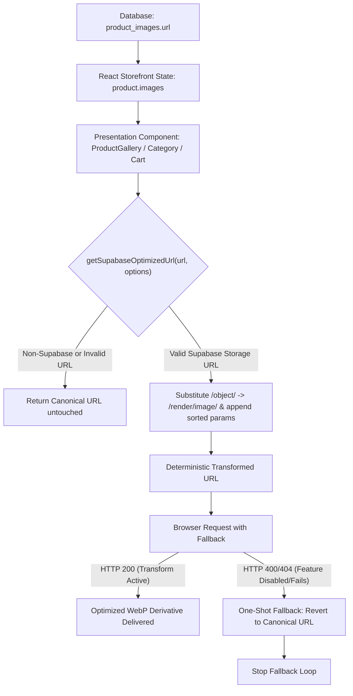

# HOP Media Integration — Phase 3 Pattern 3 Plan
## Dynamic Supabase Storage Images

## 1. Executive Summary

- **Pattern 3 Status**: `PLAN CORRECTED — READY FOR CTO IMPLEMENTATION GATE`
- **Scope**: Pattern 3 — Dynamic Supabase Storage Images Only
- **Implementation Status**: `NOT AUTHORIZED / NOT EXECUTED` (Planning and architecture documentation only)
- **Deployment Status**: `PROHIBITED`
- **Approved Architectural Direction**: **Option C** — Dedicated pure Supabase URL transformation utility (`src/lib/supabaseImage.ts`) generating deterministic transformed URLs and responsive candidates for presentation renderers, coupled with an explicit one-shot client fallback to the canonical URL upon transformation failure.
- **Architectural Separation**:
  - `<OptimizedImage />` remains strictly the static/local media abstraction backed by the pre-compiled static pipeline manifest. It is **not** converted into a dynamic Supabase image abstraction.
  - `src/lib/supabaseImage.ts` will serve exclusively as the runtime dynamic storage URL transformation utility.
- **Core Governance Distinctions**:
  - **Static Local Media Pipeline**: Pre-compiled AVIF + WebP candidate sets generated at build time.
  - **Dynamic Supabase Runtime Transformation**: Standardized on a **WebP-based strategy** for initial implementation, with the original canonical asset available as fallback. AVIF is explicitly excluded from the initial runtime strategy.
- **Commerce Safety Invariant**: Canonical storage URLs must remain untouched in database records, cart state, wishlist state, checkout payloads, order data, OpenGraph metadata, and JSON-LD schemas. Transformation is strictly a presentation-time delivery concern.

---

## 2. Current Architecture & Data Flow

Currently, dynamic media flows from the database to the browser without intermediate optimization:

```text
PostgreSQL Database (Supabase)
  │ (Table: product_images, Column: url = "https://[project].supabase.co/storage/v1/object/public/product-images/[file].jpg")
  ▼
Storefront Services (src/services/productService.ts, collectionService.ts)
  │ (Selects raw canonical url via TanStack Query)
  ▼
React Application State (useQuery data, CartContext, WishlistContext)
  │ (Preserves canonical URL string in memory / localStorage)
  ▼
Storefront Presentation Components
  ├── ProductGallery.tsx   ──>  (Loads 100% full-resolution image for both 800px main view AND 80px thumbnail!)
  ├── Category.tsx         ──>  (Loads raw full-resolution image for catalog grid)
  ├── Cart.tsx             ──>  (Loads raw full-resolution image for 80px thumbnail)
  ├── Checkout.tsx         ──>  (Loads raw full-resolution image for 64px thumbnail)
  ├── Wishlist.tsx         ──>  (Loads raw full-resolution image for 80px thumbnail)
  ├── OrderDetail.tsx      ──>  (Loads raw image for 56px thumbnail)
  └── OrderConfirmation.tsx──>  (Loads raw image for 56px thumbnail)
  ▼
Browser Network Request
  │ Directly requests uncompressed raw asset from Supabase Storage
  ▼
Supabase Storage Object Endpoint (/storage/v1/object/public/...)
```

---

## 3. Dynamic Image Inventory & Pattern Boundaries

An exhaustive repository inspection discovered the following runtime consumers of dynamic image URLs:

| Data Field / Source | Consumer Component | Layout Context | Rendered Dimensions | Current Image Handling | Pattern | Planned Action |
| :--- | :--- | :--- | :--- | :--- | :--- | :--- |
| `product_images.url` | `ProductGallery.tsx` (Main) | Product Detail Carousel | Mobile: 100vw, Desktop: ~600px (`aspect-[4/5]`) | `` | 3 | Transform to responsive candidate set (480, 800, 1200 WebP) |
| `product_images.url` | `ProductGallery.tsx` (Thumbs) | 4-column thumbnail bar | ~80px × 80px (`aspect-square`) | `` (Full resolution!) | 3 | Transform to fixed thumbnail candidate (160 WebP) |
| `product_images.url` | `Category.tsx` | Storefront Catalog Grid | Mobile: ~50vw (180–360px), Desktop: ~33vw (300–420px) | `` | 3 | Transform to responsive candidate set (360, 640, 840 WebP) |
| `cart.items[].image` | `Cart.tsx` | Slide-over cart sheet | 80px × 96px (`w-20 h-24`) | `` (Full resolution!) | 3 | Transform at render time to 160 WebP |
| `checkout.items[].image` | `Checkout.tsx` | Order summary list | 64px × 80px (`w-16 h-20`) | `` (Full resolution!) | 3 | Transform at render time to 160 WebP |
| `wishlist.items[].image` | `Wishlist.tsx` | Saved items list | 80px × 96px (`w-20 h-24`) | `` (Full resolution!) | 3 | Transform at render time to 160 WebP |
| `order_items.image_url` | `OrderDetail.tsx` (Account) | Customer Order History | 56px × 72px (`w-14 h-18`) | `` | 3 | Transform at render time to 112 WebP |
| `order_items.image_url` | `OrderConfirmation.tsx` | Post-checkout confirmation | 56px × 72px (`w-14 h-18`) | `` | 3 | Transform at render time to 112 WebP |
| `collections.hero_image_url` | `CollectionStage.tsx` | Storefront Collection Film | Responsive 16/11, 4/5, 5/4 | `<Film poster={c.hero_image_url} />` | **6** | **EXCLUDE FROM PATTERN 3**. Pattern 3 data source; Pattern 6 presentation integration. |
| `products.og_image_url` | `ProductDetail.tsx` (Meta) | OpenGraph / Twitter metadata | N/A (Social crawler) | `<meta property="og:image" content={...} />` | **SEO** | **EXCLUDE FROM TRANSFORM**. Retain canonical public URL. |
| `products.image_url` | `studio/*` (Admin) | Admin Dashboard / Workspaces | Various tables and forms | Administrative preview `` | **Admin** | **EXCLUDE FROM PATTERN 3**. Studio/admin tooling outside storefront scope. |

---

## 4. URL Architecture & Taxonomy

1. **Public Supabase Storage URLs** (`VERIFIED`):
   - Format: `https://<project-id>.supabase.co/storage/v1/object/public/<bucket>/<path>`
   - Status: 100% of storefront customer images use this structure.
   - Buckets: `product-images`, `HOP-films`.
2. **Signed Storage URLs** (`VERIFIED`):
   - Format: `https://<project-id>.supabase.co/storage/v1/object/sign/<bucket>/<path>?token=...`
   - Status: **NOT USED** in HOP. Zero instances of `createSignedUrl` exist in the codebase.
3. **Storage Paths** (`VERIFIED`):
   - Stored in database tables as full public URLs, constructed at upload time via `supabase.storage.from('product-images').getPublicUrl(filePath)`.
4. **External Fallback URLs** (`VERIFIED`):
   - Some mocks and tests use `https://placehold.co/...`.
   - The transformation helper must detect non-Supabase URLs and return them unmodified.

---

## 5. Supabase Transformation Capabilities & Claim Discipline

| Technical Claim | Classification | Evidence / Basis |
| :--- | :--- | :--- |
| Endpoint transformation path | **VERIFIED** | Supabase Storage transforms public assets by substituting `/storage/v1/object/public/` with `/storage/v1/render/image/public/`. |
| SDK native transformation support | **VERIFIED** | `@supabase/supabase-js` v2.106.2 in `package.json` supports `getPublicUrl(path, { transform: { width, height, quality, format, resize } })`. |
| Initial runtime format support (WebP) | **VERIFIED** | WebP is universally supported on Supabase image transformation across all modern browsers. |
| Initial runtime format support (AVIF) | **UNVERIFIED / EXCLUDED** | AVIF runtime transformation must NOT be assumed in production without deployment verification. Standardized on WebP for initial rollout. |
| Public bucket transformation compatibility | **VERIFIED** | Transformations operate directly on public storage buckets without authentication tokens. |
| Transformation tier entitlement | **UNVERIFIED** | On-the-fly transformation requires Supabase Pro/Enterprise tier. Whether the live production project has this add-on active requires deployment confirmation. |
| One-shot canonical fallback necessity | **INFERENCE** | Because production project entitlement is unverified, the client must implement an automated, one-shot fallback to the canonical URL if the render URL fails. |
| Runtime performance improvements | **UNVERIFIED** | LCP, CLS, INP, and real bandwidth savings are unverified until measured in a live browser session. |

---

## 6. Security & RLS Assessment

- **Bucket Access Controls** (`VERIFIED`):
  - `product-images`: `public: true`. RLS policy grants `SELECT` to `anon` and `authenticated`.
  - `HOP-films`: `public: true`. RLS policy grants `SELECT` to `anon` and `authenticated`.
- **Sensitive Data Exposure** (`VERIFIED`): None. Product catalog images and collection films are non-sensitive public marketing assets.
- **Service-Role Safety** (`VERIFIED`): Client storefront queries use only `VITE_SUPABASE_PUBLISHABLE_KEY` with anonymous public read access. Zero service-role keys are exposed or used in media rendering.
- **Transformation URL Security** (`INFERENCE`): Query parameters (`width`, `height`, `quality`) on public buckets do not bypass access controls or expose private objects.

---

## 7. Approved Presentation-Layer Architecture

### Decision: **Option C — Dedicated Pure URL Transformation Utility + Existing Renderers**



### Key Architectural Invariants:
1. `<OptimizedImage />` remains the static/local media abstraction and is **not** modified or expanded into a Supabase runtime image abstraction.
2. `src/lib/supabaseImage.ts` will be a pure, stateless utility with zero side-effects.
3. The utility performs deterministic parameter sorting to ensure URL stability.
4. If the URL is not a Supabase public storage URL, it returns the input URL untouched.

---

## 8. Controlled Transformation Candidate Sets

The runtime implementation explicitly rejects uncontrolled generation of arbitrary transformation URLs. Only a small, controlled candidate set based on actual rendered geometry will be generated:

| Surface / Component | Context | Viewport Breakdown | Recommended Initial Candidates (Widths) | Layout `sizes` Description |
| :--- | :--- | :--- | :--- | :--- |
| **Product Detail** (`ProductGallery` Main) | Carousel View | Mobile: 100vw, Tablet: 50vw, Desktop: ~600px | `480, 800, 1200` | `(max-width: 768px) 100vw, (max-width: 1280px) 50vw, 640px` |
| **Product Detail** (`ProductGallery` Thumbs) | Thumbnail Strip | Fixed 80px × 80px | `160` (2x retina @ 80px) | `80px` |
| **Category Grid** (`Category.tsx`) | Storefront Catalog | Mobile: 50vw (~200px), Desktop: 33vw (~360px) | `360, 640, 840` | `(max-width: 640px) 100vw, (max-width: 1024px) 50vw, 33vw` |
| **Cart Sheet** (`Cart.tsx`) | Slide-over Drawer | Fixed 80px × 96px | `160` | `80px` |
| **Checkout Summary** (`Checkout.tsx`) | Review List | Fixed 64px × 80px | `160` | `64px` |
| **Wishlist** (`Wishlist.tsx`) | Saved Items | Fixed 80px × 96px | `160` | `80px` |
| **Order History** (`OrderDetail.tsx`) | Account Receipts | Fixed 56px × 72px | `112` | `56px` |
| **Order Confirmation** (`OrderConfirmation.tsx`) | Post-checkout | Fixed 56px × 72px | `112` | `56px` |

*Note: These represent **recommended initial candidates** based on existing CSS geometry, not measured browser requirements.*

---

## 9. Fallback Loop Safety Architecture

To prevent infinite fallback loops if both the transformed URL and canonical URL fail (or if `onError` triggers repeatedly), fallback must be strictly **one-shot**.

### Fallback Rules:
1. A component must track fallback state independently from the URL itself (e.g. via a component state flag `hasFailedTransform`, or a dataset attribute `data-fallback="true"` on the DOM node).
2. When the transformed URL triggers `onError`:
   - If fallback has not occurred: switch `src` to the canonical URL and mark fallback as completed.
   - If fallback has already occurred: **STOP**. Do not retry or cycle URLs.
3. Silent browser behavior: Do not flood user console with repetitive error spam.

```text
Optimized URL
      │
      ▼
Request Fails (HTTP 400/404)
      │
      ▼
Check: Has fallback already run?
  ├── NO  ──> Set fallback flag = true; Switch src to Canonical URL
  └── YES ──> STOP (Prevent infinite loop)
```

---

## 10. Cache Determinism & CDN Considerations

- **Deterministic URL Construction**: Query parameters must be sorted alphabetically and serialized identically across all renders:
  `?format=webp&quality=80&resize=cover&width=800`
- **Cache Key Stability**: Producing deterministic URLs prevents cache fragmentation for identical transformation requests.
- **CDN Behavior (`UNVERIFIED`)**: CDN caching behavior requires deployment-level verification. No claims are made regarding specific third-party CDN cache hit rates or edge behaviors until tested on the live infrastructure.

---

## 11. Boundaries: Video Posters & Admin Studio

1. **Pattern 6 Boundary (`CollectionStage.tsx`)**:
   - `CollectionStage.tsx` consumes `hero_image_url` as `<Film poster={c.hero_image_url} />`.
   - The underlying URL is a dynamic Supabase asset, but its presentation integration belongs to **Pattern 6 (Video Posters)**.
   - `CollectionStage.tsx` is **excluded from Pattern 3 implementation** and preserved for Pattern 6.
2. **Admin Studio Boundary (`src/studio/*`)**:
   - Admin workspace image management (`ProductWorkspace`, `Inventory`, `CollectionWorkspace`, `Media`) is strictly outside the customer storefront Pattern 3 rollout.
   - Studio files will remain untouched during Pattern 3.

---

## 12. Accessibility & SEO Integrity

- **Accessibility**:
  - Alt text preserved verbatim (`alt={product.name}`, `alt={`Product view ${index + 1}`}`).
  - Decorative thumbnails retain `alt=""`.
  - Intrinsic aspect ratios (`aspect-[4/5]`, `aspect-square`) preserved to prevent Cumulative Layout Shift (CLS).
- **SEO & Metadata**:
  - `ProductDetail.tsx` and `OurStory.tsx` `useMetadata({ ogImage: ... })` MUST retain the raw canonical storage URL. Social crawlers often reject transformed URLs or query parameters.
  - Schema.org JSON-LD structured data retains canonical public URLs.

---

## 13. Commerce Safety Guarantees

The implementation plan strictly enforces that:
1. Product records (`products.id`, `products.selling_price`, `products.stock`, SKUs) remain byte-identical.
2. `CartContext` and `CartItem.image` store the raw canonical URL string.
3. Checkout submission payloads and database order records (`order_items.image_url`) store canonical URLs.
4. Zero database schema migrations are performed.

---

## 14. Staged Implementation Plan (Upon Separate CTO Authorization)

```text
STAGE 1: Core Transformation Utility + Unit Tests
  Scope:
    - Implement src/lib/supabaseImage.ts
    - Unit tests in src/lib/__tests__/supabaseImage.test.ts (URL detection, parameter sorting, non-Supabase pass-through, srcset generation, WebP defaults)
  Prohibitions:
    - NO modifications to ProductGallery, Category, Cart, Checkout, Wishlist, OrderDetail, CollectionStage, Studio.
  Gate:
    - Run npx tsc --noEmit, npm run lint, npx vitest
    - STOP FOR CTO REVIEW

STAGE 2: ProductGallery POC
  Scope:
    - Integrate getSupabaseOptimizedUrl and getSupabaseSrcSet into ProductGallery.tsx (Main view: 480/800/1200 WebP; Thumbnails: 160 WebP)
    - Implement one-shot fallback loop prevention
    - Verify LCP image loading priority
  Gate:
    - Run build and lint validation
    - STOP FOR CTO REVIEW

STAGE 3: Remaining Approved Storefront Dynamic Surfaces
  Scope:
    - Category.tsx catalog cards (360/640/840 WebP)
    - Cart.tsx, Checkout.tsx, Wishlist.tsx, OrderDetail.tsx thumbnails (160/112 WebP)
    - Commerce flow regression validation
  Gate:
    - Run full validation suite
    - Produce PHASE_3_PATTERN_3_REPORT.md
    - STOP FOR CTO REVIEW
```

---

## 15. Validation Requirements for Implementation

When Stage 1 is authorized, the implementation must pass:
1. **TypeScript**: `npx tsc --noEmit` — 0 errors.
2. **ESLint**: `npm run lint` — 0 errors, 0 warnings.
3. **Vite Compilation**: `npx vite build` — clean compilation.
4. **Unit Tests**:
   - Valid Supabase public storage URL detection.
   - Non-Supabase external URL pass-through.
   - Malformed, empty, null, and undefined URL handling.
   - Deterministic query parameter serialization.
   - WebP default format enforcement.
   - Responsive `srcset` string generation.
5. **Commerce Invariance**: Zero modifications to cart state or database schemas.
6. **Git Cleanliness**: Zero modifications outside authorized stage files.

---

## 16. Risk Register

| Risk | Severity | Mitigation |
| :--- | :--- | :--- |
| Supabase project on Free tier without transformation add-on | Medium | Automated one-shot client fallback to canonical URL ensures zero customer-visible breakage. |
| Fallback infinite loop on broken images | High | Mandatory one-shot fallback tracking prevents cyclical re-fetching. |
| Cache fragmentation from unordered parameters | Medium | Strict alphabetical query parameter sorting in transformation utility. |
| Cart/checkout data contamination | Critical | Canonical URLs strictly preserved in data models; transformations applied only in JSX presentation. |
| Video poster coupling | Low | `CollectionStage.tsx` decoupled from Pattern 3 and assigned to Pattern 6. |

---

## 17. Open Questions for CTO Review

1. **Supabase Plan Tier Confirmation**: Is the production Supabase instance confirmed to have Storage Image Transformations active? *(If unconfirmed, the one-shot fallback guarantees zero customer disruption, but byte savings would be deferred until tier activation).*

---

## 18. Final Recommendation

```text
PATTERN 3 PLAN CORRECTED — READY FOR CTO IMPLEMENTATION GATE
```
