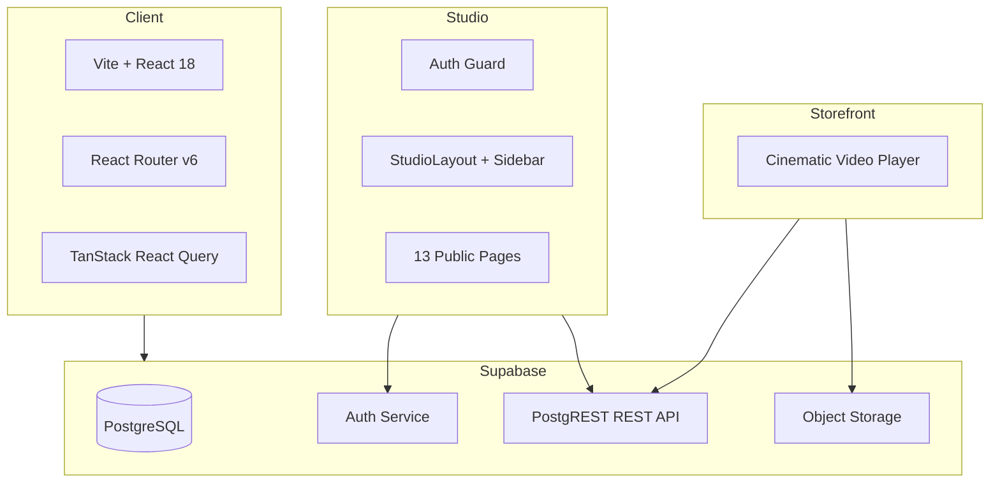
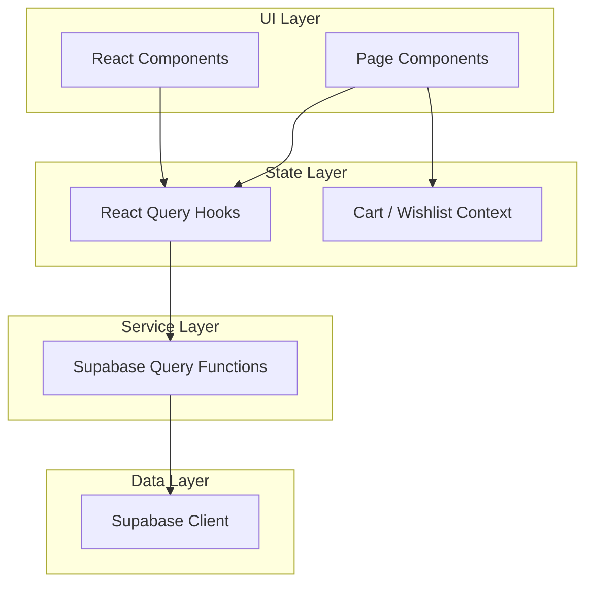

# Architecture

## System Overview



## Layer Architecture



## Data Flow

1. **Query flow**: Component → useQuery hook → service function → Supabase client → PostgREST → PostgreSQL → JSON response → component renders
2. **Mutation flow**: Component → useMutation hook → service function → Supabase client → PostgREST → PostgreSQL → cache invalidation → toast notification
3. **Auth flow**: Login form → authService.signIn → Supabase Auth → session token → AuthGuard validates → StudioLayout renders
4. **Video flow**: Component renders Film → src from hardcoded URL map or DB hero_video_url → HTML5 video autoplays → loops independently

## Component Hierarchy (Homepage)

```
Index
├── PageLayout (transparent)
│   ├── HopHeader
│   │   ├── Logo
│   │   ├── Nav Links
│   │   └── Cart/Wishlist icons
│   ├── HeroSection
│   │   ├── fetchFeaturedCollection()
│   │   └── Film (COLLECTION_VIDEOS.hero)
│   ├── CollectionStage
│   │   ├── fetchCollections()
│   │   └── 5× Film (hero_video_url → fallback)
│   ├── CraftSection
│   ├── ModernHeirlooms
│   └── JournalPreview
│       └── 3× Journal entry cards
└── HopFooter
```

## Studio Component Hierarchy

```
StudioLayout
├── StudioSidebar (9 nav items)
├── StudioHeader (title + breadcrumb)
└── Content Area
    ├── Dashboard (metric cards + recent widgets)
    ├── Orders (list + search + filters)
    ├── OrderDetail (customer + items + shipping + actions)
    ├── Products (grid)
    ├── ProductWorkspace (7 sections)
    ├── Collections (list)
    ├── CollectionWorkspace (form + media)
    └── ...
```

## React Query Key Conventions

| Pattern | Example |
|---------|---------|
| `["storefront", "entity"]` | `["storefront", "collections"]` |
| `["storefront", "entity", id]` | `["storefront", "product", pid]` |
| `["studio", "entity"]` | `["studio", "orders"]` |
| `["studio", "entity", id]` | `["studio", "order", oid]` |
| `["dashboard", "metric"]` | `["dashboard", "revenueToday"]` |

All cache invalidations use `queryClient.invalidateQueries({ queryKey: [...prefix] })` to invalidate by prefix.
