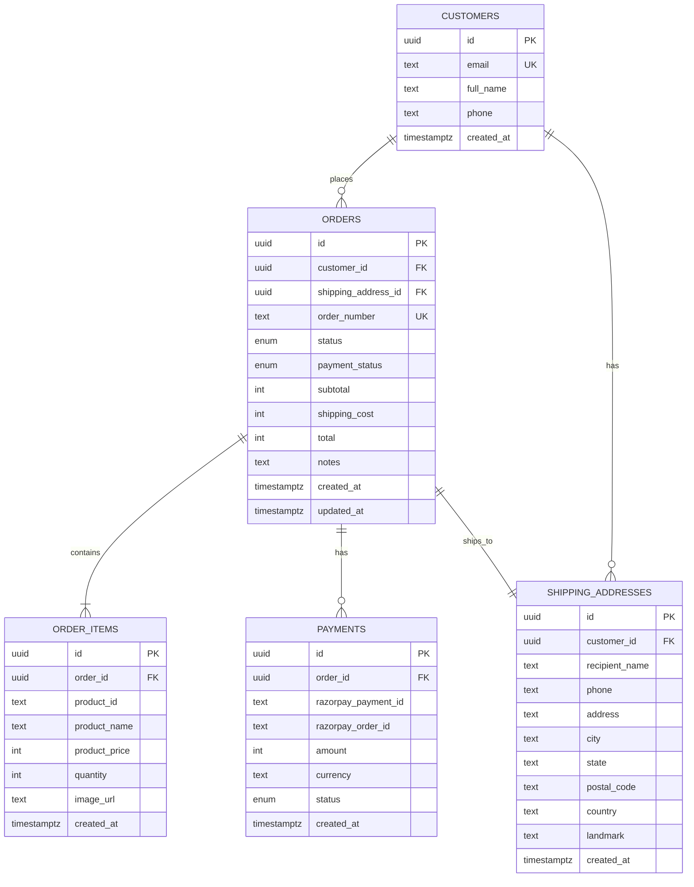
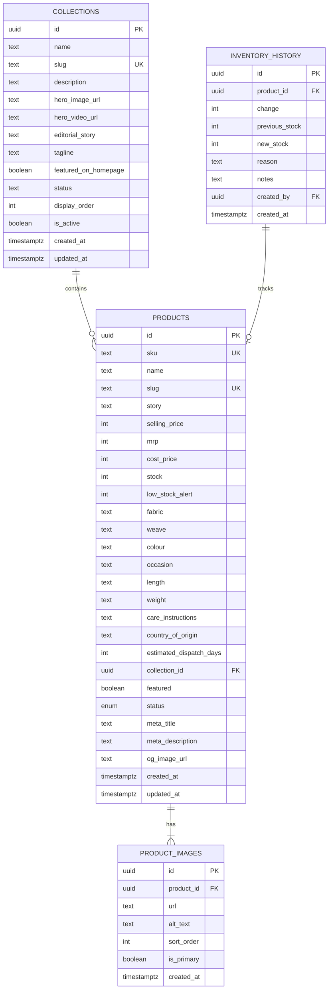

# Database Schema

## Entity Relationship



## Enums

### order_status
```
pending_payment | confirmed | processing | shipped | delivered | cancelled | returned
```

### payment_status
```
pending | paid | failed | refunded | partially_refunded
```

### payment_transaction_status
```
pending | paid | failed | refunded
```

## Products & Collections Schema



## Detailed per‑table references

| Table | Doc |
|-------|-----|
| `customers` | `docs/database/customers.md` |
| `shipping_addresses` | `docs/database/customers.md` |
| `orders` | `docs/database/orders.md` |
| `order_items` | `docs/database/orders.md` |
| `payments` | `docs/database/payments.md` |
| `collections` | `docs/database/collections.md` |
| `products` | `docs/database/products.md` |
| `product_images` | `docs/database/products.md` |
| `inventory_history` | `docs/database/inventory.md` |

## Indexes

| Table | Index |
|-------|-------|
| `customers` | `idx_customers_email` on `LOWER(email)` |
| `shipping_addresses` | `idx_shipping_addresses_customer_id` on `customer_id` |
| `orders` | `idx_orders_order_number` unique on `order_number` |
| `orders` | `idx_orders_customer_id` on `customer_id` |
| `orders` | `idx_orders_status` on `status` |
| `orders` | `idx_orders_payment_status` on `payment_status` |
| `order_items` | `idx_order_items_order_id` on `order_id` |
| `payments` | `idx_payments_order_id` on `order_id` |
| `products` | `products_sku_idx` unique on `sku` |
| `products` | `products_slug_idx` unique on `slug` |
| `products` | `products_collection_idx` on `collection_id` |
| `products` | `products_status_idx` on `status` where `status = 'active'` |
| `products` | `products_featured_idx` on `featured` where `featured = true` |
| `product_images` | `idx_product_images_product_id` on `(product_id, sort_order)` |
| `collections` | `collections_slug_idx` unique on `slug` |
| `collections` | `collections_active_idx` on `is_active` |
| `collections` | `idx_collections_featured` on `(featured_on_homepage, display_order)` where `featured_on_homepage = true AND status = 'published'` |
| `inventory_history` | `idx_inventory_history_product_id` on `product_id` |
| `inventory_history` | `idx_inventory_history_created_at` on `created_at DESC` |

## Functions (RPCs)

### `create_order()`
Transactional RPC that creates customer (find-or-create by email), shipping address, order, and order items in one atomic operation. Security definer — runs with superuser privileges.

### `generate_order_number()`
Generates `HOP-YYYYMMDD-XXXXXX` format order numbers using a sequence.

### `update_updated_at_column()`
Trigger function that sets `NEW.updated_at = NOW()`.
