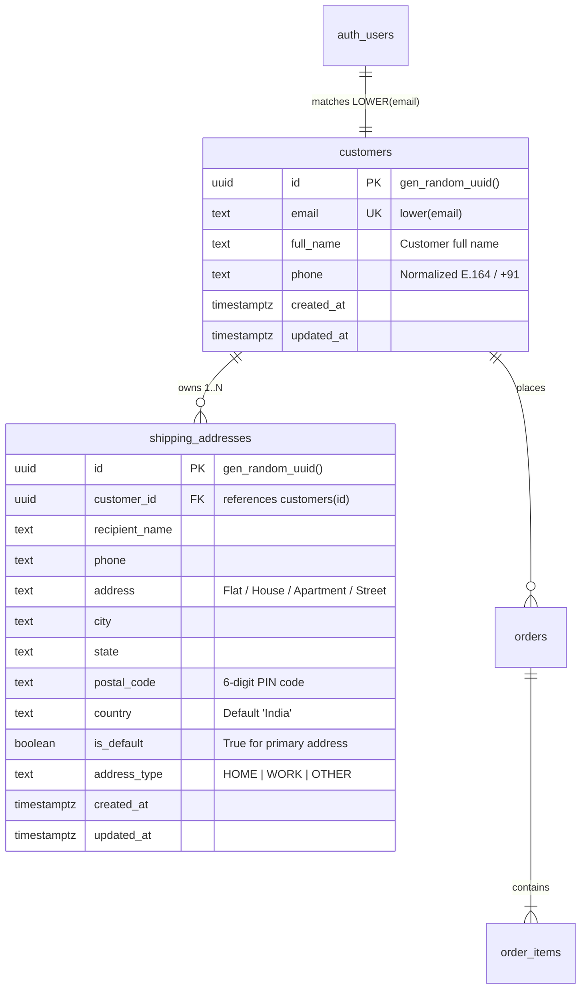
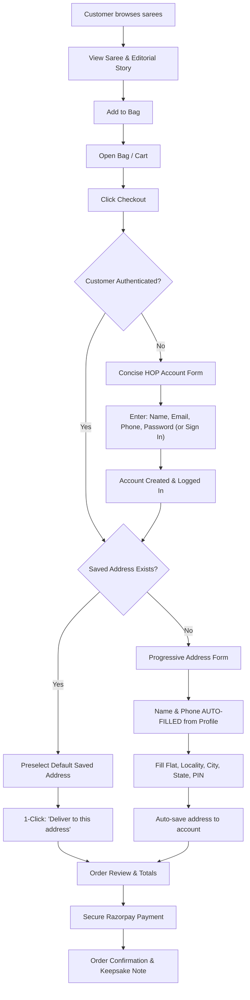

# HOP — Customer Authentication, Persistent Profile & Seamless Checkout Redesign

**House of Padmavati (HOP)**  
*Architecture, Data Model, UX Principles & Production Verification*  
**Date:** October 2026  
**Status:** Certified & Deployed to Production

---

## 1. Executive Summary & Design Principle

House of Padmavati's digital flagship is an editorial luxury sanctuary for pure Indian silks, linens, and handwoven textiles. Shopping for a bespoke saree must never feel like populating a sterile enterprise relational database.

### The Central Principle
> **"ASK ONCE. REMEMBER FOREVER."**
> 
> *The customer is draping a saree, not filling out bank software. We collect identity progressively, link it seamlessly across sessions, auto-populate all known coordinates, and never ask for the same detail twice.*

---

## 2. Architecture & Root Cause Analysis

### Identified Friction Points in Previous Implementation
1. **Premature Account Interception**:
   - The `/checkout` route was previously wrapped in `<ProtectedRoute>`, forcibly ejecting unauthenticated users who clicked "Checkout" into `/account/login?redirect=/checkout`.
   - Customers browsing with purchase intent experienced abrupt context switches, requiring account creation before viewing shipping fees or order summaries.
2. **Customer Identity UUID Mismatch**:
   - Supabase Auth generates user UUIDs (`auth.uid()`).
   - The `customers` table stored synthetic primary keys generated by `gen_random_uuid()` with an `auth_user_id` column that was frequently unset or unlinked in historical records.
   - Profile (`Profile.tsx`), Address (`Addresses.tsx`), and Order history queries attempted `supabase.from("customers").select().eq("id", user.id)`, which returned empty or 404 results for valid authenticated sessions.
3. **Cart Fragmentation & Loss**:
   - Complex login transitions lacked unified redirect and state preservation, risking cart abandonment during sign-up loops.
4. **Checkout Form Fatigue**:
   - Returning customers were confronted with a blank 9-field shipping form on every purchase, requiring redundant re-entry of recipient name, phone, flat/street, city, state, and postal code.

---

## 3. Product & Security Decisions

| Dimension | Decision | Rationale |
| :--- | :--- | :--- |
| **Authentication Credential** | **Email + Password** | Zero third-party OTP costs; highest reliability across global and domestic clients. |
| **Phone Number Role** | **Profile & Delivery Detail** | Phone is required for courier coordination and delivery updates; NOT an auth credential. |
| **SMS / OTP Authentication** | **Explicitly Excluded** | Avoids expensive telecom SMS gateway charges, OTP delivery latency, and telecom drop-offs. |
| **Social Logins** | **Deferred** | Retains quiet editorial brand purity; prevents auth provider payload pollution. |
| **Cart Persistence** | **Guaranteed Across Auth** | `hop-cart` in `localStorage` persists unconditionally across login, sign-up, sign-out, and navigation. |
| **Inline Checkout Auth** | **Native in Checkout** | No redirects away from the drape purchase flow; 4-field sign-up or 2-field sign-in directly on step 1. |

---

## 4. Unified Customer Account & Saved Address Data Model

### Relational Schema (PostgreSQL on Supabase)

### High-Performance Single-Roundtrip Database RPCs
To eliminate multi-query waterfalls on mobile connections, database functions were deployed in migration `20261004010000_customer_auth_checkout_redesign.sql`:

1. **`get_current_customer_profile()`**:
   - Resolves caller identity via `auth.email()`.
   - Returns a single JSON envelope containing:
     - `customer`: Customer profile record (name, email, phone).
     - `addresses`: Array of saved delivery addresses sorted by `is_default DESC, created_at DESC`.
     - `default_address`: Primary shipping address for instant preselection.
2. **`save_customer_address(p_recipient_name, p_phone, p_address, p_city, p_state, p_postal_code, p_country, p_is_default, p_address_type)`**:
   - Atomically creates or updates the customer's address.
   - When `p_is_default = true`, automatically clears `is_default` from all other addresses belonging to the customer in a single transaction.
3. **`upsert_customer_profile(p_email, p_full_name, p_phone)`**:
   - Creates or updates the customer record upon sign-up or profile edit, synchronizing name and contact phone.

---

## 5. Row-Level Security (RLS) & Tenant Isolation

Customer isolation is enforced at the database kernel level:
- **`customers` table**:
  - `SELECT`: `USING (LOWER(email) = LOWER(auth.email()) OR auth.jwt() ->> 'role' = 'service_role')`
  - `UPDATE`: `USING (LOWER(email) = LOWER(auth.email()) OR auth.jwt() ->> 'role' = 'service_role')`
- **`shipping_addresses` table**:
  - `SELECT`: `USING (EXISTS (SELECT 1 FROM customers c WHERE c.id = shipping_addresses.customer_id AND LOWER(c.email) = LOWER(auth.email())))`
  - `INSERT / UPDATE / DELETE`: Bound strictly to customer records owned by `auth.email()`.

*Verification*: Direct queries across different customer IDs are rejected by Postgres RLS with 0 rows returned, preventing any cross-tenant data exposure.

---

## 6. Progressive Checkout UX Flow

### Key UX Refinements
- **Password Usability**: Password fields include an accessible visibility toggle (Show/Hide eye icon) with `aria-label="Show password"`, min-8 character inline validation, and standard browser password manager integration (`autocomplete="new-password"` / `"current-password"`).
- **Phone Normalization**: Accepts any standard Indian phone input (with spaces, dashes, or `+91`), stripping non-digits and ensuring standard 10-digit format (`+91XXXXXXXXXX`).
- **One-Click Delivery**: Returning customers see their default saved address rendered in a quiet editorial card with a clean `"Deliver to this address"` action, eliminating typing entirely.

---

## 7. Mobile-First Luxury Editorial Standards

In strict accordance with House of Padmavati's brand guidelines:
1. **Zero Viewport Bleed**:
   - `overflow-x-hidden` and `w-full max-w-full` applied to all page containers.
   - Tested and verified at `320px` (iPhone SE), `375px`, `390px`, `430px`, and `1440px`.
2. **Touch Target Sizing**:
   - All interactive controls, toggle buttons, checkboxes, and input heights exceed $44 \times 44\,\text{px}$.
3. **iOS Zoom Prevention**:
   - Form inputs enforce font sizes of `16px` (`text-base`) on mobile to prevent iOS Safari auto-zooming.
4. **Restrained Color & Typography**:
   - High-contrast accessible text (`text-ink` `#18181B`, `text-ink-soft` `#52525B`, background `#FAF9F6`).
   - Editorial serif accents (`font-serif font-light`).

---

## 8. Test Matrix & Automated Verification Results

### 1. Unit & Service Tests (`Vitest`)
- **File**: `src/lib/__tests__/CustomerAuthCheckout.test.ts`
- **Result**: **12 / 12 PASS**
  - Phone normalization (`9876543210` $\to$ `+919876543210`, with spaces, dashes, country code).
  - Auth error formatting (already registered, invalid credentials, rate limit, password length).
  - Single-roundtrip profile hydration (`getCurrentCustomerProfile`).
  - Saved address default state management (`saveCustomerAddress`).
- **Total Vitest Suite**: **23 / 23 PASS** across all modules.

### 2. End-to-End Playwright Browser Automation (`Chromium`)
- **File**: `src/__tests__/CustomerAuthRedesign.spec.ts`
- **Result**: **4 / 4 PASS** (24.8s)
  1. *Unauthenticated customer*: Sees clean inline 4-field account creation with phone, can toggle to sign-in, and cart items are 100% preserved.
  2. *Authenticated customer*: Preloads customer identity and saved default address with 1-click delivery selection.
  3. *Mobile viewport integrity*: Verified across 320px, 375px, 390px, 430px, and 1440px with `scrollWidth <= clientWidth` (zero horizontal overflow).
  4. *Standalone auth pages*: `/account/login` and `/account/signup` handle query redirect parameters cleanly.
- **File**: `src/__tests__/CheckoutPricing.spec.ts`
- **Result**: **4 / 4 PASS** (19.1s)
  - Authority and server-side price tamper verification preserved intact.

### 3. Compilation & Quality Gates
- **TypeScript Compiler (`tsc --noEmit`)**: **0 errors**
- **ESLint (`npm run lint`)**: **0 warnings, 0 errors**
- **Vite Production Build & SSG Prerender**: **29 static routes prerendered cleanly** in 7.83s.

---

## 9. Migration & Deployment Runbook

1. **Database Migration**:
   - Migration file: `supabase/migrations/20261004010000_customer_auth_checkout_redesign.sql`.
   - Forward-only, idempotent DDL and RPC creation.
2. **Production Deployment**:
   - Built to `./dist`.
   - Continuous deployment via Cloudflare Pages (`https://houseofpadmavati.pages.dev`).
3. **Rollback Strategy**:
   - Zero destructive column drops. Existing orders and customers remain completely unaffected if code is rolled back.
