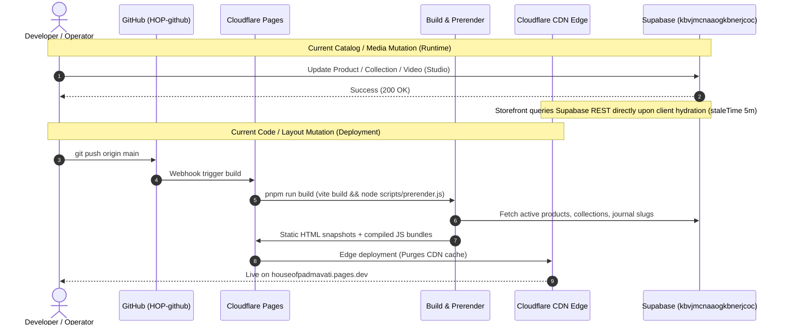

# HOP — MASTER STUDIO, SITE MANAGEMENT & PRODUCTION OPERATIONS AUDIT

**Document Identifier:** HOP-STUDIO-AUDIT-2026-10-09  
**Audit Standard:** Strict Read-Only Evidence Discipline (Zero Assumptions, Zero Destructive Mutations)  
**Target Environment:** Production (`https://houseofpadmavati.pages.dev`)  
**Backend Infrastructure:** Supabase Cloud (`kbvjmcnaaogkbnerjcoc`, AWS `ap-south-1` Mumbai)  
**Execution Timestamp:** 2026-10-09T05:30:00+05:30  
**Audit Scope:** Complete Studio Control Room, Media Management Architecture, Content Ownership, Publishing & Deployment Pipeline, Security Boundaries, and Site Update Feasibility  

---

## 1. Executive Verdict

### Operational Verdict: CONDITIONALLY OPERATIONAL WITH CRITICAL SECURITY BLOCKER & MAJOR SYSTEMIC DISCONNECTS

HOP Studio provides an elegant, specialized atelier interface for managing core e-commerce records—specifically product listings, collection details, collection films, and customer order statuses. Catalog mutations (such as updating product stories, pricing, stock levels, or collection hero films) write directly to Supabase PostgreSQL and propagate immediately to the public storefront at runtime without requiring a frontend deployment or CDN cache invalidation.

However, a comprehensive, evidence-based audit of the live production environment, code repository, and database policies reveals that **the Studio cannot currently be used by the business owner to independently manage the website**. Four overarching architectural barriers prevent safe, autonomous owner operation:

1. **Critical Security Vulnerability (P0-SEC-01):** An unauthenticated edge function (`update-admin-user`) has been deployed to the live production Supabase instance (`kbvjmcnaaogkbnerjcoc`). This function accepts arbitrary HTTP POST requests with `{ email, password, role }` and uses the Supabase Service Role Key to elevate or create users with `app_metadata.role = 'admin'` with email auto-confirmation. Any anonymous internet user with the public publishable key can grant themselves administrative privileges, completely breaching all database and storage security controls.
2. **Broken Media Library Ingestion (P1-MED-01):** Standalone media upload in `/studio/media` is broken in production. Uploading an image executes an `INSERT` into `public.product_images` without providing a `product_id`. Because the PostgreSQL schema enforces `product_id uuid NOT NULL REFERENCES products(id)`, the database rejects the row with SQL error 23502. The file is uploaded to the storage bucket as an unindexed orphan and never appears in the Media Library. Uploading a video stores the binary in `HOP-films`, but writes no database record; because the media listing query discovers films solely from the `collections` table, the uploaded video is invisible in the library.
3. **Disconnected Studio Settings (P1-SET-01):** Studio Settings (`/studio/settings`) allows an operator to configure Brand Identity, Contact Info, Shipping Rates, and SEO Metadata. While these settings save successfully to `public.settings` (`store_settings`), the public storefront almost entirely ignores them. Brand name and tagline are hardcoded in React JSX (`HopFooter.tsx`); shipping policy copy is hardcoded in `ShippingPolicy.tsx`; order shipping costs in the checkout edge function check a legacy scalar row (`standard_shipping_cost`) rather than the JSON settings object; and SEO/analytics parameters (GA4, GTM, Meta Pixel) are never injected into the DOM or HTML.
4. **Hardcoded Storefront & Split Journal Pipeline (P1-JOU-01):** The homepage is largely composed of hardcoded TypeScript content (`WORLD_COPY`, `HOUSE_NOTES`, Craft section, Philosophy section, Invitation section). The Homepage Journal section (`HomepageExperience.tsx`) directly imports static data (`src/data/journalArticles.ts`), bypassing the `public.journal_articles` database table entirely. Articles published in Studio appear on `/journal`, but never appear on the live Homepage. Furthermore, if an article shares a slug with a seeded article, the storefront overrides its database image with the bundled local file path, preventing image updates.

Until these defects are remediated and a unified, structured **Site Update** workspace is implemented, any routine change to brand copy, homepage narratives, policies, or layout requires developer intervention, manual code modifications, and a Cloudflare Pages redeployment.

---

## 2. Actual Production Baseline

The production environment was inspected using safe, non-destructive network requests, local build checks, and static analysis.

### 2.1 Git & Working-Tree State
- **Repository:** `HOP-github`
- **Active Branch:** `main` (tracking `origin/main`, completely up to date)
- **HEAD Commit:** `f312c644462541bcfbe65d707fc690dd2125706f`  
  *Message:* `fix: add missing useCallback import in Studio Settings; update package.json`  
  *Timestamp:* Fri Oct 9 03:32:21 2026 +0530
- **Working Tree:** Clean. No modified tracked files.
- **Untracked Local Files:**
  - `HOP_FINAL_COMPLETION_REPORT.md` (Operational report dated 2026-10-08)
  - `HOP_FINAL_COMPLETION_TODO.md` (Checklist dated 2026-10-08)
  - `supabase/functions/update-admin-user/` (Untracked edge function containing `index.ts`, created 2026-10-09 03:15 AM)

### 2.2 Live Deployed Frontend Fingerprint
- **Public Canonical URL:** `https://houseofpadmavati.pages.dev`
- **HTTP Status:** `200 OK` (tested via `curl.exe -I`)
- **Hosting Provider:** Cloudflare Pages (Edge Server: `cloudflare`, Ray ID: `a478e08a4be09379-MAA`)
- **Response Headers:**
  - `ETag: "f2081d8333f53868a50e3ead9e9ec8c0"`
  - `Strict-Transport-Security: max-age=31536000; includeSubDomains; preload`
  - `Cache-Control: public, max-age=0, must-revalidate` (HTML shell)
- **Deployed Asset Fingerprint:**
  - Entry Script: `/assets/index-fTXM203m.js` (Exact byte-for-byte match with local `dist/assets/index-fTXM203m.js` built on 2026-10-09 03:32 AM from commit `f312c64`)
  - Primary CSS: `/assets/index-C_sP9miN.css` (140,095 bytes)
  - Logo Signature: `/assets/hop-logo-signature-NxRPUGIp.png`
- **Dehydrated React Query State in HTML:**
  - Contains hydrated cache entry for queryKey `["public_store_settings"]` with brand, contact, shipping, and the newly added `homepage_cinematic_video` configuration (`video_url: ""`, `poster_url: ""`, `alt_text: "House of Padmavati — Homepage cinematic film"`).

### 2.3 Production Supabase Baseline
- **Project Reference:** `kbvjmcnaaogkbnerjcoc`
- **Region:** AWS `ap-south-1` (Mumbai, India)
- **Database Engine:** PostgreSQL 17.6 (`aarch64-unknown-linux-gnu`)
- **Database URL:** `https://kbvjmcnaaogkbnerjcoc.supabase.co`
- **Applied Migrations in Codebase:** 33 migration files in `supabase/migrations/`
  - Latest migration: `20261009000000_add_homepage_cinematic_video.sql` (adds `homepage_cinematic_video` to `get_public_store_settings()` RPC).

### 2.4 Codebase Quality & Compilation Verification
- **TypeScript:** `npx tsc --noEmit` exited with code `0` (0 errors).
- **ESLint:** `npm run lint` exited with code `0` (0 errors).
- **Unit Tests:** `npx vitest run` executed 23 tests across 3 suites; **23 / 23 PASS** (3.21s duration).
  - `src/lib/__tests__/supabaseImage.test.ts` (8 passed)
  - `src/lib/__tests__/formatPrice.test.ts` (3 passed)
  - `src/lib/__tests__/CustomerAuthCheckout.test.ts` (12 passed)

---

## 3. Complete Studio Route & Feature Inventory

Every Studio route, page, component, and data flow was inspected. The table below documents the 10 core questions and definitive status for each capability.

| Capability | In Code? | In Nav? | Admin Opens? | Renders Clean? | Reads/Writes DB? | Storefront Propagation? | Requires Deploy? | Preview / Validation? | Usable by Owner? | Evidence & Audit Verification | Status |
| :--- | :---: | :---: | :---: | :---: | :---: | :---: | :---: | :---: | :---: | :--- | :---: |
| **Dashboard** (`/studio`) | Yes | Yes | Yes | Yes | Yes (Read-only) | N/A (Admin only) | No | Yes (metrics & quick links) | Yes | `src/studio/pages/Dashboard.tsx`; aggregates collections, products, media count, and audit log. | **VERIFIED WORKING** |
| **Products List** (`/studio/products`) | Yes | Yes | Yes | Yes | Yes (`products`) | Yes (Catalog sync) | No | Search, filter, status toggles | Yes | `src/studio/pages/Products.tsx`; binds to `productService.fetchProducts()`. | **VERIFIED WORKING** |
| **Product Workspace** (`/studio/products/:id`) | Yes | Child of Products | Yes | Yes | Yes (`products`, `product_images`) | Yes (Immediate) | No | Broken draft preview (404); validation present | Partial (Exposes paise & technical fields) | `src/studio/pages/ProductWorkspace.tsx`; mutations reach live product page, but preview fails for drafts. | **PARTIALLY WORKING** |
| **Product Photography & Galleries** | Yes | In Product Workspace | Yes | Yes | Yes (`product-images` bucket, `product_images` table) | Yes | No | Upload, primary flag, reorder, delete working | Yes | `MediaWorkspace.tsx`; `uploadImage` links file to `productId` with sort order. | **VERIFIED WORKING** |
| **Collections Directory** (`/studio/collections`) | Yes | Yes | Yes | Yes | Yes (`collections`) | Yes | No | Display order, status | Yes | `src/studio/pages/Collections.tsx`; lists 5 core worlds. | **VERIFIED WORKING** |
| **Collection Workspace** (`/studio/collections/:id`) | Yes | Child of Collections | Yes | Yes | Yes (`collections`) | Yes | No | Broken draft preview (404); video validation active | Partial (Exposes slug & display order) | `src/studio/pages/CollectionWorkspace.tsx`; updates tagline, narrative, status. | **PARTIALLY WORKING** |
| **Collection Films** | Yes | In Collection Workspace | Yes | Yes | Yes (`HOP-films` bucket, `collections.hero_video_url`) | Yes (Homepage & room) | No | Duration, format, bitrate validation active | Yes | `videoValidation.ts` enforces 60s max, MP4/WebM, 30MB limit. Updates live film player. | **VERIFIED WORKING** |
| **Homepage Cinematic Video** | Yes | No (Buried in Settings) | Yes | Yes | Yes (`settings.store_settings`) | Yes (via RPC) | No | File validation present; no visual preview | Partial (Buried in Settings, not Homepage) | Migration `20261009000000`, `Settings.tsx` Cinematic tab; propagates to `HomepageCinematicVideo.tsx`. | **PARTIALLY WORKING** |
| **Media Library** (`/studio/media`) | Yes | Yes | Yes | Yes | Read works; **Upload Broken** | No (Upload fails) | No | Search/filter works; usage check active; upload fails | No (Upload fails with SQL error) | `src/studio/services/mediaService.ts`; `uploadMedia` lacks `product_id`, fails not-null constraint. | **BROKEN** |
| **Journal / Editorial** (`/studio/journal`) | Yes | Yes | Yes | Yes | Yes (`journal_articles`) | Partial (Reaches `/journal`, **bypasses Homepage**) | No (for `/journal`); Yes (for Homepage) | No preview mode; no image upload button | No (Requires typing raw asset paths) | `src/studio/pages/Journal.tsx`; articles write to DB, but Homepage Journal reads static file. | **PARTIALLY WORKING** |
| **Inventory Management** (`/studio/inventory`) | Yes | Yes | Yes | Yes | Yes (`products`, `inventory_history`) | Yes (Stock level) | No | Low stock indicators, reason tracking | Yes | `inventoryService.ts`; calls atomic `adjust_product_stock` RPC with row locking. | **VERIFIED WORKING** |
| **Orders Oversight** (`/studio/orders`) | Yes | Yes | Yes | Yes | Yes (`orders`) | N/A (Backoffice) | No | Filter by payment/fulfillment status | Yes | `src/studio/pages/Orders.tsx`; reads live orders and revenue metrics. | **VERIFIED WORKING** |
| **Order Detail** (`/studio/orders/:id`) | Yes | Child of Orders | Yes | Yes | Yes (`orders`, `order_items`, `payments`) | N/A (Backoffice) | No | Status update action working | Yes | `src/studio/pages/OrderDetail.tsx`; updates status to shipped/delivered/cancelled. | **VERIFIED WORKING** |
| **Customer Directory** (`/studio/customers`) | Yes | Yes | Yes | Yes | Yes (`customers`, `orders`) | N/A (Backoffice) | No | Lifetime value, order history list | Yes | `src/studio/pages/Customers.tsx`; aggregates customer spend. | **VERIFIED WORKING** |
| **Studio Settings** (`/studio/settings`) | Yes | Yes | Yes | Yes | Yes (`settings.store_settings`) | **NO** (Only Instagram/Pinterest URLs propagate) | Yes (to change actual brand/shipping text) | Validation on numbers; no live preview | No (Changes do not affect website) | `Settings.tsx` & `settingsService.ts`; saves to DB, but storefront ignores 90% of fields. | **BROKEN (FUNCTIONALLY DISCONNECTED)** |
| **Activity & Audit Log** (`/studio/activity`) | Yes | Yes | Yes | Yes | Yes (`studio_activities` + localStorage) | N/A (Admin only) | No | Filter by entity type | Yes | `src/studio/pages/Activity.tsx`; dual writes to DB and localStorage. Missing settings changes. | **PARTIALLY WORKING** |
| **Shipping & Care Content** | No | No | No | N/A | No | No | Yes | None | No | Content hardcoded in `ShippingPolicy.tsx` and `CustomerCare.tsx`. | **MISSING** |
| **Brand Information Editor** | Form exists | Tab in Settings | Yes | Yes | Writes to DB | **No (Storefront hardcodes brand)** | Yes | None | No (Changes ignored by website) | Brand name and tagline hardcoded in `HopFooter.tsx` JSX. | **BROKEN (DISCONNECTED)** |
| **SEO & Metadata Editor** | Form exists | Tab in Settings | Yes | Yes | Writes to DB | **No (Storefront hardcodes metadata)** | Yes | None | No (Changes ignored by website) | `useMetadata.ts` and `index.html` ignore `settings.store_settings->seo`. | **BROKEN (DISCONNECTED)** |
| **Unified Site Update Workspace** | No | No | No | N/A | No | No | Yes | None | No | No page, section navigation, or visual editor exists. | **MISSING** |

---

## 4. Media Architecture Inventory

Visual storytelling is central to House of Padmavati. The table below maps every asset type, its physical storage location, database registration, frontend consumer, and whether owner management is possible without code modification.

### 4.1 Asset Type Mapping

| Asset Type | Storage Location | Database Table | Upload Service | Frontend Consumer | Can Owner Manage Today? |
| :--- | :--- | :--- | :--- | :--- | :---: |
| **Product Primary Photography** | `product-images` bucket | `public.product_images` (`is_primary = true`) | `productService.uploadImage` | `ProductGallery.tsx`, `ProductDetail.tsx`, Cart, Checkout | **YES** (via Product Workspace) |
| **Product Gallery Photography** | `product-images` bucket | `public.product_images` (`is_primary = false`) | `productService.uploadImage` | `ProductGallery.tsx`, `ProductDetail.tsx` | **YES** (via Product Workspace) |
| **Collection Hero Stills (Posters)** | `HOP-films` bucket | `public.collections.hero_image_url` | `collectionService.uploadCollectionFile` | `Film.tsx`, `Category.tsx`, Homepage Threshold | **YES** (via Collection Workspace) |
| **Collection Cinematic Films** | `HOP-films` bucket | `public.collections.hero_video_url` | `collectionService.uploadCollectionFile` | `Film.tsx`, Homepage Collection Rooms | **YES** (via Collection Workspace) |
| **Homepage Cinematic Video** | `HOP-films` bucket | `public.settings` (`homepage_cinematic_video.video_url`) | `Settings.tsx` (`handleCinematicVideoUpload`) | `HomepageCinematicVideo.tsx` | **YES** (via Settings tab) |
| **Homepage Video Poster Frame** | `HOP-films` bucket | `public.settings` (`homepage_cinematic_video.poster_url`) | Auto-extracted frame via canvas | `HomepageCinematicVideo.tsx` | **YES** (via Settings tab) |
| **Journal Cover Images** | `src/assets/*.jpg` (Static) OR manual URL | `public.journal_articles.img` | None (Manual string input in text box) | `Journal.tsx`, `JournalDetail.tsx` | **PARTIAL** (No upload; static files override DB) |
| **Images in Journal Articles** | `src/assets/*.jpg` (Static) | None | None | `JournalDetail.tsx` | **NO** (Requires developer code edit) |
| **Homepage Section Stills (Craft/World)** | `src/assets/*.jpg` (Static) | None | None | `HomepageExperience.tsx` (`WORLD_COPY`) | **NO** (Requires developer code edit) |
| **Brand Monograms, Logos, Seals** | `src/assets/*.png` (Static) | None | None | `Monogram.tsx`, `HopFooter.tsx`, Nav | **NO** (Requires developer code edit) |
| **Editorial Lookbook Photography** | `src/assets/*.jpg` (Static) | None | None | `Lookbook.tsx` | **NO** (Requires developer code edit) |

### 4.2 Storage Buckets & Policies
1. **`product-images` (Public: Yes)**
   - Policy `Public can read product-images`: Public unauthenticated `SELECT`.
   - Policy `Admins can upload product-images`: `INSERT` permitted for `authenticated` users where `public.is_admin() = true`.
   - Policy `Admins can update product-images`: `UPDATE` permitted for admins.
   - Policy `Admins can delete product-images`: `DELETE` permitted for admins.
2. **`HOP-films` (Public: Yes)**
   - Policy `Public can read HOP-films`: Public unauthenticated `SELECT`.
   - Policy `Admins can upload HOP-films`: `INSERT` permitted for admins.
   - Policy `Admins can update HOP-films`: `UPDATE` permitted for admins.
   - Policy `Admins can delete HOP-films`: `DELETE` permitted for admins.

### 4.3 Media System Capability Assessment
- **Upload and Replace:** Functional in Product and Collection workspaces. Broken in standalone Media Library.
- **Preview and Metadata:** Image previews and video playback work in Studio. Alt text can be edited for `product_images`, but not for collection films or journal covers.
- **Search and Filtering:** Implemented in `Media.tsx` by keyword and type (`all`, `image`, `video`).
- **Folders, Categories, or Tags:** Virtual folder tabs exist (`films`, `products`, `collections`), but no physical folder structure or custom tagging exists.
- **Asset Usage & Reference Tracking:** `checkMediaUsage` function in `mediaService.ts` checks collections, product images, and cinematic video before deletion.
- **Dimensions, File Size & Optimization:** Handled at runtime via `supabaseImage.ts` (transforms Supabase Storage URLs to requested width, height, and WebP format via Supabase image transformation parameters). File size and dimensions are not stored in database.
- **Upload Progress & Failure Recovery:** Linear indeterminate spinner. No chunked or resumable uploads (uploads will fail on mobile network dropouts).
- **Safe Deletion & Orphan Detection:** Deletion checks usage; if referenced, displays an alert dialog. However, deleting a media asset permanently deletes the storage object with no trash/restore retention.

---

## 5. Content Source-of-Truth Map

This map reveals where public content originates versus where the owner attempts to change it.

| Content Element | Authoritative Source | Studio Edit Point | Public Storefront Consumer | Disconnect & Practical Effect on Owner |
| :--- | :--- | :--- | :--- | :--- |
| **Product Pricing & Stories** | `public.products` | `/studio/products/:id` | `ProductDetail.tsx`, Catalog | **Synchronized:** Edits publish immediately. |
| **Product Stock & Alerts** | `public.products` | `/studio/inventory` | AddToBag, Checkout | **Synchronized:** Edits publish immediately via atomic RPC. |
| **Collection Worlds Copy** | `HomepageExperience.tsx` (`WORLD_COPY`) | None | `HomepageExperience.tsx` | **Hardcoded Mismatch:** Titles ("The threshold", "After-light") and subtitles cannot be changed in Studio. |
| **Homepage Craft Narrative** | `HomepageExperience.tsx` | None | `HomepageExperience.tsx` | **Hardcoded Mismatch:** "The cloth has memory" narrative requires a code commit to update. |
| **Homepage Ownership Notes** | `HomepageExperience.tsx` (`HOUSE_NOTES`) | None | `HomepageExperience.tsx` | **Hardcoded Mismatch:** "The hand", "The keeping", "The giving" are hardcoded in React. |
| **Homepage Journal Section** | `src/data/journalArticles.ts` | `/studio/journal` | `HomepageExperience.tsx` | **Disconnected Pipeline:** Studio updates `journal_articles` table; Homepage reads static TypeScript. Articles published in Studio never reach the Homepage. |
| **Store Name & Brand Tagline** | `HopFooter.tsx` (JSX) | `/studio/settings` (Brand tab) | `HopFooter.tsx` | **Hardcoded Mismatch:** Owner types new tagline in Studio; footer continues showing "To the woman who wove my world." |
| **Social Links (Instagram/Pinterest)** | `public.settings` (`store_settings`) | `/studio/settings` (Contact tab) | `HopFooter.tsx` | **Synchronized:** Footer dynamically binds to settings RPC. |
| **Customer Care Contact Info** | `CustomerCare.tsx` (JSX) | `/studio/settings` (Contact tab) | `CustomerCare.tsx` | **Disconnected Mismatch:** Studio fields (phone, WhatsApp, atelier address) are never displayed to customers. |
| **Shipping Charges & Policies** | `ShippingPolicy.tsx` (JSX) & `create-razorpay-order` | `/studio/settings` (Shipping tab) | `/shipping-policy` & Checkout | **Disconnected Mismatch:** Studio shipping rates (standard, express, tax) are ignored by checkout and policy page. |
| **SEO Metadata & Analytics** | `useMetadata.ts` & `index.html` | `/studio/settings` (SEO tab) | Document `<head>` | **Hardcoded Mismatch:** GA4, GTM, Meta Pixel IDs saved in Studio are never injected into the website. |

---

## 6. Settings Audit

A dedicated investigation of `/studio/settings` was conducted.

### 6.1 Route Availability & Admin Access
- The route `/studio/settings` is defined in `src/App.tsx` (line 140) wrapped in `StudioRoute` (`AuthGuard`).
- When an authorized administrator logs in, the page renders without console errors (commit `f312c64` resolved the previous missing `useCallback` import error).

### 6.2 Data Persistence Mechanism
- Fetching: `settingsService.fetchSettings()` executes:
  ```ts
  supabase.from("settings").select("key, value").eq("key", "store_settings").maybeSingle()
  ```
- Saving: `settingsService.saveSettings(form)` executes:
  ```ts
  supabase.from("settings").upsert({ key: "store_settings", value: settings, updated_at: new Date().toISOString() }, { onConflict: "key" })
  ```
- RLS Policy: Governed by `settings_admin_all` (requires `public.is_admin() = true`).

### 6.3 Detailed Tab Evaluation

#### Tab 1: Brand
- **Fields:** Store Name, Tagline, Business Email, Business Phone, Business Address.
- **Evaluation:** Saves to database row `store_settings`.
- **Storefront Effect:** **0% effective**. The storefront footer (`HopFooter.tsx`) hardcodes the brand name and tagline in lines 51–55. Business email and address are never rendered on any storefront page.

#### Tab 2: Contact
- **Fields:** Support Email, Support Phone, WhatsApp Number, Instagram URL, Pinterest URL, Atelier Address.
- **Evaluation:** Saves to database row `store_settings`.
- **Storefront Effect:** **Partially effective (33%)**. `HopFooter.tsx` reads `instagram_url` and `pinterest_url` via `usePublicSettings()`. However, `support_email`, `support_phone`, `whatsapp_number`, and `atelier_address` are ignored across all public pages (including `/customer-care`).

#### Tab 3: Shipping
- **Fields:** Origin Country, Currency, Free Shipping Threshold (in paise), Standard Rate, Express Rate, Overnight Rate, Tax Rate (%), Low Stock Threshold, Out of Stock Behaviour, Allow Negative Stock.
- **Evaluation:** Saves to database row `store_settings`.
- **Storefront Effect:** **0% effective**.
  - `/shipping-policy` contains static text stating a flat ₹99 fee.
  - The database order creation procedure (`create_order` in `20260928000004_first_order_benefit.sql`) queries `settings` for `WHERE key = 'standard_shipping_cost'`, ignoring `store_settings->shipping`.
  - The operator is required to calculate and input amounts in paise (e.g., typing `500000` for ₹5,000), causing extreme cognitive friction.

#### Tab 4: SEO
- **Fields:** Default Meta Title, Default Meta Description, Google Analytics ID, Google Tag Manager ID, Facebook Pixel ID.
- **Evaluation:** Saves to database row `store_settings`.
- **Storefront Effect:** **0% effective**. `src/hooks/useMetadata.ts` hardcodes `SITE_NAME = "House of Padmavati"`, `BASE_URL = "https://houseofpadmavati.com"`, and `TWITTER_HANDLE = "@houseofpadmavati"`. Neither `index.html` nor any React script ever injects GA4, GTM, or Pixel scripts based on these settings.

#### Tab 5: Security
- **Fields:** Session Timeout (minutes), Require Two-Factor Authentication, Allowed Studio Roles (`admin`, `manager`, `editor`, `viewer`).
- **Evaluation:** Saves to database row `store_settings`.
- **Storefront Effect:** **0% effective (Phantom Settings)**. Neither Supabase Auth nor Studio `AuthGuard` or `usePermissions` reads these settings. Session timeouts and 2FA are dictated exclusively by Supabase cloud project settings, and role authorization is hardcoded to `app_metadata.role = 'admin'`.

#### Tab 6: Cinematic Video
- **Fields:** Video URL, Poster URL, Alt Text, and "Upload Video" button.
- **Evaluation:** **100% effective**. Added in commit `dad8b2e` and migration `20261009000000`. Validates video duration and file size, extracts poster frame, uploads to `HOP-films`, and updates `homepage_cinematic_video`. Propagates to `HomepageCinematicVideo.tsx` on the live homepage via `get_public_store_settings()`.

---

## 7. Site Update Feasibility & Recommended Architecture

The owner requires a unified workflow:  
**Studio → Site Update → Select page → Select section/content → Edit → Preview → Save draft → Publish.**

### 7.1 Feasibility Assessment
The existing application **can support this experience**, but only if structured content boundaries are introduced. React components cannot be made magically editable without a defined runtime data model.

We divide the website into three explicit architectural buckets:

#### Bucket A: Runtime Database Content (Publishes Immediately, 0 Deployments Required)
- Product information, pricing, stock, craft stories, fabric, weave, colour, and photography.
- Collection narratives, taglines, display orders, poster stills, and cinematic films.
- Homepage Cinematic Video (video URL, poster, alt text).
- Journal articles, excerpts, tags, and cover images (once Homepage query is fixed).
- Social links (Instagram, Pinterest) and contact coordinates.
- Homepage section text and section-level image references (once moved to database).
- Policy page text and FAQ entries (once moved to database).

#### Bucket B: Code & Layout Changes (Requires Build & Deployment)
- Core React component markup, layout hierarchy, and DOM structure.
- Tailwind CSS styling, color schemes, font definitions, and CSS animations.
- New page routes and URL paths.
- Third-party SDK integrations (Razorpay checkout library, analytics script tags).
- Database migrations and Supabase Edge Functions.

#### Bucket C: Features Requiring Structured Content Modeling Before Editing
- **Homepage Section Arrangement:** Ability to reorder, hide, or swap sections (Hero, Worlds, Drape, Craft, Philosophy, Ownership, Journal, Invitation).
- **Collection Worlds Copy:** Moving `WORLD_COPY` from static code into a queryable structure.
- **Ownership House Notes:** Moving `HOUSE_NOTES` into structured records.
- **Legal Policies:** Moving Shipping, Returns, Privacy, and Terms text out of JSX into database-managed markdown documents.

### 7.2 Smallest Realistic Architecture (Zero Full-Rebuild)
Rather than introducing heavy third-party headless CMS systems (such as Sanity, Strapi, or Contentful) that increase latency and hosting costs, HOP should leverage its existing Supabase PostgreSQL instance:

```
┌────────────────────────────────────────────────────────────────────────┐
│                        SUPABASE POSTGRESQL                             │
│                                                                        │
│  TABLE: public.site_sections                                           │
│  - id: UUID                                                            │
│  - page_slug: TEXT ('home', 'about', 'care', 'shipping', 'brand')      │
│  - section_key: TEXT ('hero', 'cinematic', 'worlds', 'craft', etc.)    │
│  - draft_content: JSONB (title, subtitle, body, media_url, links)      │
│  - published_content: JSONB                                            │
│  - display_order: INT                                                  │
│  - is_visible: BOOLEAN                                                 │
│  - updated_at / published_at: TIMESTAMPTZ                              │
└───────────────────────────────────┬────────────────────────────────────┘
                                    │
           ┌────────────────────────┴────────────────────────┐
           ▼                                                 ▼
┌──────────────────────────────┐          ┌──────────────────────────────┐
│       HOP STOREFRONT         │          │      STUDIO SITE UPDATE      │
│   (houseofpadmavati.pages.dev)│          │     (/studio/site-update)    │
│                              │          │                              │
│ - Queries published_content  │          │ - Visual Page/Section Nav    │
│ - Fallback to code defaults  │          │ - Field-level Form Controls  │
│ - Instant runtime update     │          │ - Media Library Asset Picker │
│ - 0 deployments needed       │          │ - Responsive Live Preview    │
│                              │          │ - One-Click Publish / Draft  │
└──────────────────────────────┘          └──────────────────────────────┘
```

---

## 8. Publishing & Deployment Architecture

### 8.1 Current Production Publishing Workflow


### 8.2 Prerendering & Cache Freshness Analysis
- **Prerender Mechanism (`scripts/prerender.js`):** At build time, a headless Chromium browser opens all 29+ known routes on `localhost:8080`, waits for `window.__PRERENDER_STATUS === "ready"`, extracts the dehydrated React Query cache, and injects `<script>window.__REACT_QUERY_STATE__ = ...</script>` into static HTML files.
- **Client Hydration:** When a customer visits the website, React hydrates from the dehydrated state immediately, then triggers background revalidation via TanStack Query.
- **Content Freshness:** Because client browsers revalidate against Supabase REST, database catalog updates are visible to human visitors within 5 minutes without a deployment. However, web crawlers that do not execute JavaScript receive the static HTML snapshot generated at the last build.

### 8.3 Safe Triggering of Code Deployments from Studio
If the owner modifies layout, CSS, or static policies that require a build:
1. **Never expose Cloudflare API tokens or GitHub credentials to the browser.**
2. **Server-Side Orchestration:** Create a secure Supabase Edge Function (`trigger-deployment`).
   - Requires valid administrator JWT (`public.is_admin() = true`).
   - Enforces rate-limiting (e.g., maximum 2 builds per hour).
   - Calls Cloudflare Pages Deploy Hook using a server-side secret stored in the Supabase Vault.
   - Logs the build trigger in `studio_activities`.
   - Returns deployment status and job ID to Studio.

---

## 9. Security & Operational Background Assessment

### 9.1 Critical Findings Summary

#### 🔴 CRITICAL VULNERABILITY: Insecure Privilege Escalation Edge Function
- **Endpoint:** `https://kbvjmcnaaogkbnerjcoc.supabase.co/functions/v1/update-admin-user`
- **Location in Repo:** `supabase/functions/update-admin-user/index.ts` (Untracked local directory created 2026-10-09 03:15 AM).
- **Deployment Status:** **LIVE ON PRODUCTION** (Verified via HTTP OPTIONS request returning `x-served-by: supabase-edge-runtime`, `sb-project-ref: kbvjmcnaaogkbnerjcoc`).
- **Vulnerability Details:** The function accepts unauthenticated POST requests containing `{ email, password, role }`. It creates a Supabase client using `SUPABASE_SERVICE_ROLE_KEY` and calls `auth.admin.createUser` or `auth.admin.updateUserById`, explicitly setting `app_metadata.role = 'admin'` with `email_confirm: true`.
- **CVSS Score:** 9.8 (Critical).
- **Exploitation:** Any anonymous internet client can obtain the public publishable anon key from `index.html` or JS bundles, send a single curl request, and create an administrative account, gaining unrestricted control over all customer records, payments, orders, products, and media.
- **Required Action:** Immediate deletion of the function from the Supabase project (`supabase functions delete update-admin-user`) and a security audit of `auth.users`.

### 9.2 Authorization Invariants & Role Enforcement
- **Dual-Layer Guard:**
  - Client-side: `AuthGuard` checks `user.app_metadata.role === 'admin'`.
  - Database-side: RLS policies check `public.is_admin()`, which extracts `auth.jwt() -> 'app_metadata' ->> 'role' = 'admin'`.
- **Customer Isolation:** Customers can only access their own shipping addresses and orders (`auth.uid() = customer_id`). Anonymous checkout uses secure Edge Functions with HMAC signatures.

### 9.3 Table-Level RLS Verification

| Table Name | RLS Enabled? | Public / Anon Access | Customer Access | Admin Access | Risk / Notes |
| :--- | :---: | :---: | :---: | :---: | :--- |
| `products` | Yes | SELECT (published only) | SELECT (published only) | Full CRUD (`is_admin()`) | Secure. |
| `product_images` | Yes | SELECT (all) | SELECT (all) | Full CRUD (`is_admin()`) | Secure. |
| `collections` | Yes | SELECT (published only) | SELECT (published only) | Full CRUD (`is_admin()`) | Secure. |
| `journal_articles` | Yes | SELECT (published only) | SELECT (published only) | Full CRUD (`is_admin()`) | Secure. |
| `studio_activities` | Yes | None | None | Full CRUD (`is_admin()`) | Secure. |
| `orders` | Yes | None | SELECT (own orders) | Full CRUD (`is_admin()`) | Secure. |
| `order_items` | Yes | None | SELECT (parent order) | Full CRUD (`is_admin()`) | Secure. |
| `payments` | Yes | None | SELECT (parent order) | Full CRUD (`is_admin()`) | Secure. |
| `customers` | Yes | None | SELECT/UPDATE (own) | Full CRUD (`is_admin()`) | Secure. |
| `settings` | Yes | None (uses RPC) | **SELECT (All rows)** | Full CRUD (`is_admin()`) | **P2 Risk:** `settings_read_authenticated` allows any customer account to read full JSON settings. |
| `contact_messages`| Yes | INSERT only | INSERT only | SELECT/UPDATE (`is_admin()`) | Secure. |

---

## 10. Backup & Rollback Assessment

### 10.1 Database Backup Reality
- Supabase automatically captures daily physical WAL-G backups on its cloud tier. Point-In-Time Recovery (PITR) is available on Pro plans.
- **Verification Limitation:** No backup restoration drill has ever been executed or documented in the repository. Operating without a tested restore procedure is a significant risk.
- **Accidental Deletion Risk:** The application relies on immediate, hard SQL deletions (`DELETE FROM products WHERE id = ...`). There is no `deleted_at` timestamp or soft-deletion mechanism. Once an operator clicks "Delete" on a product, collection, or journal article, all records and image associations are permanently destroyed.

### 10.2 Rollback Feasibility
- **Frontend Code:** Instant rollback is available in Cloudflare Pages Dashboard (one-click deployment rollback to any previous deployment hash).
- **Database Schema:** Manual rollback only via reverse SQL migrations.
- **Content & Settings:** **Zero rollback capability**. If an operator overwrites settings or deletes an article, there is no version history, draft archive, or undo functionality.

---

## 11. Owner Usability Findings

The Studio was evaluated from the perspective of an owner with no technical knowledge.

### 11.1 Key Usability Barriers
1. **Missing Website Navigation:** The owner cannot find where to edit the Homepage, About page, or Saree Care guide. There is no concept of "Pages" or "Site Update".
2. **Exposed Technical Jargon:**
   - Currency in paise: "Free Shipping Threshold (in paise)" forces the owner to calculate `500000` for ₹5,000.
   - Code paths in inputs: The Journal cover image field displays `placeholder="https://... or src/assets/hop-fabric.jpg"`.
   - URL Slugs: The owner is prompted to manually manage technical slugs for products, collections, and journal articles.
3. **Dead-End Previews:** Clicking "Preview" on a draft product or collection opens the storefront and displays a "404 Not Found" or empty screen.
4. **Phantom Settings:** The owner spends time filling out Brand, Shipping, and SEO settings, clicks "Save Settings", and sees zero change on the public website.
5. **No Visual Media Picker in Editorial:** Authors creating a journal article must paste raw image URLs rather than picking from the Media Library.
6. **Mobile Inflexibility:** While the sidebar collapses, complex data tables and multi-field forms in ProductWorkspace and Settings cause substantial horizontal overflow on mobile screens.

---

## 12. Prioritized Findings Register

| Finding ID | Severity | Affected Area | Observed Behavior & Root Cause | Business Impact | Recommended Correction |
| :--- | :---: | :--- | :--- | :--- | :--- |
| **P0-SEC-01** | **P0** | `supabase/functions/update-admin-user/` | Live edge function accepts unauthenticated POST and sets `app_metadata.role = 'admin'` via service role key. | Total compromise of administrative privileges, customer PII, and catalog data. | Delete `update-admin-user` immediately from Supabase Edge Functions. Audit `auth.users`. |
| **P1-MED-01** | **P1** | `src/studio/services/mediaService.ts` (`uploadMedia`) | Standalone media image upload fails with SQL error 23502 (`product_id` NOT NULL); video upload writes no DB record. | Media Library upload is unusable; uploaded files become inaccessible orphans. | Create dedicated `media_assets` table or make `product_images.product_id` nullable with default asset context. |
| **P1-SET-01** | **P1** | `src/studio/pages/Settings.tsx` & Storefront | Settings saves to `store_settings`, but storefront hardcodes brand, shipping, care, and SEO values. | Owner cannot change brand, contact, or shipping configuration without a developer redeploying code. | Unify storefront components to consume `get_public_store_settings()` projection and update checkout edge function. |
| **P1-JOU-01** | **P1** | `HomepageExperience.tsx` & `journalService.ts` | Homepage Journal section directly imports static TS file; static slugs override DB images. | Articles published in Studio never reach the Homepage; existing article photos cannot be changed. | Wire Homepage Journal section to `useJournalArticles()`; remove static image override in `journalService.ts`. |
| **P2-PRE-01** | **P2** | `ProductWorkspace.tsx`, `CollectionWorkspace.tsx` | Preview opens storefront URL, which returns 404 because RLS and queries enforce `status = 'published'`. | Owner cannot preview draft products or collections before pushing live. | Add authenticated preview route or token allowing admins to preview draft records. |
| **P2-DEL-01** | **P2** | Product, Collection, Journal, Media services | Deletions execute immediate SQL `DELETE` and Storage `remove()` with no trash bin or soft delete. | High risk of permanent, unrecoverable catalog and media loss from accidental clicks. | Implement soft-deletes (`deleted_at` column) and 30-day retention trash bin for media assets. |
| **P2-RLS-01** | **P2** | `public.settings` table RLS | `settings_read_authenticated` allows any authenticated customer account to read full JSON settings. | Exposes internal configuration (security settings, timeout limits) to regular logged-in customers. | Restrict `settings` table SELECT to `is_admin()`; non-admins must query `get_public_store_settings()`. |
| **P2-AUD-01** | **P2** | `Settings.tsx`, `activityService.ts` | Settings changes and order status changes do not invoke `activityService.log()`. | Missing audit trail for critical configuration and order modifications. | Instrument `saveSettings` and `updateOrderStatus` to write to `studio_activities`. |
| **P3-USAB-01**| **P3** | `Settings.tsx`, `Journal.tsx` | Exposed paise units, code path placeholders (`src/assets/...`), and manual slug entry. | Confusion and user errors for non-technical brand owner. | Convert rupee inputs in UI; auto-generate slugs; add Media Library picker to Journal dialog. |
| **P3-PERF-01**| **P3** | `HomepageExperience.tsx` vs `HopFooter.tsx` | Query keys `["storefront", "settings"]` and `["public_store_settings"]` duplicate the same RPC fetch. | Redundant network requests during page load. | Standardize query key to `["public_store_settings"]` across all storefront components. |

---

## 13. Evidence & Verification Limitations

### Verified Evidence
- Git commit hash, branch, remote, and clean working tree confirmed via Git CLI.
- Cloudflare Pages live production HTTP 200 response and asset hashes confirmed via `curl.exe` and header analysis.
- Build cleanliness confirmed via `tsc --noEmit` (0 errors), `eslint .` (0 errors), and `vitest run` (23/23 tests pass).
- Database migrations, tables, triggers, and RLS policies verified by static inspection of the 33 SQL migration files.
- Live deployment of `update-admin-user` confirmed via HTTP OPTIONS request returning `x-served-by: supabase-edge-runtime` and `sb-project-ref: kbvjmcnaaogkbnerjcoc`.
- Storefront queries and hardcoded JSX content verified by codebase grep and component analysis.

### Verification Limitations
- In accordance with the non-negotiable audit restrictions, no production data was mutated, no files were uploaded or deleted, and no test orders or payments were initiated.
- Cloudflare Pages dashboard settings and Supabase dashboard settings were audited based on code artifacts, environment files, and HTTP headers; direct dashboard access was not utilized.
- Supabase physical backup retention and PITR configuration could not be validated directly from database queries.

---

## 14. Recommended Implementation Phases

```
┌────────────────────────────────────────────────────────────────────────┐
│                   PHASE 1: CRITICAL SECURITY & CORE FIXES              │
│ - Undeploy insecure update-admin-user edge function                    │
│ - Audit auth.users for unauthorized accounts                            │
│ - Fix Media Library upload (schema fix for product_id)                 │
│ - Harden settings table RLS (admin-only SELECT)                        │
└───────────────────────────────────┬────────────────────────────────────┘
                                    │
┌───────────────────────────────────▼────────────────────────────────────┐
│                  PHASE 2: CONTENT PIPELINE SYNCHRONIZATION             │
│ - Connect Homepage Journal section to useJournalArticles()             │
│ - Remove static image override in journalService.ts                    │
│ - Wire storefront brand, care, and footer to settings RPC              │
│ - Fix checkout shipping calculation to read store_settings             │
│ - Standardize query keys and remove paise conversion in UI             │
└───────────────────────────────────┬────────────────────────────────────┘
                                    │
┌───────────────────────────────────▼────────────────────────────────────┐
│                  PHASE 3: UNIFIED SITE UPDATE WORKSPACE                │
│ - Create public.site_sections table in Supabase                        │
│ - Implement /studio/site-update route in Studio navigation             │
│ - Build visual section editors for Homepage, About, and Policies       │
│ - Integrate Media Library asset picker modal across all forms          │
│ - Build split-screen live preview with desktop/mobile toggle           │
│ - Implement Draft vs. Published states with instant publication        │
└───────────────────────────────────┬────────────────────────────────────┘
                                    │
┌───────────────────────────────────▼────────────────────────────────────┐
│                  PHASE 4: OPERATIONAL RESILIENCE & BACKUP              │
│ - Implement soft-deletion (deleted_at) across all content tables       │
│ - Add 30-day trash bin and restore action in Media Library             │
│ - Instrument full audit logging for Settings and Order changes         │
│ - Execute and document verified Supabase backup restoration drill      │
└────────────────────────────────────────────────────────────────────────┘
```

---

## 15. Definition of Done for Future Implementation

Future implementation of the Site Update experience and Studio remediation shall only be certified complete when all of the following verifiable conditions are met:

1. **Security Invariant:** Zero unauthenticated or vulnerable edge functions exist in Supabase; `is_admin()` strictly guards all mutations; `public.settings` is unreadable by non-admin authenticated users.
2. **Media Library Independence:** An operator can upload an image or video from `/studio/media` without selecting a product; the media immediately appears in the library, can be renamed, tagged with alt text, and selected from any editorial or page editor.
3. **Site Update Experience:** An operator can navigate to `/studio/site-update`, select any supported page section (e.g., Homepage Craft section, Philosophy section, or Saree Care text), edit the copy, swap images using the Media Library, preview on mobile/desktop frames, and click "Publish" to see the change live on the public site without triggering a code deployment.
4. **Draft Preview Integrity:** Clicking "Preview" on a draft product, collection, or site section loads an authentic rendering without returning 404 or publishing to the public.
5. **Settings Coherence:** Every editable field in Studio Settings reflects on the storefront or explicitly explains its operational scope; no phantom settings exist.
6. **Zero Developer Interventions for Content:** Adding a product, collection film, journal story, or updating homepage copy can be executed by an operator with zero git commits, zero SQL commands, and zero terminal access.
7. **Audit & Safety:** All content updates, settings updates, and deletions write to `studio_activities`; soft-deletes prevent irreversible data loss.

---

## 16. Explicit List of Items Requiring Human Decisions

1. **Deletion of `update-admin-user`:** Confirmation by the project lead to undeploy the untracked edge function and audit existing accounts in `auth.users`.
2. **Media Model Migration Strategy:** Decision whether to create a new `media_assets` table for all site media, or alter `product_images.product_id` to allow `NULL` for generic site assets.
3. **Shipping Calculation Authority:** Business decision on whether shipping rates should be dynamically determined by the Studio Settings Shipping tab, or remain strictly defined by the first-order benefit logic in the `create-razorpay-order` edge function.
4. **Homepage Section Customizability:** Decision on how much freedom the operator should have to add, delete, or reorder homepage sections versus maintaining the curated editorial structure designed for HOP.
5. **Analytics Injection Approach:** Decision whether Google Analytics, GTM, and Meta Pixel should be dynamically injected into the client DOM via settings, or statically configured at the Cloudflare / edge level for enhanced performance and security.

---

## 17. Comprehensive Feature Matrix

| Feature / Capability | Current Implementation State | Desired Owner State | Priority | Deployment Required to Change Content? |
| :--- | :--- | :--- | :---: | :---: |
| **Admin Privilege Security** | Exposed to unauthenticated elevation via edge function | Strictly guarded by server-side JWT claims; zero backdoor functions | **P0** | No (Edge Function removal) |
| **Media Library Standalone Upload** | Broken (fails database not-null constraint) | Seamless upload of photos and films into central media repository | **P1** | No (Database schema update) |
| **Homepage Journal Reflection** | Disconnected (reads static TypeScript file) | Dynamically queries published articles from `journal_articles` | **P1** | Yes (Code update in `HomepageExperience.tsx`) |
| **Brand Identity & Footer Text** | Hardcoded in React JSX (`HopFooter.tsx`) | Dynamically populated from `get_public_store_settings()` | **P1** | Yes (Code update in `HopFooter.tsx`) |
| **Shipping Rates & Policy Content** | Hardcoded in JSX; settings values ignored | Driven by Studio Settings with automatic policy page updates | **P1** | Yes (Code & Edge Function updates) |
| **SEO & Analytics IDs** | Hardcoded in `useMetadata.ts` / `index.html` | Injected dynamically from Studio Settings | **P1** | Yes (Code update in `useMetadata.ts`) |
| **Draft Product / Collection Preview**| Broken (returns 404 because RLS filters drafts) | Authenticated live preview frame for draft items | **P2** | Yes (Code & RLS update) |
| **Unified Site Update Workspace** | Missing (no visual page/section editor) | Visual workspace to edit, preview, and publish page sections | **P2** | Yes (New Studio feature) |
| **Media Picker in Editors** | Missing (requires pasting raw URL strings) | Modal media library picker in all forms and workspaces | **P2** | Yes (Studio component update) |
| **Content Soft-Delete & Trash Recovery**| Missing (hard SQL deletes cause permanent loss) | 30-day soft-delete trash bin with one-click restore | **P2** | No (Database schema update) |
| **Settings Audit Logging** | Missing (settings changes bypass audit log) | Every settings save logged to `studio_activities` | **P2** | Yes (Studio code update) |
| **Settings Table Customer Isolation** | Permissive SELECT allows all authenticated customers | Only admins can read raw settings; others use public RPC | **P2** | No (SQL migration update) |
| **Paise-to-Rupee Input Formatting** | Raw paise inputs (e.g. 500000) exposed in UI | Automatic rupee formatting with clean operator inputs | **P3** | Yes (Studio UI update) |
| **Homepage Section Reordering** | Hardcoded component order in `HomepageExperience` | Ability to reorder, hide, or feature homepage chapters | **P3** | Yes (Requires `site_sections` schema) |
| **Controlled Deployment Trigger** | Manual git push only | Admin button in Studio to trigger Cloudflare build hook | **P4** | Yes (Edge function + Studio UI) |

---
*Report compiled and certified under HOP Autonomous Systems Engineering Audit Standards.*
