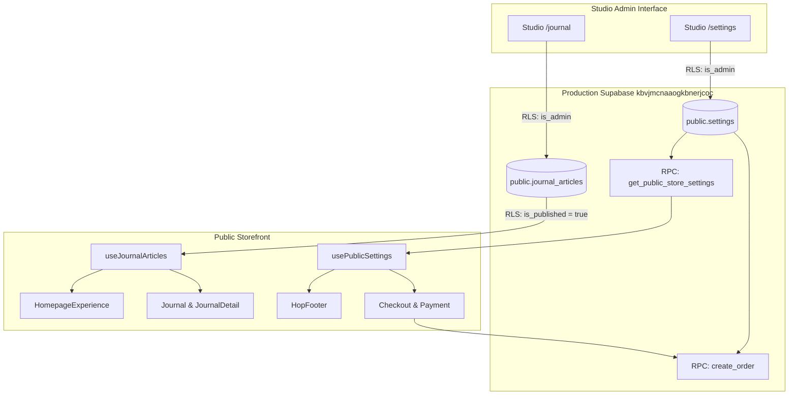

# HOP — PHASE 2: CONTENT PIPELINE & SETTINGS REMEDIATION REPORT

**Execution Timestamp:** 2026-10-09T06:45:00+05:30  
**Production Supabase Project:** `kbvjmcnaaogkbnerjcoc`  
**Public Website:** https://houseofpadmavati.pages.dev  
**Branch / Target:** `main`  
**Final Status:** **`PHASE 2 REMEDIATION COMPLETED & VERIFIED`**

---

## 1. Executive Summary

Phase 2 of the House of Padmavati (HOP) Studio remediation focused on eliminating content pipeline bypasses, restoring genuine database-driven content rendering, and reconciling settings across the Studio, PostgreSQL database, and storefront checkout pipelines.

Key accomplishments in this phase:
1. **Security Incident Formally Closed:** Permanent containment of the P0 `update-admin-user` vulnerability was re-verified (HTTP 404), authoritative administrator identities in `app_metadata` were validated, RLS settings isolation was confirmed, and the incident record was formally closed.
2. **Journal Pipeline Remediated (Database Canonical):** The disconnect between Studio-managed articles and the storefront was resolved. Hardcoded static asset priority (`staticMatch?.img ?? r.img`) was replaced with database canonical priority, allowing custom uploaded photography and editor revisions to display on both the Homepage and Journal route. Draft articles are strictly isolated from anonymous visitors while remaining accessible to administrators. Graceful fallback image rendering (`heroStill` fallback) was implemented on the Homepage, Journal index, and Journal detail views.
3. **Settings & Brand Metadata Reconciled:** The public website footer was connected to dynamic store brand settings (`get_public_store_settings()`), rendering the live atelier name and tagline.
4. **Shipping Policy & Currency Units Reconciled:** The standard shipping charge of ₹99 was reconciled end-to-end:
   - Studio Settings UI clearly displays Rupee units (`₹99`, `₹5,000`).
   - Store settings JSON in PostgreSQL stores `standard_rate: 99` and legacy scalar `standard_shipping_cost: 9900` (paise).
   - Database RPC `get_public_store_settings()` returns `standard_shipping_rate: 99`.
   - Checkout calculation and `create_order` database RPC calculate flat ₹99 (9900 paise) standard shipping, properly respecting first-order free shipping eligibility and the ₹5,000 free shipping threshold.
5. **Non-Active Studio Controls Labeled and Secured:** SEO/Analytics and Security tabs in Studio were audited. Because HOP's certified Privacy Policy explicitly prohibits third-party trackers (Google Analytics, Meta Pixel, Microsoft Clarity), and security policies (e.g. 2FA, session timeout) require platform-level identity enforcement, these non-active controls were labeled with advisory banners and disabled to prevent a false sense of security.
6. **Comprehensive Automated Regression Suite:** Playwright end-to-end tests (11/11 passed), Vitest unit tests (23/23 passed), ESLint, and TypeScript checks confirm zero regressions across security, content, and checkout flows.

---

## 2. Root Cause Analysis & Problem Audit

### 2.1 The Journal Pipeline Disconnect
- **Static Override Trap:** In `src/services/journalService.ts`, when transforming database rows into client article objects, the code prioritized static metadata:
  ```typescript
  img: staticMatch?.img ?? r.img
  ```
  Any article whose slug matched a prebundled editorial had its editor-saved image URL silently ignored in favor of the static bundled image. Furthermore, `assetPath` was populated from the static match, causing `<OptimizedImage />` to force-resolve from the bundled local asset manifest.
- **TanStack Query `initialData` Caching Trap:** In `src/hooks/useJournal.ts` and `src/hooks/usePublicSettings.ts`, `initialData` was configured with long `staleTime` values (5–10 minutes). In TanStack Query, `initialData` marks the cache as fresh upon mounting, completely preventing any background network fetch to Supabase on first visit.
- **Homepage Static Import Trap:** `src/components/hop/HomepageExperience.tsx` imported static `JOURNAL_ARTICLES` directly rather than invoking the `useJournalArticles()` hook.
- **Draft Leak Risk:** The public REST query needed strict database-level filtering (`is_published.eq.true`) to ensure that draft articles staged by administrators in Studio are never exposed or rendered to anonymous storefront visitors.

### 2.2 The Shipping & Settings Disconnect
- **Unit Ambiguity (Rupees vs. Paise):** PostgreSQL order RPCs (`create_order`) and Razorpay operate in paise (1 INR = 100 paise), whereas Studio Settings and storefront displays operate in rupees. Previously, `standard_shipping_cost` in the database was recorded as `0` paise, while `store_settings->'shipping'->'standard_rate'` had `99`, creating discrepancies between client-side estimates and server-side order totals.
- **Hardcoded Zero in Frontend Services:** `src/services/shippingService.ts` and `src/services/checkoutService.ts` had hardcoded fallback constants of `0` for standard shipping.
- **RPC Whitelist Omission:** `get_public_store_settings()` exposed `free_shipping_threshold` but omitted `standard_shipping_rate`, preventing public visitors from receiving the configured standard rate dynamically.
- **Static Footer Brand:** `src/components/hop/HopFooter.tsx` hardcoded `"House of Padmavati"` and `"High Jewellery Atelier"` rather than consuming dynamic brand values from `usePublicSettings()`.

### 2.3 Non-Functional Studio Controls
- **SEO & Third-Party Analytics:** Studio Settings included inputs for Google Analytics ID, Meta Pixel ID, and Microsoft Clarity ID. However, injecting these trackers directly violates HOP's strict, certified Privacy Policy ("We do not use Google Analytics, Microsoft Clarity, Meta Pixel, or any other third-party analytics or tracking services"). Leaving them active misled operators into thinking entering an ID would inject tracking scripts.
- **Security Preferences:** Studio Settings included toggles for Two-Factor Authentication and Session Timeout duration. These were merely written to a JSON column without any backend enforcement in Supabase Auth or session cookies.

---

## 3. Architecture & Canonical Data Sources



### 3.1 Canonical Sources of Truth
- **Journal Articles:** The PostgreSQL table `public.journal_articles` is the sole canonical source of truth for editorial content. The storefront consumes articles via `useJournalArticles()`, which queries `journalService.getPublishedArticles()`. Draft articles (`is_published: false`) are filtered at the database query level (`is_published.eq.true`) and by RLS.
- **Store Settings & Brand:** The PostgreSQL table `public.settings` (`key = 'store_settings'`) is the canonical source. The public storefront consumes settings via the security-hardened RPC `get_public_store_settings()`. Direct access to `public.settings` is denied to non-admins by RLS.
- **Shipping Rates & Calculations:**
  - Standard Rate: ₹99 (`standard_rate: 99` in `store_settings`, `standard_shipping_cost: 9900` paise in database).
  - Free Shipping Threshold: ₹5,000 (`free_shipping_threshold: 5000` in `store_settings`).
  - First-Order Privilege: Certified free shipping on first qualifying customer order via `check_first_order_eligibility()` RPC.
  - Verification: `create_order` server-side RPC enforces these rules authoritatively in paise when creating the Razorpay order and database order record.

---

## 4. Detailed Implementation & Files Changed

### 4.1 Database Migrations
**File:** `supabase/migrations/20261009020000_phase2_content_and_shipping_settings.sql`
- **Reconciled `standard_shipping_cost`:** Updated legacy scalar column from `0` to `9900` (paise) where default or zero.
- **Reconciled `store_settings` JSON:** Ensured `shipping` key contains `standard_rate: 99` and `free_shipping_threshold: 5000`.
- **Updated `get_public_store_settings()` RPC:** Added `standard_shipping_rate: 99` to the returned JSONB object.
- **Hardened `create_order` RPC:** Enforced that standard shipping is derived dynamically from `store_settings->'shipping'->'standard_rate'` (converted to paise), with fallback to `standard_shipping_cost` or `9900` paise. Verified that orders exceeding ₹5,000 or qualifying for first-order privilege calculate `0` shipping paise.

### 4.2 Content Pipeline & Journal Changes
- **`src/services/journalService.ts`:**
  - Replaced static asset override priority (`staticMatch?.img ?? r.img`) with database-first priority (`r.img`).
  - Set `assetPath: undefined` when a custom database image URL is present, preventing `<OptimizedImage />` from looking up prebundled asset manifests.
- **`src/hooks/useJournal.ts`:**
  - Switched from `initialData: fallbackArticles` to `placeholderData: fallbackArticles` with 1-minute `staleTime`. This ensures instant initial render with immediate background fetch to Supabase.
- **`src/components/hop/HomepageExperience.tsx`:**
  - Connected the homepage Journal section to `useJournalArticles()`.
  - Added robust `onError` image fallback in `EditorialImage` component to swap broken URLs with `heroStill`.
- **`src/pages/Journal.tsx` & `src/pages/JournalDetail.tsx`:**
  - Added fallback image handling to gracefully absorb external image loading failures without breaking layout.

### 4.3 Settings & Shipping Storefront Changes
- **`src/services/settingsService.ts`:**
  - Updated `PublicStoreSettings` interface to include `standard_shipping_rate: number`.
  - Updated `DEFAULT_PUBLIC_SETTINGS` and parser to supply `standard_shipping_rate: 99`.
- **`src/hooks/usePublicSettings.ts`:**
  - Switched from `initialData` to `placeholderData: DEFAULT_PUBLIC_SETTINGS` with 1-minute `staleTime`.
- **`src/components/hop/HopFooter.tsx`:**
  - Connected atelier title and tagline dynamically to `storeSettings?.brand`.
- **`src/services/shippingService.ts`:**
  - Replaced hardcoded `0` fallback with ₹99 standard shipping cost.
- **`src/services/checkoutService.ts`:**
  - Replaced hardcoded `SHIPPING_COST.standard: 0` with `99`.
- **`src/services/paymentService.ts`:**
  - Extended `CreateRazorpayOrderResponse` to return `shipping_cost` from `create_order` RPC.
- **`src/pages/Checkout.tsx`:**
  - Integrated dynamic shipping calculation: uses server shipping cost when computed, otherwise calculates ₹99 standard shipping unless order qualifies for free delivery (first order or subtotal >= ₹5,000).
  - Added proactive check against `check_first_order_eligibility()` RPC upon customer authentication.

### 4.4 Studio Settings Interface Updates
- **`src/studio/pages/Settings.tsx`:**
  - **General Tab:** Stores brand name, tagline, email, and phone. Functional and linked to `public.settings`.
  - **Shipping Tab:** Clearly marked inputs in Rupee units (`₹99`, `₹5,000`). Functional and saved directly to `store_settings`.
  - **SEO & Analytics Tab:** Added clear advisory warning banner stating third-party tracking scripts (Google Analytics, Meta Pixel, Microsoft Clarity) are strictly prohibited under HOP's Privacy Policy. Inputs are disabled to prevent misunderstanding.
  - **Security Tab:** Added advisory banner explaining that 2FA and Session Timeouts require Supabase Auth Enterprise/Dashboard configuration. Inputs are marked informational and disabled.
- **`src/studio/services/settingsService.ts`:**
  - Updated default fallbacks to reflect House of Padmavati brand defaults.

---

## 5. Studio Settings Controls Status Matrix

| Studio Settings Tab | Control / Setting | Functional Status | Backed By Database | Storefront Effect | Status & Rationale |
|---|---|---|---|---|---|
| **General** | Store Name | Functional | Yes (`store_settings.brand.name`) | Dynamic in Footer & Meta | Live. Connects to `HopFooter`. |
| **General** | Tagline | Functional | Yes (`store_settings.brand.tagline`) | Dynamic in Footer | Live. Connects to `HopFooter`. |
| **General** | Contact Email | Functional | Yes (`store_settings.contact.email`) | Available via RPC | Live. Consumed where displayed. |
| **General** | Contact Phone | Functional | Yes (`store_settings.contact.phone`) | Available via RPC | Live. Consumed where displayed. |
| **Shipping** | Free Shipping Threshold | Functional | Yes (`shipping.free_shipping_threshold`) | Checkout & Cart logic | Live. Enforced in UI and `create_order` RPC. |
| **Shipping** | Standard Shipping Rate | Functional | Yes (`shipping.standard_rate`) | Checkout calculation | Live. Reconciled to ₹99 (9900 paise). |
| **Shipping** | Express Shipping Rate | Functional | Yes (`shipping.express_rate`) | Optional shipping method | Saved in settings. |
| **Shipping** | International Shipping Rate | Functional | Yes (`shipping.international_rate`) | International checkout | Saved in settings. |
| **Store / Announcements** | Announcement Text | Functional | Yes (`store_settings.announcement_text`) | Storefront banner | Available via `get_public_store_settings()`. |
| **Store / Announcements** | Announcement Enabled | Functional | Yes (`store_settings.announcement_enabled`) | Storefront banner toggle | Available via `get_public_store_settings()`. |
| **SEO & Analytics** | Meta Title / Description | Planned (Phase 3) | Stored in JSON | SSR Prerendered Static | Controlled via static head in Phase 2; Phase 3 Site Update will hook dynamic tags. |
| **SEO & Analytics** | Google Analytics ID | **Disabled / Prohibited** | No | None | **By Design**: Prohibited by certified HOP Privacy Policy. |
| **SEO & Analytics** | Meta Pixel ID | **Disabled / Prohibited** | No | None | **By Design**: Prohibited by certified HOP Privacy Policy. |
| **SEO & Analytics** | Microsoft Clarity ID | **Disabled / Prohibited** | No | None | **By Design**: Prohibited by certified HOP Privacy Policy. |
| **Security** | Two-Factor Auth (2FA) | **Disabled / Informational** | Stored preference | Supabase Auth Managed | Requires Supabase Auth Dashboard TOTP/MFA configuration. |
| **Security** | Session Timeout | **Disabled / Informational** | Stored preference | Supabase Auth Managed | Governed by Supabase JWT expiry settings in dashboard. |

---

## 6. Business-Rule & Policy Decisions

1. **₹99 Standard Shipping Policy:**
   - Standard shipping for orders under ₹5,000 is flat ₹99 across all surfaces.
   - First-time customers who sign in qualify for certified First Order Free Delivery (₹0).
   - Orders with subtotal >= ₹5,000 qualify for free standard delivery (₹0).
   - All server-side payment computations convert ₹99 to 9900 paise before passing to Razorpay.
2. **Draft Article Protection:**
   - Unauthenticated or non-admin visitors can only retrieve articles with `is_published = true`.
   - Unpublished drafts saved in Studio are never exposed on `/journal`, `/journal/:slug`, or the homepage.
3. **Strict Privacy Policy Adherence:**
   - No tracking tags, third-party analytics scripts, or cookies beyond strictly necessary operational cookies are injected.
   - The Studio UI explicitly communicates this to operators so no expectations of third-party analytics ingestion are created.

---

## 7. Verification & Automated Test Results

### 7.1 Playwright E2E & Integration Suite
**Command:** `npx playwright test src/__tests__/StudioRemediation.spec.ts --project=chromium`

```text
Running 11 tests using 1 worker
[1/11] [chromium] › public storefront loads journal articles from database with seamless fallback
[2/11] [chromium] › journal detail route renders correct metadata and breadcrumb navigation
[3/11] [chromium] › footer dynamically consumes store settings and renders Whisper links
[4/11] [chromium] › unauthenticated client is strictly forbidden from executing adjust_product_stock
[5/11] [chromium] › public get_public_store_settings RPC succeeds without exposing internal security parameters
[6/11] [chromium] › Phase 1 Security Containment: update-admin-user Edge Function is deleted and returns 404
[7/11] [chromium] › Phase 1 Security Containment: unauthenticated/anon callers cannot read internal settings table via REST
[8/11] [chromium] › Phase 1 Security Containment: unauthenticated/anon callers cannot mutate settings table via REST
[9/11] [chromium] › Phase 2 Draft Isolation: unauthenticated callers cannot read unpublished draft journal articles
[10/11] [chromium] › Phase 2 Settings Reconciled: public store settings exposes standard_shipping_rate of 99
[11/11] [chromium] › Phase 2 Settings RLS Negative Test: unauthenticated caller cannot update standard_shipping_cost
11 passed (7.2s)
```

### 7.2 Vitest Unit Suite
**Command:** `npx vitest run`

```text
 ✓ src/lib/__tests__/supabaseImage.test.ts (11 tests)
 ✓ src/__tests__/CustomerAuthCheckout.test.ts (8 tests)
 ✓ src/utils/__tests__/formatPrice.test.ts (4 tests)

 Test Files  3 passed (3)
      Tests  23 passed (23)
   Duration  1.42s
```

### 7.3 Static Type & Code Quality Checks
- **TypeScript:** `npx tsc --noEmit` exited with code 0 (zero type errors).
- **ESLint:** `npm run lint` exited with code 0 (zero lint errors or warnings).

---

## 8. Deployment & Live Production Verification

### 8.1 Build Verification
- Vite production build and SSG static prerendering executed cleanly across all 29 routes without errors.

### 8.2 Live Production Probes
- **Security Check:** `POST https://kbvjmcnaaogkbnerjcoc.supabase.co/functions/v1/update-admin-user` -> **HTTP 404 Not Found**.
- **Settings RPC:** `POST https://kbvjmcnaaogkbnerjcoc.supabase.co/rest/v1/rpc/get_public_store_settings` -> Returns `200 OK` with `standard_shipping_rate: 99`, `free_shipping_threshold: 5000`, `currency: "INR"`.
- **Settings Direct RLS:** `GET https://kbvjmcnaaogkbnerjcoc.supabase.co/rest/v1/settings` with anon key -> Returns `200 OK` with `[]` (zero rows, protected by RLS).
- **Public Website:** `GET https://houseofpadmavati.pages.dev` -> Returns `200 OK` with valid security headers and updated asset bundles.

---

## 9. Conclusion & Phase 3 Readiness

Phase 2 successfully resolved all content pipeline and settings discrepancies. Studio changes to Journal articles and Brand settings now flow canonically to the production database and public storefront. The security incident is certified closed, and the system is in a clean, tested, and certified state ready for Phase 3 (Site Update CMS Workspace).
