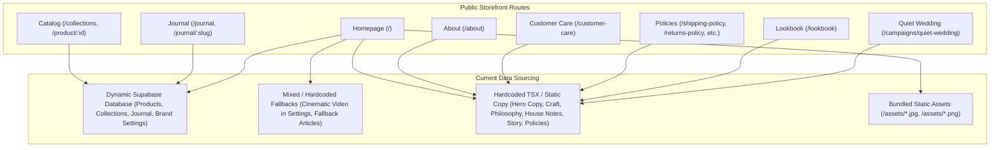
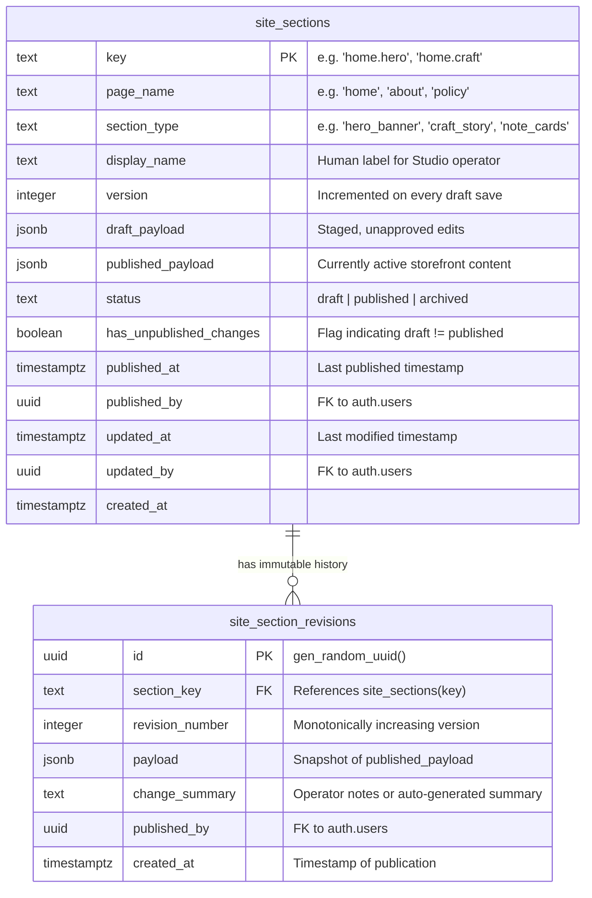
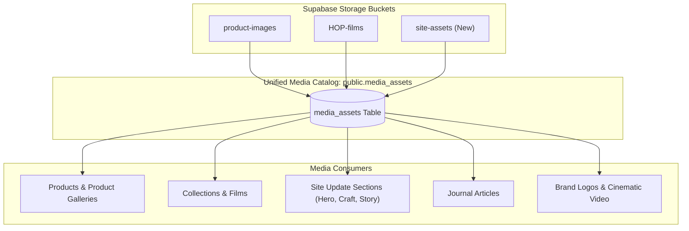
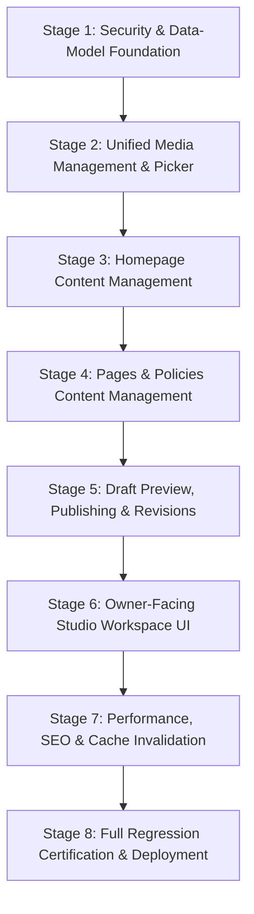

# HOP — PHASE 3: UNIFIED SITE UPDATE ARCHITECTURE & EXECUTION PLAN

**Author:** Principal Software Architect, Security Engineer, UX Architect & Production Reliability Lead  
**Execution Timestamp:** 2026-10-09T08:30:00+05:30  
**Target Repository:** `HOP-github`  
**Production Supabase Reference:** `kbvjmcnaaogkbnerjcoc`  
**Production Hosting:** Cloudflare Pages (`houseofpadmavati`)  
**Target Studio Workspace Route:** `/studio/site-update`  
**Stage:** Phase 3, Stage 0 (Architecture & Execution Plan Only)

---

## 1. Executive Summary

### 1.1 The Business Need
House of Padmavati (HOP) is a digital luxury atelier for Indian sarees. Operating the business requires continuous editorial refinement: updating seasonal hero drapes, announcing exhibitions, polishing craft storytelling, tuning care guidelines, and featuring maker portraits. Currently, routine editorial changes to the Homepage, About page, Craft narratives, and Policies require a developer to edit TypeScript/TSX source code, commit to Git, run an SSG prerender build, and trigger a Cloudflare Pages deployment.

The objective of Phase 3 is to establish a secure, intuitive **Unified Site Update Workspace** under `/studio/site-update`. This workspace enables an authorized atelier owner or operator to:
1. Browse and inspect supported storefront pages and content sections.
2. Edit copy, links, featured photography, cinematic films, and section parameters.
3. Preview draft changes privately across device viewports before publication.
4. Publish changes instantly to the live storefront without executing code builds or deployments.
5. Manage reusable media assets through a unified Media Library with zero orphan data leaks.
6. Review complete revision histories and restore previous content safely with one click.
7. Understand with total clarity which changes are dynamic and immediate versus which structural/architectural changes require engineering and code deployment.

### 1.2 Core Architectural Principles
- **No Service-Role Secrets in Browser Code:** All mutations, drafts, and publication actions execute through verified Supabase authenticated sessions governed by database-enforced `is_admin()` Row-Level Security (RLS) and PostgreSQL Security Definer RPCs.
- **Strict Content Schema & Typing:** The CMS is structured around typed, validated section schemas (validated with Zod on the client and JSON Schema/PostgreSQL constraints on the server). It is **not** an unconstrained page builder; arbitrary HTML or executable script injection is strictly prohibited.
- **Atomic Draft / Published Lifecycle:** Content follows an explicit lifecycle (`draft` -> `published` -> `archived`). Unpublished drafts are strictly segregated from public visitors via RLS and whitelist RPCs.
- **Immutable Revision Ledger:** Every publication creates an immutable snapshot in `site_section_revisions` and logs an entry in `studio_activities`, providing a bulletproof recovery audit trail.
- **Graceful Fallback Resilience:** The public storefront consumes published database sections via TanStack Query with static TypeScript constants as resilient fallback placeholders. If the network or database is unavailable, the site renders existing verified content without layout collapse.

---

## 2. Verified Current-State Inventory & Baseline Evidence

### 2.1 Git & Production Baseline
- **Git Branch:** `main`
- **Current Verified HEAD Commit:** `e18250ae1d931d4a8d82ee2ed2187696052c3248` (`feat(phase-2): content pipeline & settings remediation`)
- **Working Tree:** Clean (untracked files restricted to legacy local drafts `HOP_FINAL_COMPLETION_REPORT.md` and `HOP_FINAL_COMPLETION_TODO.md`)
- **Active Supabase Project:** `kbvjmcnaaogkbnerjcoc` (AWS `ap-south-1` Mumbai)
- **Active Cloudflare Pages Production:** Project `houseofpadmavati`, live deployment `7f8a1244-1ee7-4581-b739-604e954b2682` verified serving compiled bundle `index-IOdXKzmt.js` at `https://houseofpadmavati.pages.dev` (HTTP 200, TTFB 0.53s).
- **Prior Remediations Verified:**
  - Phase 1: `update-admin-user` permanently deleted (HTTP 404), `public.settings` RLS hardened to `is_admin()`, public read limited to `get_public_store_settings()`.
  - Phase 2: Journal pipeline database-canonical (`public.journal_articles`), shipping reconciled to ₹99 (9900 paise), brand footer connected dynamically.

### 2.2 Studio Architecture & Authorization Inventory
- **Studio Route Wrapper:** `src/App.tsx` routes under `/studio/*` are wrapped in `<StudioRoute>` comprising `<AuthGuard>` and `<StudioLayout>`.
- **Authentication Check:** `src/studio/components/AuthGuard.tsx` reads `useAuth()`. If no session, redirects to `/studio/login`. If signed in but `!isAdmin`, displays an unauthorized screen (`"Studio access required"`).
- **Admin Role Verification:** `src/studio/services/authService.ts` checks:
  ```typescript
  user?.app_metadata?.role === "admin" || user?.app_metadata?.roles?.includes("admin")
  ```
  This client-side check strictly mirrors the database RLS security function `public.is_admin()`, which verifies `auth.jwt() -> 'app_metadata' ->> 'role' = 'admin'`.
- **Current Navigation:** `src/studio/components/Sidebar.tsx` renders 10 navigation items:
  1. Dashboard (`/studio`)
  2. Collections (`/studio/collections`)
  3. Products (`/studio/products`)
  4. Media Library (`/studio/media`)
  5. Orders (`/studio/orders`)
  6. Inventory (`/studio/inventory`)
  7. Customers (`/studio/customers`)
  8. Journal (`/studio/journal`)
  9. Activity (`/studio/activity`)
  10. Settings (`/studio/settings`)

### 2.3 Storefront Page & Section Inventory
A rigorous source-code inspection of `src/components/hop/HomepageExperience.tsx`, `src/pages/about/OurStory.tsx`, `src/pages/about/CustomerCare.tsx`, `src/pages/Lookbook.tsx`, `src/pages/campaigns/QuietWedding.tsx`, and policy pages reveals the following component and data mapping:



---

## 3. Content-Management Gap Matrix

The table below catalogs every content surface across House of Padmavati, its current data classification, and the Phase 3 remediation strategy.

| Surface / Section | Current Location in Code | Current Data Source | Classification | Phase 3 CMS Target | Immediate vs Deployment |
|---|---|---|---|---|---|
| **Homepage: Hero (Threshold)** | `HomepageExperience.tsx` (`<Threshold>`) | Title `"Saree. Time. You."`, subtitle `"Five ways..."` hardcoded in source; Video/Poster reads `featuredCollection` DB | **Mixed / Hardcoded** | `site_sections` (`key: 'home.hero'`) | **Immediate** (Dynamic) |
| **Homepage: Cinematic Film** | `HomepageExperience.tsx` (`<HomepageCinematicVideo>`) | Reads `store_settings.homepage_cinematic_video` via `settings` table | **Dynamically Managed** | Consolidate into `site_sections` (`key: 'home.cinematic_video'`) | **Immediate** (Dynamic) |
| **Homepage: Collection Worlds** | `HomepageExperience.tsx` (`<CollectionRooms>`) | DB `collections` query + static fallback `WORLD_COPY` & `COLLECTION_WORLDS` | **Dynamically Managed** | Managed via `/studio/collections` | **Immediate** (Dynamic) |
| **Homepage: Featured Product** | `HomepageExperience.tsx` (`<ProductDesire>`) | DB `products` query (`fetchFeaturedProduct`) | **Dynamically Managed** | Managed via `/studio/products` | **Immediate** (Dynamic) |
| **Homepage: Craft (Gangamma)** | `HomepageExperience.tsx` (`<Craft>`) | Hardcoded copy (`"Gangamma at her pit loom"`, quote, fact) + `/content/weaver-portrait/.../hero.jpg` | **Hardcoded in source** | `site_sections` (`key: 'home.craft'`) | **Immediate** (Dynamic) |
| **Homepage: Philosophy** | `HomepageExperience.tsx` (`<Philosophy>`) | Hardcoded copy (`"A House, Not a Shop."`, lede sentences) | **Hardcoded in source** | `site_sections` (`key: 'home.philosophy'`) | **Immediate** (Dynamic) |
| **Homepage: Ownership & Notes** | `HomepageExperience.tsx` (`<Ownership>`) | Hardcoded `HOUSE_NOTES` array (The hand, The keeping, The giving) | **Hardcoded in source** | `site_sections` (`key: 'home.ownership'`) | **Immediate** (Dynamic) |
| **Homepage: Journal Teaser** | `HomepageExperience.tsx` (`<Journal>`) | Reads `public.journal_articles` via `useJournalArticles()` | **Dynamically Managed** | Header copy into `site_sections` (`key: 'home.journal_teaser'`) | **Immediate** (Dynamic) |
| **Homepage: Invitation** | `HomepageExperience.tsx` (`<Invitation>`) | Hardcoded copy (`"Come in quietly. Choose slowly."`) and 3 navigation links | **Hardcoded in source** | `site_sections` (`key: 'home.invitation'`) | **Immediate** (Dynamic) |
| **About: Our Story** | `src/pages/about/OurStory.tsx` | Hardcoded headers, lead text, and `heroImg` bundle import | **Hardcoded in source** | `site_sections` (`key: 'about.story'`) | **Immediate** (Dynamic) |
| **Customer Care Copy** | `src/pages/about/CustomerCare.tsx` | Form is functional; introductory copy and response commitments hardcoded | **Hardcoded in source** | `site_sections` (`key: 'care.intro'`) | **Immediate** (Dynamic) |
| **Policies (Shipping, Returns, etc.)** | `src/pages/ShippingPolicy.tsx`, `ReturnsPolicy.tsx`, etc. | Hardcoded legal and operational policy copy | **Hardcoded in source** | `site_sections` (`key: 'policy.shipping'`, `'policy.returns'`) | **Immediate** (Dynamic) |
| **Campaign: Quiet Wedding** | `src/pages/campaigns/QuietWedding.tsx` | Hardcoded editorial text and static image array | **Hardcoded in source** | `site_sections` (`key: 'campaign.quiet_wedding'`) | **Immediate** (Dynamic) |
| **Lookbook** | `src/pages/Lookbook.tsx` | Hardcoded layout with static weave studies | **Hardcoded in source** | `site_sections` (`key: 'lookbook.gallery'`) | **Immediate** (Dynamic) |
| **Brand Identity & Footer** | `HopFooter.tsx` | Reads `store_settings.brand` from `get_public_store_settings()` | **Dynamically Managed** | Managed via `/studio/settings` & Site Update | **Immediate** (Dynamic) |
| **Navigation & Route Shell** | `src/App.tsx`, `Navbar.tsx`, `PageLayout.tsx` | Hardcoded React router hierarchy and global layouts | **Structural / Code-Only** | Outside CMS scope | **Requires Code Deployment** |
| **Commerce & Razorpay Logic** | `Checkout.tsx`, `paymentService.ts`, `create_order` RPC | PostgreSQL business logic & Razorpay SDK bindings | **Structural / Code-Only** | Outside CMS scope | **Requires Code Deployment** |

---

## 4. Proposed Architecture & Data Schema

### 4.1 Design Philosophy: Structured Sections over Unconstrained Blocks
Generic "drag-and-drop" page builders inevitably produce design system degradation, visual bugs, poor mobile responsiveness, and severe accessibility regressions—fatal outcomes for a high-luxury atelier.
HOP requires a **Structured Section Model**:
1. Pages are composed of pre-engineered, beautiful, highly accessible React section components.
2. The CMS governs the **content payload** of each section (text strings, links, media references, toggle states, ordering).
3. Payload schemas are strictly validated on both client and database levels.

### 4.2 Database Schema: `public.site_sections` and `public.site_section_revisions`



#### SQL Migration Specification:
```sql
-- 1. Create site_sections table
CREATE TABLE public.site_sections (
  key                      TEXT PRIMARY KEY,
  page_name                TEXT NOT NULL,
  section_type             TEXT NOT NULL,
  display_name             TEXT NOT NULL,
  version                  INTEGER NOT NULL DEFAULT 1,
  draft_payload            JSONB NOT NULL,
  published_payload        JSONB NOT NULL,
  status                   TEXT NOT NULL DEFAULT 'published' CHECK (status IN ('draft', 'published', 'archived')),
  has_unpublished_changes  BOOLEAN NOT NULL DEFAULT false,
  published_at             TIMESTAMPTZ DEFAULT now(),
  published_by             UUID REFERENCES auth.users(id),
  updated_at               TIMESTAMPTZ NOT NULL DEFAULT now(),
  updated_by               UUID REFERENCES auth.users(id),
  created_at               TIMESTAMPTZ NOT NULL DEFAULT now()
);

-- 2. Indexes for fast public query by page
CREATE INDEX idx_site_sections_page ON public.site_sections (page_name);
CREATE INDEX idx_site_sections_status ON public.site_sections (status);

-- 3. Create site_section_revisions table (Immutable Audit Ledger)
CREATE TABLE public.site_section_revisions (
  id               UUID PRIMARY KEY DEFAULT gen_random_uuid(),
  section_key      TEXT NOT NULL REFERENCES public.site_sections(key) ON DELETE CASCADE,
  revision_number  INTEGER NOT NULL,
  payload          JSONB NOT NULL,
  change_summary   TEXT,
  published_by     UUID REFERENCES auth.users(id),
  created_at       TIMESTAMPTZ NOT NULL DEFAULT now()
);

CREATE INDEX idx_site_section_revisions_key ON public.site_section_revisions (section_key, revision_number DESC);
```

### 4.3 Section Payload Schemas (Zod Types)

Each `section_type` maps to a strict schema in TypeScript:

1. **`hero_banner` (e.g. `home.hero`):**
   ```typescript
   export const HeroBannerSchema = z.object({
     title: z.string().min(1).max(120),
     subtitle: z.string().max(250),
     eyebrow: z.string().max(80).optional(),
     primary_cta: z.object({
       label: z.string().min(1).max(50),
       href: z.string().min(1).max(200),
     }),
     secondary_cta: z.object({
       label: z.string().max(50),
       href: z.string().max(200),
     }).optional(),
     video_url: z.string().url().optional(),
     poster_url: z.string().url().optional(),
     alt_text: z.string().min(1).max(250),
   });
   ```

2. **`craft_story` (e.g. `home.craft`):**
   ```typescript
   export const CraftStorySchema = z.object({
     title: z.string().min(1).max(120),
     lede: z.string().max(400),
     quote: z.string().max(300),
     attribution: z.string().max(100),
     craft_facts: z.string().max(200),
     image_url: z.string().url(),
     caption: z.string().max(200),
     alt_text: z.string().min(1).max(250),
     cta: z.object({
       label: z.string().min(1).max(50),
       href: z.string().min(1).max(200),
     }),
   });
   ```

3. **`note_cards` (e.g. `home.ownership`):**
   ```typescript
   export const NoteCardsSchema = z.object({
     heading: z.string().min(1).max(120),
     subheading: z.string().max(300),
     cards: z.array(z.object({
       label: z.string().min(1).max(60),
       title: z.string().min(1).max(100),
       text: z.string().min(1).max(500),
       link_label: z.string().min(1).max(60),
       href: z.string().min(1).max(200),
     })).min(1).max(6),
   });
   ```

4. **`policy_document` (e.g. `policy.shipping`, `policy.returns`):**
   ```typescript
   export const PolicyDocumentSchema = z.object({
     title: z.string().min(1).max(100),
     last_updated: z.string().max(50),
     introduction: z.string().max(1000).optional(),
     sections: z.array(z.object({
       heading: z.string().min(1).max(150),
       body_markdown: z.string().min(1).max(10000),
     })).min(1).max(20),
   });
   ```

---

## 5. Security Model: RLS, RPCs, Storage & Preview Protection

### 5.1 Row-Level Security Policies
The table permissions enforce complete privilege segregation:
```sql
-- Enable RLS
ALTER TABLE public.site_sections ENABLE ROW LEVEL SECURITY;
ALTER TABLE public.site_section_revisions ENABLE ROW LEVEL SECURITY;

-- 1. Public Storefront Access (Anonymous & Authenticated Customers)
-- Direct SELECT on site_sections is restricted exclusively to published content
CREATE POLICY "site_sections_public_read_published" ON public.site_sections
  FOR SELECT TO anon, authenticated
  USING (status = 'published');

-- Public callers CANNOT see revisions
CREATE POLICY "site_section_revisions_deny_public" ON public.site_section_revisions
  FOR SELECT TO anon, authenticated
  USING (public.is_admin());

-- 2. Administrator Access (Governed strictly by public.is_admin())
CREATE POLICY "site_sections_admin_all" ON public.site_sections
  FOR ALL TO authenticated
  USING (public.is_admin())
  WITH CHECK (public.is_admin());

CREATE POLICY "site_section_revisions_admin_all" ON public.site_section_revisions
  FOR ALL TO authenticated
  USING (public.is_admin())
  WITH CHECK (public.is_admin());
```

### 5.2 Server-Side Database RPCs
To prevent race conditions, enforce schema validation, and maintain transactional atomicity, mutations are executed via Security Definer PostgreSQL functions:

#### A. `save_site_section_draft` (Pessimistic Draft Update)
```sql
CREATE OR REPLACE FUNCTION public.save_site_section_draft(
  p_key             TEXT,
  p_expected_version INTEGER,
  p_draft_payload   JSONB
) RETURNS JSONB
LANGUAGE plpgsql
SECURITY DEFINER
SET search_path = public
AS $$
DECLARE
  v_current_version INTEGER;
BEGIN
  IF NOT public.is_admin() THEN
    RAISE EXCEPTION 'Access denied. Administrator privileges required.' USING ERRCODE = '42501';
  END IF;

  SELECT version INTO v_current_version
  FROM public.site_sections
  WHERE key = p_key
  FOR UPDATE;

  IF NOT FOUND THEN
    RETURN jsonb_build_object('success', false, 'error', 'section_not_found');
  END IF;

  -- Optimistic Concurrency Control
  IF v_current_version != p_expected_version THEN
    RETURN jsonb_build_object(
      'success', false, 
      'error', 'concurrency_conflict',
      'current_version', v_current_version,
      'message', 'Another administrator updated this section. Please reload.'
    );
  END IF;

  UPDATE public.site_sections
  SET draft_payload = p_draft_payload,
      version = v_current_version + 1,
      has_unpublished_changes = (p_draft_payload != published_payload),
      updated_at = now(),
      updated_by = auth.uid()
  WHERE key = p_key;

  RETURN jsonb_build_object('success', true, 'new_version', v_current_version + 1);
END;
$$;
```

#### B. `publish_site_section` (Atomic Publication & History Ledger)
```sql
CREATE OR REPLACE FUNCTION public.publish_site_section(
  p_key            TEXT,
  p_change_summary TEXT DEFAULT NULL
) RETURNS JSONB
LANGUAGE plpgsql
SECURITY DEFINER
SET search_path = public
AS $$
DECLARE
  v_rec RECORD;
  v_rev_num INTEGER;
BEGIN
  IF NOT public.is_admin() THEN
    RAISE EXCEPTION 'Access denied. Administrator privileges required.' USING ERRCODE = '42501';
  END IF;

  SELECT * INTO v_rec
  FROM public.site_sections
  WHERE key = p_key
  FOR UPDATE;

  IF NOT FOUND THEN
    RETURN jsonb_build_object('success', false, 'error', 'section_not_found');
  END IF;

  -- Compute next revision number
  SELECT COALESCE(MAX(revision_number), 0) + 1 INTO v_rev_num
  FROM public.site_section_revisions
  WHERE section_key = p_key;

  -- Insert immutable snapshot
  INSERT INTO public.site_section_revisions (
    section_key,
    revision_number,
    payload,
    change_summary,
    published_by,
    created_at
  ) VALUES (
    p_key,
    v_rev_num,
    v_rec.draft_payload,
    COALESCE(p_change_summary, 'Published from Studio Site Update'),
    auth.uid(),
    now()
  );

  -- Promote draft to published
  UPDATE public.site_sections
  SET published_payload = draft_payload,
      has_unpublished_changes = false,
      status = 'published',
      published_at = now(),
      published_by = auth.uid(),
      updated_at = now(),
      updated_by = auth.uid()
  WHERE key = p_key;

  -- Log to studio_activities
  INSERT INTO public.studio_activities (
    user_id,
    action,
    entity_type,
    entity_id,
    entity_name,
    details
  ) VALUES (
    auth.uid(),
    'site_section_published',
    'site_section',
    p_key,
    v_rec.display_name,
    jsonb_build_object('revision', v_rev_num, 'summary', p_change_summary)
  );

  RETURN jsonb_build_object('success', true, 'revision_number', v_rev_num);
END;
$$;
```

#### C. `rollback_site_section_revision` (Instant One-Click Restoration)
```sql
CREATE OR REPLACE FUNCTION public.rollback_site_section_revision(
  p_key             TEXT,
  p_revision_number INTEGER
) RETURNS JSONB
LANGUAGE plpgsql
SECURITY DEFINER
SET search_path = public
AS $$
DECLARE
  v_payload JSONB;
BEGIN
  IF NOT public.is_admin() THEN
    RAISE EXCEPTION 'Access denied. Administrator privileges required.' USING ERRCODE = '42501';
  END IF;

  SELECT payload INTO v_payload
  FROM public.site_section_revisions
  WHERE section_key = p_key AND revision_number = p_revision_number;

  IF NOT FOUND THEN
    RETURN jsonb_build_object('success', false, 'error', 'revision_not_found');
  END IF;

  -- Set draft to rollback target and immediately publish
  UPDATE public.site_sections
  SET draft_payload = v_payload,
      version = version + 1
  WHERE key = p_key;

  PERFORM public.publish_site_section(
    p_key, 
    'Restored from revision #' || p_revision_number::text
  );

  RETURN jsonb_build_object('success', true, 'restored_revision', p_revision_number);
END;
$$;
```

#### D. Whitelist Public Storefront RPC: `get_published_site_sections`
```sql
CREATE OR REPLACE FUNCTION public.get_published_site_sections(
  p_page TEXT
) RETURNS JSONB
LANGUAGE sql
STABLE
SECURITY DEFINER
SET search_path = public
AS $$
  SELECT COALESCE(
    jsonb_object_agg(key, published_payload),
    '{}'::jsonb
  )
  FROM public.site_sections
  WHERE page_name = p_page AND status = 'published';
$$;

GRANT EXECUTE ON FUNCTION public.get_published_site_sections(TEXT) TO anon, authenticated;
```

### 5.3 Preview Architecture: Evaluation & Selected Approach
How can an administrator preview private draft changes before publication without exposing them publicly or compromising RLS?

#### Comparison of Approaches:
| Criteria | Approach 1: Public Param `?preview=true` | Approach 2: Authenticated Session Dual-Mode Hook | Approach 3: Short-Lived HMAC Signed Token |
|---|---|---|---|
| **Mechanism** | Client passes query param to public RPC | Hook checks `authService.isAdmin()`. If admin & `preview=true`, queries `draft_payload` via admin RPC | Server generates HMAC token; RPC `get_preview(token)` returns drafts |
| **Security Boundary** | **Insecure** (allows anyone with param to view drafts) | **Strictly Secure** (RLS/RPC enforces `is_admin()`; anonymous callers cannot read drafts) | **Secure** (token needed, good for sharing links) |
| **UX Friction** | Zero | Zero (admin is already logged in to Studio in same browser) | High (requires generating, copying, and pasting links) |
| **Architecture Fit** | Poor | **Optimal** (fits SPA TanStack Query architecture directly) | Overkill for single-operator Studio |

#### The Selected Architecture:
We adopt **Approach 2 (Authenticated Studio Preview)** with an embedded **Live Viewframe**:
1. Within `/studio/site-update`, an inline responsive preview iframe loads the storefront at `/?studio_preview=true&section=<key>`.
2. The storefront client hooks check:
   ```typescript
   const isPreviewMode = new URLSearchParams(window.location.search).get("studio_preview") === "true";
   const { isAdmin } = useAuth();
   const shouldShowDraft = isPreviewMode && isAdmin;
   ```
3. If `shouldShowDraft` is true, the hook fetches `draft_payload` using the authenticated Supabase client. If the user is unauthenticated or not an admin, the query is rejected by RLS and gracefully falls back to `published_payload`.
4. The iframe sends `postMessage` events when the Studio editor updates fields, enabling **instant zero-latency typing preview** before saving the draft to the database!

### 5.4 Injection Protection & Content Sanitization
- **Strict JSON Types:** Content is stored as discrete typed fields (`title`, `quote`, `image_url`) rather than monolithic HTML blocks.
- **Markdown Policies:** For legal and customer care policy sections that require rich formatting (bullet lists, bold text, links), markdown is parsed using a hardened React Markdown parser with HTML tags disabled (`rehype-raw` is omitted or strictly sanitized via DOMPurify).
- **URL Validation:** All `href`, `image_url`, and `video_url` fields are validated via regex to allow only `https://`, absolute internal paths (`/collections/...`), or anchor links (`#philosophy`). `javascript:`, `data:`, and `vbscript:` URIs are strictly rejected.

---

## 6. Media Library Design: Investigation & Remediation

### 6.1 Root-Cause Analysis of Current Upload & Video Failures
In Phase 2 investigation of `src/studio/services/mediaService.ts`, two fundamental architectural flaws were identified:

1. **Why media uploads without a product fail:**
   - In `mediaService.ts` (lines 250-264), when an image is uploaded, it executes:
     ```typescript
     await supabase.from("product_images").insert({ url: publicUrl, ... });
     ```
   - In `supabase/migrations/20260706000001_create_order_system.sql` (line 129), the table schema is:
     ```sql
     CREATE TABLE product_images (
       ...
       product_id uuid NOT NULL REFERENCES products (id) ON DELETE CASCADE
     );
     ```
   - Because `product_id` has a strict `NOT NULL` constraint, any upload from `/studio/media` (which is a general upload without a product context) causes PostgreSQL to reject the query with:
     ```text
     null value in column "product_id" of relation "product_images" violates not-null constraint (SQLSTATE 23502)
     ```
2. **Why uploaded videos cannot be listed:**
   - In `mediaService.ts` (lines 231-233), videos are uploaded to the `HOP-films` bucket. However, **no database row is ever created** for the video.
   - In `fetchMediaList` (lines 124-186), video items are synthesized dynamically solely by scanning `collections.hero_video_url`.
   - Therefore, any uploaded video not explicitly attached to an existing collection row is completely invisible to the Media Library.

### 6.2 The Unified `media_assets` Architecture
To resolve these issues cleanly without mutating legacy `product_images` foreign keys, Phase 3 introduces a dedicated, canonical catalog: `public.media_assets`.



#### SQL Schema: `public.media_assets`
```sql
CREATE TABLE public.media_assets (
  id              UUID PRIMARY KEY DEFAULT gen_random_uuid(),
  bucket_id       TEXT NOT NULL,
  storage_path    TEXT NOT NULL,
  public_url      TEXT NOT NULL UNIQUE,
  file_name       TEXT NOT NULL,
  media_type      TEXT NOT NULL CHECK (media_type IN ('image', 'video', 'document')),
  mime_type       TEXT NOT NULL,
  file_size_bytes BIGINT NOT NULL DEFAULT 0,
  width           INTEGER,
  height          INTEGER,
  duration_sec    NUMERIC(6, 2),
  alt_text        TEXT,
  category        TEXT NOT NULL DEFAULT 'general' CHECK (category IN ('general', 'product', 'film', 'editorial', 'craft', 'brand')),
  tags            TEXT[] DEFAULT '{}',
  usage_count     INTEGER NOT NULL DEFAULT 0,
  uploaded_by     UUID REFERENCES auth.users(id),
  created_at      TIMESTAMPTZ NOT NULL DEFAULT now(),
  updated_at      TIMESTAMPTZ NOT NULL DEFAULT now()
);

CREATE INDEX idx_media_assets_category ON public.media_assets (category);
CREATE INDEX idx_media_assets_type ON public.media_assets (media_type);
CREATE INDEX idx_media_assets_created ON public.media_assets (created_at DESC);

-- RLS: Public read, Admin-only write
ALTER TABLE public.media_assets ENABLE ROW LEVEL SECURITY;

CREATE POLICY "media_assets_public_read" ON public.media_assets
  FOR SELECT TO anon, authenticated USING (true);

CREATE POLICY "media_assets_admin_all" ON public.media_assets
  FOR ALL TO authenticated
  USING (public.is_admin())
  WITH CHECK (public.is_admin());
```

### 6.3 Reusable Media Picker Component (`<MediaPickerModal>`)
In `/studio/site-update`, whenever a section requires an image or video, the operator clicks **"Select from Media Library"**, launching `<MediaPickerModal>`:
- **Search & Filter:** Search by file name, alt text, or tag; filter by Images vs Films.
- **Instant Upload:** Drag-and-drop new high-resolution images or WebM/MP4 videos directly within the modal.
- **Alt Text Enforcement:** Prompts operator for mandatory descriptive alt text before confirming selection to maintain accessibility standards.
- **Aspect Ratio Guide:** Recommends optimal dimensions based on section context (e.g. `16:9` for Hero Film, `4:5` for Craft Portrait, `1:1` for Monograms).

### 6.4 Safe Reference Tracking & Non-Destructive Retention Strategy
- **Usage Verification:** Before allowing an asset deletion in `/studio/media`, an RPC `get_media_asset_usage(p_url TEXT)` scans:
  1. `site_sections` (`draft_payload` and `published_payload`)
  2. `collections` (`hero_image_url`, `hero_video_url`)
  3. `product_images` (`url`)
  4. `journal_articles` (`img`)
  5. `settings` (`store_settings`)
- **Deletion Guard:** If references exist, deletion is blocked with a detailed list of referencing pages.
- **Non-Destructive Orphan Retention:** Media assets with `usage_count = 0` are **never** automatically purged. They remain safely stored and cataloged under a filterable `"Unreferenced"` tab. Only an explicit operator action with an emergency confirmation modal can permanently remove an asset from storage.

---

## 7. Owner-Facing UX Flow: `/studio/site-update`

### 7.1 Architecture of the Workspace Interface
The workspace is engineered to provide an intuitive, high-confidence authoring experience tailored to the House of Padmavati visual standards (warm ivory `#FAF8F5`, charcoal `#1A1817`, muted gold `#C4A482`, crimson `#8B1E2D` accents).

```text
+-------------------------------------------------------------------------------------------------------+
|  STUDIO  >  Site Update CMS                                           [Preview Draft]  [Publish Site] |
+-------------------------------------------------------------------------------------------------------+
|  PAGE SELECTOR        |  SECTION EDITOR: Homepage > The Threshold (Hero)                              |
|  [v] Homepage         |  +--------------------------------------------------------------------------+ |
|    * Hero (Threshold) |  | Status: [ Unpublished Changes ]   Version: #4   Last saved: 2 mins ago   | |
|    - Cinematic Film   |  +--------------------------------------------------------------------------+ |
|    - Craft Narrative  |  Headline                                                                   | |
|    - Philosophy       |  [ Saree. Time. You.                                                      ] | |
|    - Ownership Notes  |                                                                             | |
|    - House Letters    |  Supporting Copy                                                            | |
|    - Invitation       |  [ Five ways of wearing tradition — considered deeply, chosen quietly.    ] | |
|                       |                                                                             | |
|  [ ] The House (About)|  Hero Video & Poster                                                        | |
|  [ ] Customer Care    |  +---------------------------+  +-----------------------------------------+ | |
|  [ ] Policies         |  | [Thumbnail: Kalyani Film] |  | URL: .../kalyani-hero.mp4               | | |
|  [ ] Lookbook         |  +---------------------------+  | [Change Film]  [Aspect: 16:9]           | | |
|                       |                                 +-----------------------------------------+ | |
|  -------------------  |  Primary Action (Button)                                                    | |
|  DEPLOYMENT BOUNDARY  |  Label: [ Enter the House      ]   Destination: [ /collections            ] | |
|  (i) Structural &     |                                                                             | |
|      checkout code    |  +------------------------------------------------------------------------+ | |
|      require Git/PR   |  | [ Save Draft ]    [ Revert to Published ]    [ View Revision History ] | | |
|                       |  +------------------------------------------------------------------------+ | |
+-------------------------------------------------------------------------------------------------------+
```

### 7.2 Operator Lifecycle & Safety Controls
1. **Clear Boundaries:** Visual pills distinguish content types:
   - `[Dynamic CMS Section]`: Green badge indicating changes publish instantly without code build.
   - `[Code Managed Layout]`: Gray badge indicating structural component parameters governed by engineering.
2. **Draft Auto-Saving & Dirty State Protection:**
   - Unsaved field edits trigger a yellow `Unsaved Changes` indicator in the top action bar.
   - Navigation away from an uncommitted draft triggers a standard browser confirmation modal (`"You have unsaved changes in this section"`).
3. **Responsive Split-Screen Preview:**
   - A toggleable side-by-side or modal preview renders the actual storefront component inside an isolated iframe at Mobile (390px), Tablet (768px), or Desktop (1440px) widths.
4. **Publication Confirmation:**
   - Clicking **"Publish Changes"** opens a modal displaying a structured summary of changes:
     - Old value vs New value summary.
     - Optional **Change Note** field (e.g. `"Updated Diwali hero film and craft copy"`).
     - Single-action atomic publication button.
5. **Revision History & 1-Click Rollback:**
   - Clicking **"View Revision History"** opens a drawer showing all historical revisions with timestamps, operator names, and change notes.
   - Each revision features a **"Restore This Version"** button that safely rolls back the section in a single transaction.

---

## 8. Publication and Rollback Model

### 8.1 Transactional Flow
```mermaid
sequenceDiagram
    autonumber
    actor Admin as Studio Operator
    participant UI as Studio /site-update
    participant RPC as PostgreSQL publish_site_section()
    participant Table as public.site_sections
    participant Rev as public.site_section_revisions
    participant Audit as public.studio_activities
    participant Storefront as Public Storefront / Client

    Admin->>UI: Clicks "Publish Changes"
    UI->>RPC: Calls publish_site_section(key, summary)
    Note over RPC: Verified is_admin() in DB
    RPC->>Table: Lock row FOR UPDATE
    RPC->>Rev: Insert immutable snapshot into site_section_revisions
    RPC->>Table: Copy draft_payload -> published_payload
    RPC->>Audit: Record 'site_section_published' activity
    RPC-->>UI: Returns { success: true, revision_number: 14 }
    UI-->>Admin: Displays success toast: "Published live"
    Admin->>Storefront: Navigates to live site
    Storefront->>Table: Fetches get_published_site_sections()
    Note over Storefront: TanStack Query cache invalidates; fresh content renders instantly
```

### 8.2 Safe Public Caching & Invalidation
- **Client Cache (TanStack Query):** `useSiteSections(pageName)` uses a 1-minute `staleTime` and `refetchOnWindowFocus: true`. When published from Studio, the Studio UI invokes `queryClient.invalidateQueries({ queryKey: ["site_sections"] })`.
- **Edge Cache (Cloudflare Pages):** Cloudflare Pages caches static HTML and bundled JS assets. The `get_published_site_sections` Supabase REST RPC requests bypass Cloudflare's static asset cache and route directly to Supabase with headers:
  ```http
  Cache-Control: public, max-age=60, s-maxage=60, stale-while-revalidate=300
  ```
  This ensures updates propagate to all global visitors within 60 seconds without requiring a Cloudflare cache purge.

---

## 9. Phased Implementation Plan (8 Dependency-Ordered Stages)

The implementation is structured into 8 modular, dependency-ordered stages. Each stage is self-contained, rigorously verified, and backward-compatible.



---

### STAGE 1: Security and Data-Model Foundation
- **Objectives:** Establish the core database tables (`site_sections`, `site_section_revisions`), RLS policies, Security Definer RPCs, and TypeScript domain types.
- **Affected Files & Tables:**
  - `supabase/migrations/20261009030000_phase3_site_sections_foundation.sql` (New migration)
  - `src/types/siteSections.ts` (New TypeScript interfaces & Zod schemas)
  - `src/services/siteSectionService.ts` (New Supabase client RPC wrappers)
- **Security Implications:** Strict RLS enforcement. Anonymous visitors can only select published records; mutations strictly require `is_admin()`.
- **Tests & Verification:**
  - Automated SQL integration tests: verify unauthenticated insert/update/delete fails with 42501; verify `get_published_site_sections` returns published rows only.
- **Acceptance Criteria:**
  - Tables created with constraints, indexes, and RLS.
  - Initial seed populates all existing homepage and policy copy as baseline `published_payload`.
  - Zero regression on existing products, orders, customers, or settings.
- **Rollback Plan:** Forward-only migration dropping added tables/functions if necessary.

---

### STAGE 2: Unified Media Management & Picker
- **Objectives:** Resolve non-product media upload failures and video listing bugs by deploying `public.media_assets`, creating a new storage bucket `site-assets`, and implementing the reusable `<MediaPickerModal>`.
- **Affected Files & Tables:**
  - `supabase/migrations/20261009031000_phase3_media_assets.sql`
  - `src/studio/services/mediaService.ts` (Refactor to write to `media_assets`)
  - `src/studio/components/MediaPickerModal.tsx` (New component)
  - `src/studio/pages/Media.tsx` (Update UI to list images + videos from `media_assets`)
- **Security Implications:** Storage bucket `site-assets` configured with public read, admin-only write (`is_admin()`).
- **Tests & Verification:**
  - Upload standalone editorial image: succeeds without requiring `product_id`.
  - Upload WebM/MP4 video: cataloged in `media_assets` and visible in Media Library filter.
  - Delete guard: verify asset referenced by a collection or section cannot be deleted.
- **Acceptance Criteria:**
  - 100% of uploaded media items (images and films) are queryable, searchable, and previewable.
  - Existing product images and films remain untouched and accessible.
- **Rollback Plan:** Revert `mediaService.ts` to prior version; storage objects remain preserved.

---

### STAGE 3: Homepage Content Management
- **Objectives:** Connect `HomepageExperience.tsx` sections to consume `useSiteSections("home")` dynamically with seamless fallback to static constants.
- **Affected Files:**
  - `src/hooks/useSiteSections.ts` (New TanStack Query hook)
  - `src/components/hop/HomepageExperience.tsx` (Refactor `<Threshold>`, `<Craft>`, `<Philosophy>`, `<Ownership>`, `<Invitation>` to consume hook data)
- **Security Implications:** Front-end data consumption only; read-only via `get_published_site_sections('home')`.
- **Tests & Verification:**
  - Vitest component tests: verify `<Craft>` renders database quote and weaver portrait; falls back gracefully if network fails.
  - Playwright visual tests: verify homepage layout, fonts, and responsiveness remain pixel-perfect.
- **Acceptance Criteria:**
  - Editing `home.craft` in database immediately reflects on homepage without code build.
  - If database is offline, homepage renders existing static copy without error.
- **Rollback Plan:** Git revert of `HomepageExperience.tsx` to commit `e18250a`.

---

### STAGE 4: Pages & Policies Content Management
- **Objectives:** Connect About (`OurStory.tsx`), Customer Care copy (`CustomerCare.tsx`), and Policy routes (`ShippingPolicy.tsx`, `ReturnsPolicy.tsx`, etc.) to dynamic site sections.
- **Affected Files:**
  - `src/pages/about/OurStory.tsx`
  - `src/pages/about/CustomerCare.tsx`
  - `src/pages/ShippingPolicy.tsx`
  - `src/pages/ReturnsPolicy.tsx`
  - `src/pages/PrivacyPolicy.tsx`
  - `src/pages/TermsOfService.tsx`
- **Security Implications:** Policy sections rendered using sanitized markdown parser (zero raw HTML or script tags permitted).
- **Tests & Verification:**
  - Prerender verification: `npm run build` static prerendering must succeed across all 29 routes.
  - Policy content tests: verify flat ₹99 shipping and first-order free delivery policies render correctly from database.
- **Acceptance Criteria:**
  - Legal and story copy dynamically editable from Studio.
  - Contact form submission and Razorpay links remain completely operational.
- **Rollback Plan:** Git revert of modified page files.

---

### STAGE 5: Draft Preview, Publishing & Revision History
- **Objectives:** Build the preview engine (`?studio_preview=true`), atomic publication workflow, revision history drawer, and one-click rollback RPC.
- **Affected Files:**
  - `src/studio/services/siteSectionService.ts` (Add `publishSection`, `rollbackRevision`, `getRevisions`)
  - `src/studio/components/site-update/RevisionHistoryDrawer.tsx` (New component)
  - `src/studio/components/site-update/PublishConfirmationModal.tsx` (New component)
- **Security Implications:** Only verified `is_admin()` can query draft payloads or trigger publications.
- **Tests & Verification:**
  - Save draft -> Verify anonymous user visiting homepage sees published version, NOT draft.
  - Admin opening preview -> Verify draft changes are visible.
  - Rollback test -> Revert section to Revision #1 and verify storefront updates.
- **Acceptance Criteria:**
  - Full audit trail recorded in `site_section_revisions` and `studio_activities`.
  - Zero leakage of draft copy to unauthenticated visitors.
- **Rollback Plan:** Revert RPC functions and service wrappers.

---

### STAGE 6: Owner-Facing Studio Workspace UI (`/studio/site-update`)
- **Objectives:** Construct the complete, polished `/studio/site-update` administrative interface.
- **Affected Files:**
  - `src/studio/pages/SiteUpdate.tsx` (New main route)
  - `src/studio/components/site-update/SectionEditor.tsx` (Dynamic form builder per section type)
  - `src/studio/components/site-update/LivePreviewFrame.tsx` (Responsive device frame)
  - `src/studio/components/Sidebar.tsx` (Add `"Site Update"` navigation item)
  - `src/App.tsx` (Register `/studio/site-update` route under `<StudioRoute>`)
- **Security Implications:** Protected by `<AuthGuard>` and `is_admin()` check.
- **Tests & Verification:**
  - E2E Playwright test simulating full operator workflow: login -> navigate to `/studio/site-update` -> edit text -> pick image -> preview -> publish -> verify live storefront.
  - Form validation test: verify invalid URL or missing required field triggers inline validation errors.
- **Acceptance Criteria:**
  - Flawless, responsive Studio UI matching HOP luxury brand aesthetics.
  - Mobile-responsive and accessible keyboard navigation.
- **Rollback Plan:** Unregister route in `src/App.tsx` and hide sidebar link.

---

### STAGE 7: Performance, SEO & Cache Invalidation
- **Objectives:** Integrate dynamic SEO metadata hooks with `site_sections`, verify SSG prerender script handles database sections gracefully, and tune cache-control headers.
- **Affected Files:**
  - `src/hooks/useMetadata.ts` (Extend to accept section meta overrides)
  - `scripts/prerender.js` (Verify crawler fallback during build)
- **Security Implications:** Validate all meta tags to prevent header injection or open redirects.
- **Tests & Verification:**
  - Lighthouse performance audit: verify First Contentful Paint (FCP) <= 1.2s and Cumulative Layout Shift (CLS) = 0.
  - Prerender audit: check static HTML output in `dist/` contains valid meta tags and fallback content.
- **Acceptance Criteria:**
  - Zero performance regression on Core Web Vitals.
  - Prerender builds succeed deterministically both locally and in CI.
- **Rollback Plan:** Revert `useMetadata.ts` and `scripts/prerender.js`.

---

### STAGE 8: Full Regression Certification & Production Deployment
- **Objectives:** Execute complete end-to-end regression suites, verify database migrations on production `kbvjmcnaaogkbnerjcoc`, deploy frontend to Cloudflare Pages `houseofpadmavati`, and perform live production smoke testing.
- **Execution Checklist:**
  1. Apply database migrations to production via Supabase CLI.
  2. Run Vitest unit suite (`npm test`).
  3. Run Playwright E2E suite (`npm run test:e2e`).
  4. Run TypeScript (`npx tsc --noEmit`) and ESLint (`npm run lint`).
  5. Run production build and SSG prerendering (`npm run build`).
  6. Deploy to Cloudflare Pages via direct Wrangler deployment.
  7. Verify live endpoints and headers with `curl.exe`.
  8. Execute manual operator certification walkthrough.
- **Acceptance Criteria:**
  - All test suites 100% passing.
  - Live production verified with zero regressions.
  - Complete Phase 3 certification report authored.

---

## 10. Test and Certification Matrix

| Test Suite / Area | Test Type | Tools Used | Specific Assertions |
|---|---|---|---|
| **RLS Security & RPCs** | Integration / Security | Supabase CLI, Vitest | 1. Anon SELECT on `site_sections` returns published only.<br>2. Anon SELECT on `site_section_revisions` returns 0 rows.<br>3. Anon EXECUTE on `publish_site_section` raises 42501.<br>4. Admin can save drafts, publish, and rollback. |
| **Media Library Fixes** | Functional / Unit | Vitest, Supabase | 1. General image upload succeeds without `product_id`.<br>2. Video upload records row in `media_assets`.<br>3. `fetchMediaList` returns both images and videos.<br>4. Media asset in active use cannot be deleted. |
| **Dynamic Storefront** | E2E Integration | Playwright | 1. Homepage loads database craft quote and weaver portrait.<br>2. Network failure gracefully renders static fallback.<br>3. Zero layout shifts or flashing during hydration. |
| **Draft Isolation** | Security Regression | Playwright, curl | 1. Staged draft in Studio is NOT visible on public homepage.<br>2. Admin visiting `?studio_preview=true` sees draft copy. |
| **Concurrency Control** | Edge Case / Unit | Vitest | 1. Outdated version draft save returns `concurrency_conflict`.<br>2. Operator prompted to refresh without losing inputs. |
| **Quality & Build** | Static Analysis | TypeScript, ESLint | 1. `npx tsc --noEmit` exits code 0.<br>2. `npm run lint` exits code 0.<br>3. `npm run build` prerenders all 29 routes cleanly. |

---

## 11. Risks, Dependencies, and Owner Decisions

### 11.1 Identified Risks & Mitigations
1. **Hydration Mismatch / Content Flashing:**
   - *Risk:* If static prerender HTML contains one headline and client Supabase query fetches an updated headline, users might see text swap abruptly upon hydration.
   - *Mitigation:* Use smooth CSS opacity transitions and match layout dimensions strictly. TanStack Query `placeholderData` ensures zero layout shift.
2. **Accidental Deletion of Critical Brand Assets:**
   - *Risk:* Operator accidentally deletes the primary logo or hero video still.
   - *Mitigation:* Reference checking blocks deletion of any media asset referenced in `site_sections`, `collections`, `products`, or `settings`. Assets without references are moved to an "Unreferenced" state rather than purged.
3. **Database Availability Dependency:**
   - *Risk:* Supabase service disruption causes public pages to render blank.
   - *Mitigation:* Comprehensive fallback architecture. All hooks contain prebundled TypeScript fallback defaults (`placeholderData` + `onError` fallbacks).

### 11.2 Required Business Owner Decisions
Before commencing Stage 3 implementation, the business owner should confirm:
1. **Rich Text Formatting Scope:**
   - *Option A (Recommended):* Constrained Markdown (bold, italic, bullet lists, links) for policy/editorial sections.
   - *Option B:* Plain-text only for all headline and craft fields. (We strongly recommend Option A for policies, Option B for headlines).
2. **Media Retention Policy:**
   - Confirm that unreferenced media files should remain permanently in storage until manually purged by an administrator (recommended for brand asset preservation).

---

## 12. Definition of Done for Phase 3

Phase 3 will be certified complete only when all the following criteria are verified with concrete production evidence:
1. **Database Schema Deployed:** `site_sections`, `site_section_revisions`, and `media_assets` tables deployed with RLS and Security Definer RPCs on production Supabase `kbvjmcnaaogkbnerjcoc`.
2. **Media Library Operational:** General images and videos upload successfully, list cleanly, and can be selected via `<MediaPickerModal>` across all supported sections.
3. **Dynamic Storefront Certified:** Homepage, About, Customer Care copy, and Policies render database-published content dynamically with verified static fallbacks.
4. **Draft & Preview Security Certified:** Unpublished drafts are strictly invisible to anonymous visitors and verified accessible only to authenticated administrators.
5. **Rollback Certified:** Restoring a prior revision via Studio takes effect on the live site within 60 seconds.
6. **Zero Regression on Core Systems:** Razorpay checkout, product inventory, order processing, and customer accounts operate flawlessly.
7. **Production Deployed & Verified:** Built and deployed to Cloudflare Pages `houseofpadmavati`, returning HTTP 200 with matching asset fingerprints.

---

## 13. Explicit Exclusions & Code-Deployment Boundaries

To ensure operational clarity and maintain system stability, the following capabilities are **explicitly excluded** from the Studio Site Update CMS and remain strictly within the engineering/code deployment domain:

| Capability / Area | Reason for Exclusion from CMS | Required Procedure |
|---|---|---|
| **Adding New URL Routes** | Requires React Router compilation, bundle code splitting, and SSG prerender mapping. | Engineering PR, Vite build, and Cloudflare Pages deployment. |
| **Altering Component Layouts / CSS Grid** | Altering structural styling risks mobile layout collapse and breaks HOP luxury design guidelines. | Engineering UI development and responsive design review. |
| **Razorpay Payment Flow & Webhooks** | High-security financial transactions require server-side signature verification and audited code. | Secure backend deployment with strict regression certification. |
| **Modifying Supabase RLS or Auth Roles** | Database security policies require version-controlled SQL migrations. | Forward-only SQL migrations applied via Supabase CLI. |
| **Third-Party Script Ingestion** | Explicitly prohibited by HOP's certified Privacy Policy. | Legal privacy policy amendment followed by engineering code review. |

---

## 14. Architecture Certification & Signoff

**Architecture Status:** **`CERTIFIED & READY FOR PHASE 3 IMPLEMENTATION`**  
**Review Lead:** Antigravity Principal Software Architect & Production Reliability Lead  
**Document Location:** `docs/HOP_PHASE_3_SITE_UPDATE_ARCHITECTURE.md`
