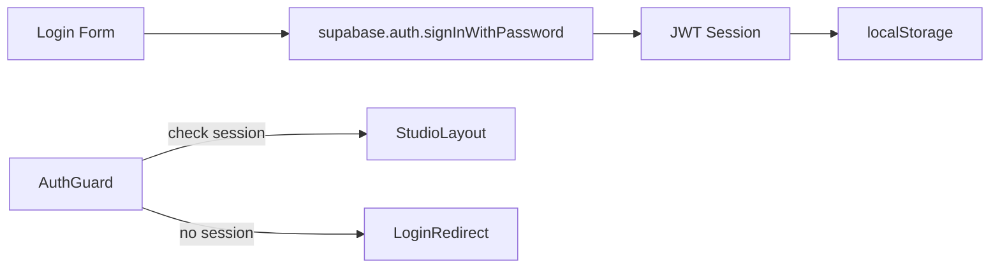

# Security

## Authentication

Studio authentication uses Supabase Auth with email/password.



- Sessions persist in `localStorage`
- Tokens auto-refresh via `supabase.auth.onAuthStateChange`
- Storefront is fully anonymous (no auth required to browse)

## Row-Level Security

### Orders (⚠️ Missing Policies)

The `orders` table has RLS **enabled** but **zero policies** — a deliberate design in the original migration (`20260708000000_create_orders_schema.sql:163`). The comment reads:

> *"Default-deny: RLS is enabled with zero policies. Only the service_role key can access tables directly."*

This means all order-related tables (`orders`, `order_items`, `customers`, `shipping_addresses`, `payments`) return empty results to `authenticated` studio users. RLS policies need to be added:

```sql
-- Required policies for Studio Orders module:
CREATE POLICY "Authenticated users can read orders"
  ON orders FOR SELECT TO authenticated USING (true);
CREATE POLICY "Authenticated users can update orders"
  ON orders FOR UPDATE TO authenticated USING (true);
-- Similarly for order_items, customers, shipping_addresses, payments
```

### Products & Collections

Full CRUD policies for `authenticated` role exist for all product-related tables:

```sql
-- Applied in 20260709000000_COMBINED_PRODUCT_WORKSPACE.sql
CREATE POLICY "Authenticated users can read products"
  ON products FOR SELECT TO authenticated USING (true);
-- (insert, update, delete also exist)
```

Collections additionally have an `anon` read policy for the public storefront:

```sql
-- Applied in 20260712000000_fix_collections_migration.sql
CREATE POLICY "Public can read collections"
  ON collections FOR SELECT TO anon USING (true);
```

### Storage Buckets

| Bucket | Public | RLS |
|--------|--------|-----|
| `product-images` | Yes | Authenticated can read/insert/update/delete |
| `HOP-films` | Yes | Anon can read; authenticated can read/insert/update/delete |

## Environment Variables

No secrets in code. Only anon/publishable key in `.env` — never the `service_role` key.

```
VITE_SUPABASE_URL=https://kbvjmcnaaogkbnerjcoc.supabase.co
VITE_SUPABASE_PUBLISHABLE_KEY=sb_publishable_...
```

## CSP Considerations

The app loads videos from `kbvjmcnaaogkbnerjcoc.supabase.co`. Ensure your deployment's Content-Security-Policy allows:

```
media-src: 'self' https://kbvjmcnaaogkbnerjcoc.supabase.co;
img-src: 'self' https://kbvjmcnaaogkbnerjcoc.supabase.co data:;
```
