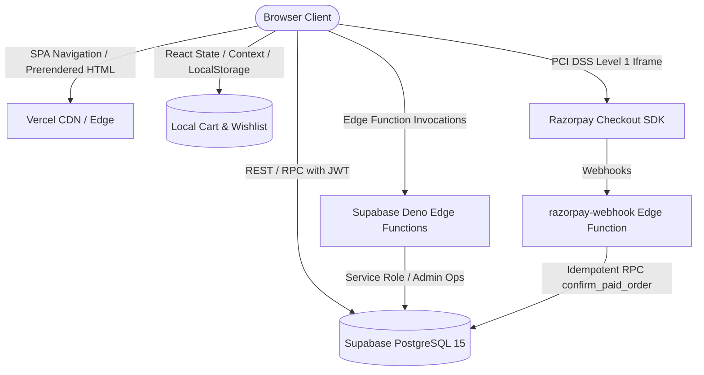

# Phase 3 — Application Architecture Reconstruction

**Audit Timestamp**: 2026-08-16T05:22:00+05:30  

---

## 1. System High-Level Topology



---

## 2. Provider Tree & Route Architecture

The React 18 application is mounted in `src/App.tsx` with the following strict provider hierarchy:

```
QueryClientProvider (TanStack React Query v5)
└── HydrationBoundary (__REACT_QUERY_STATE__)
    └── TooltipProvider (Radix Tooltip)
        └── CartProvider (useReducer + localStorage persistence)
            └── WishlistProvider (useReducer + localStorage + Supabase sync)
                └── BrowserRouter (React Router v6)
                    └── ScrollToTop
                        └── Suspense (Fallback skeleton / loader)
                            └── Routes (Public Storefront + AuthGuarded Studio)
```

---

## 3. Critical Flow: Code-Level Trace

### Flow: From Cart Item Addition to Order Confirmation

1. **Cart Addition (`src/contexts/CartContext.tsx`)**:
   - `addItem(item)` dispatches `ADD_ITEM`.
   - Generates deterministic `lineId` and retains `productId`.
   - Effect hook synchronizes `hop-cart` to `localStorage`.

2. **Checkout Submission (`src/pages/Checkout.tsx`)**:
   - User inputs contact and shipping fields.
   - Client executes `validate(form)` verifying email, required strings, postal code.
   - Client invokes `validateCheckout(items, "standard")` in `checkoutService.ts`.
   - `validateCheckout` queries `products` table for live stock and `selling_price` matching.
   - If valid, `createRazorpayOrder` invokes Edge Function `create-razorpay-order`.

3. **Backend Order Creation (`create-razorpay-order/index.ts`)**:
   - Edge Function validates user JWT and payload fields.
   - Executes database RPC `create_order(...)` (PostgreSQL `SECURITY DEFINER`).
   - RPC validates active status of every product, recalculates authoritative total + shipping, generates sequence-backed `order_number`, inserts `customers` record if not present, inserts `shipping_addresses`, creates `orders` row in `pending_payment` / `pending`, inserts `order_items`.
   - Edge Function initializes Razorpay order with `RAZORPAY_KEY_SECRET` via `razorpay.orders.create`.
   - Inserts row into `payments` table with `status = 'pending'`, `razorpay_order_id`.
   - Returns `{ order_id, order_number, razorpay_order_id, razorpay_key_id }`.

4. **Razorpay Modal & Verification (`src/hooks/usePayment.ts`)**:
   - `openRazorpayCheckout` displays Razorpay payment iframe.
   - On completion, `handler` receives `razorpay_order_id`, `razorpay_payment_id`, `razorpay_signature`.
   - `verifyPayment` invokes `verify-payment` Edge Function.
   - `verify-payment` calculates HMAC SHA256 of `order_id + "|" + payment_id` with `RAZORPAY_KEY_SECRET` and uses byte-level XOR constant-time comparison.
   - Checks `payment_events` idempotency key `verify_{orderId}_{paymentId}`.
   - Invokes `confirm_paid_order` RPC which atomically sets `payments.status = 'paid'`, `orders.payment_status = 'paid'`, `orders.status = 'confirmed'`, acquires `SELECT ... FOR UPDATE` locks on `products`, deducts stock, and records `inventory_history` entries with reason `'sale'`.
   - Inserts record into `payment_events`.

5. **Client Completion (`src/pages/Checkout.tsx`)**:
   - React hook sets `paymentState.status = 'paid'`.
   - Checkout effect triggers `clearCart()`.
   - Invalidates React Query `storefront` queries.
   - Navigates to `/order/confirmation/:orderNumber` with `{ replace: true }`.
