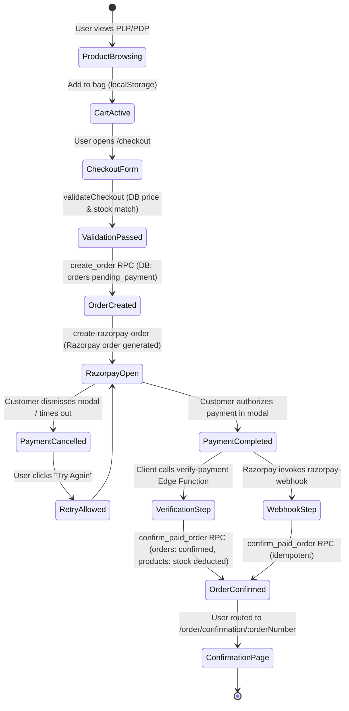

# Phase 3 — End-to-End Commerce Flow Audit

**Audit Timestamp**: 2026-08-16T05:26:00+05:30  

---

## 1. Canonical Commerce State-Transition Map

---

## 2. Transition Boundary Audit

| Step | Source -> Destination | Database Table / RPC | Auth Boundary | Idempotency Boundary | Failure Behavior |
|------|-----------------------|----------------------|---------------|----------------------|------------------|
| 1. Cart Addition | Local -> Cart State | `localStorage (hop-cart)` | Anonymous / Client | Client-side line ID | Replaces state on malformed JSON |
| 2. Checkout Pre-Check | Cart -> Validated Cart | `products` table SELECT | Anonymous / Client | Read-only | Returns user error alert if stock/price changed |
| 3. Order Insertion | Checkout -> Pending Order | `create_order` RPC | DB `SECURITY DEFINER` | Database Sequence | Atomic rollback on any error |
| 4. Razorpay Init | Pending Order -> Gateway Order | `create-razorpay-order` Edge Function | Supabase JWT | Order ID + DB Payment record reuse | Returns 400/500 with user-facing message |
| 5. Signature Verification | Gateway Result -> Verified Payment | `verify-payment` Edge Function | Razorpay Secret HMAC SHA256 | `payment_events (verify_...)` | Marks payment `failed`, calls `release_order_inventory` |
| 6. Webhook Processing | Razorpay Event -> DB State | `razorpay-webhook` Edge Function | Razorpay Webhook Secret | `payment_events (event_id)` | Returns 200 OK `{ already_processed: true }` |
| 7. Stock Deduction | Order -> Inventory Update | `confirm_paid_order` RPC | DB `SECURITY DEFINER` | `payments.status = 'paid'` check | Atomic transaction with `SELECT ... FOR UPDATE` |
