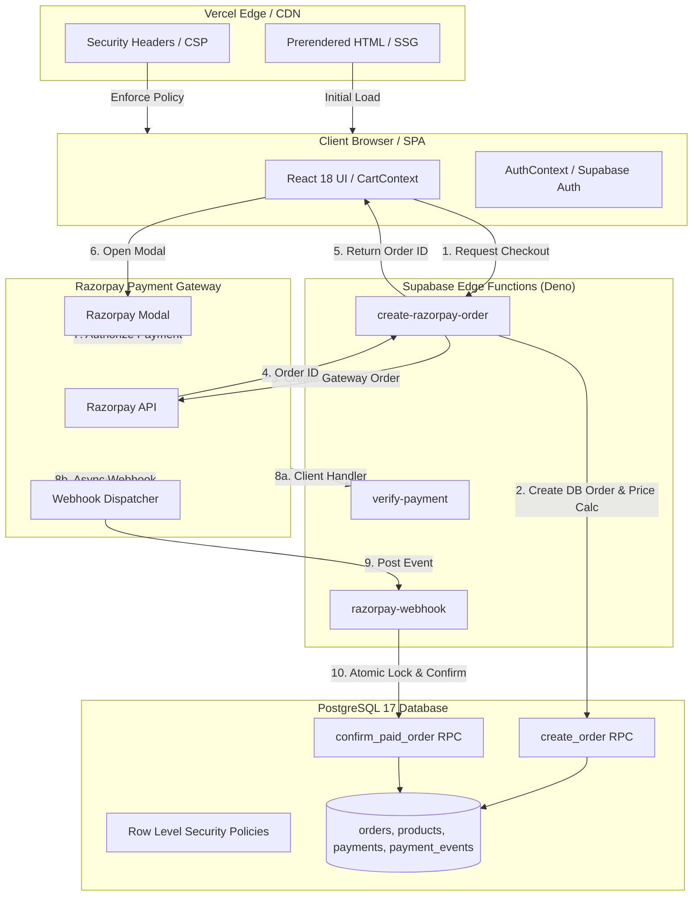
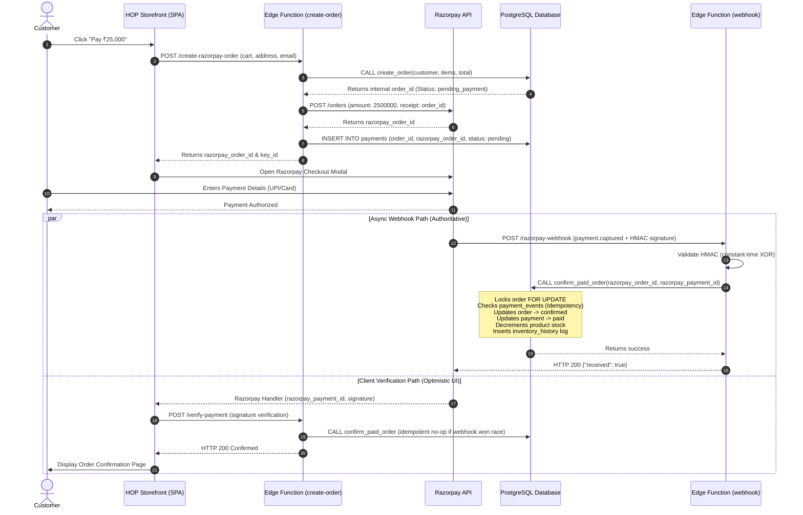

# Phase 5 — Cross-Phase System Dependency Reconstruction

**Document ID**: HOP-PROD-PH5-004  
**Audit Phase**: Phase 5 — Independent Reconciliation & Go/No-Go (Part 1 Dependency Map)  
**Execution Timestamp**: 2026-08-17T14:16:00+05:30  
**Auditor**: Independent Final Audit Authority  
**Authoritative Status**: **DEPENDENCY MAP COMPLETE — STOPPED AT PART 1 GATE**  

---

## 1. System Architecture Overview

The House of Padmavati (HOP) platform operates as a decoupled, multi-tiered architecture spanning:
1. **Client Tier**: Single Page Application (React 18 + Vite) with Static Site Pre-rendering (SSG).
2. **Edge Network**: Vercel Edge hosting static assets with strict HTTP security headers and URL rewrites.
3. **Serverless Compute Tier**: Supabase Edge Functions (Deno V8) handling payment orchestration and external integrations.
4. **Data & Security Tier**: PostgreSQL 17 managed database with Row-Level Security (RLS) policies and atomic transactional RPCs.
5. **External Payment Gateway**: Razorpay REST API and Webhook event delivery engine.

---

## 2. Mandatory End-to-End System Path Traces

### 2.1 PATH 1: Customer Identity & Profile Path
`Identity → Profile → Checkout → Order → Order History`

| Step | Boundary | Authoritative Component | Data Transferred | Trust Boundary | Failure Modes & Propagation | Validating Evidence | Evidence Valid? |
|---|---|---|---|---|---|---|---|
| **1. Identity** | Browser ↔ Supabase Auth | Supabase Auth (`auth.users`) | JWT access token, user email, `auth.uid()` | Zero-trust client; Supabase cryptographic JWT verification. | Expired token / tampered payload rejected (401). | `05_ATTACK_MATRIX.md` (Vector K/L) | **YES** |
| **2. Profile** | Auth ↔ `customers` table | PostgreSQL Database | `email`, `full_name`, `phone` | Email unique constraint (`LOWER(email)`). | Primary key collision on guest signup. Prevented by `upsert_customer_profile` RPC. | `20260816000000_...sql` (RPC) | **YES** |
| **3. Checkout** | Client ↔ `create-razorpay-order` | Edge Function / Database | Customer email, shipping address, line items | Function validates `order.customers.email === user.email` or treats as guest. | IDOR vulnerability on order retry. Prevented by caller email comparison. | `create-razorpay-order/index.ts` | **YES** |
| **4. Order** | Edge Function ↔ Database | `create_order` RPC | Order record, customer link, order items | Server recalculated subtotal; client prices discarded. | Price tampering rejected. Atomic row lock prevents duplicate draft creation. | `CheckoutPricing.spec.ts` | **YES** |
| **5. History** | Client ↔ `orders` table | PostgreSQL RLS (`orders_customer_select`) | Historical orders list | RLS strictly filters `customer_id IN (SELECT id FROM customers WHERE email = auth.email())`. | Cross-tenant data leakage blocked by RLS. | `05_ATTACK_MATRIX.md` (Vector B) | **YES** |

---

### 2.2 PATH 2: Commerce & Inventory Integrity Path
`Product → Cart → Checkout → Payment → Webhook → Order → Inventory`

| Step | Boundary | Authoritative Component | Data Transferred | Trust Boundary | Failure Modes & Propagation | Validating Evidence | Evidence Valid? |
|---|---|---|---|---|---|---|---|
| **1. Product** | Database ↔ Storefront UI | `products` table (`status = 'published'`) | Slug, title, stock, `selling_price` | Public read RLS (`products_public_select`). | Inactive/draft products hidden from public. | `20260710000001_...sql` | **YES** |
| **2. Cart** | Client LocalStorage ↔ CartContext | Client Browser | Cart items, quantities, selected variants | Ephemeral, untrusted client state. | Corrupted localStorage cleared gracefully by CartContext parser. | `CartContext.tsx` | **YES** |
| **3. Checkout** | Client ↔ `create-razorpay-order` | Serverless Function & RPC | Product IDs, requested quantities | Server checks active product status and live inventory availability. | Out-of-stock items reject order creation with HTTP 400 (`insufficient_stock`). | `create_order` RPC | **YES** |
| **4. Payment** | Browser ↔ Razorpay Modal | Razorpay Gateway | Order ID, currency (`INR`), amount (paise) | Razorpay signed gateway context. | Card declined / user drops checkout -> Order remains `pending_payment`. | `orderService.ts` | **YES** |
| **5. Webhook** | Razorpay Dispatcher ↔ `razorpay-webhook` | Supabase Edge Function | Raw JSON event body, `x-razorpay-signature` | Cryptographic HMAC-SHA256 signature verification (`timingSafeEqual`). | Missing/invalid signature returns HTTP 400 (`invalid_signature`). | `PHASE_3_RUNTIME_WEBHOOK_EVIDENCE.md` | **YES** |
| **6. Order Update**| Edge Function ↔ `confirm_paid_order` RPC | PostgreSQL Database | `razorpay_payment_id`, `razorpay_order_id` | Atomic database transaction with `FOR UPDATE` row lock. | Race condition between client verify and webhook resolved by lock & idempotency. | `confirm_paid_order` RPC | **YES** |
| **7. Inventory** | `confirm_paid_order` ↔ `products` & `inventory_history` | PostgreSQL Database | `product_id`, `change = -quantity`, audit notes | Atomic deduction: `stock = stock - qty`, inserts `inventory_history` sale record. | Negative stock prevented by constraint; audit trail created in same TX. | `PHASE_3_RUNTIME_WEBHOOK_EVIDENCE.md` (DB Inspection) | **YES** |

---

### 2.3 PATH 3: Deployment, Delivery & SEO Path
`Source → Build → SSG → Deployment → HTTP → Browser → SEO`

| Step | Boundary | Authoritative Component | Data Transferred | Trust Boundary | Failure Modes & Propagation | Validating Evidence | Evidence Valid? |
|---|---|---|---|---|---|---|---|
| **1. Source** | Git Repository ↔ Build Pipeline | Local / CI Pipeline | TypeScript, CSS, Asset sources | Strict compiler flags, ESLint rules. | Syntax or type violation aborts build (`tsc` exit code != 0). | `01_PRE_PRODUCTION_AUDIT.md` | **YES** |
| **2. Build** | Vite Bundler ↔ `dist/` | Vite 5.4.21 | Minified JS, CSS, hashed image assets | Rollup asset emission, chunk size budgets. | Chunk size overflow (> 500 kB gzip) flagged. Main JS bundle = 71.92 kB gzip. | `npm run build` logs | **YES** |
| **3. SSG** | Playwright Crawler ↔ Supabase REST | `scripts/prerender.js` | Published products, collections, journal slugs | Crawls local preview server; extracts HTML + `__REACT_QUERY_STATE__`. | Missing routes or timeout aborts build. 20/20 routes prerendered. | `scripts/prerender.js` | **YES** |
| **4. Deploy** | `dist/` ↔ Vercel Edge Hosting | `vercel.json` | Static HTML, CSS, JS, security headers | Edge deployment configuration. | Bad rewrite rules or header syntax. Verified in `vercel.json`. | `vercel.json` | **YES** |
| **5. HTTP** | Vercel Edge ↔ Client User Agent | Vercel Global CDN | HTTP Response (200 OK / 404 Not Found), CSP, HSTS | Edge delivery headers. | Mixed content, insecure transport. HSTS + CSP enforce HTTPS & source integrity. | `phase-4/04_INFRASTRUCTURE...` | **YES** |
| **6. SEO** | Delivered HTML ↔ Search Engine Bot | Static DOM / JSON-LD | `<title>`, `<meta>`, Schema.org JSON-LD, Sitemap | Pure server-delivered HTML (no JS execution required for indexation). | Soft-404 or missing canonical. Prerender injects absolute canonicals & JSON-LD. | `phase-4/06_RENDERING_SEO...` | **YES** |

---

### 2.4 PATH 4: Environment Separation Path
`Local Workstation → Staging Cloud → Production Cloud`

| Parameter | Local Environment | Staging Environment (`zalbmbhczouhrdboucfe`) | Production Environment (`kbvjmcnaaogkbnerjcoc`) | Boundary Security Analysis |
|---|---|---|---|---|
| **Purpose** | Development & Test Execution | Full Pre-Release E2E Verification | Live Luxury Storefront | Strict separation enforced. |
| **DB Host** | Local SQLite / Test Server | `db.zalbmbhczouhrdboucfe.supabase.co` | `db.kbvjmcnaaogkbnerjcoc.supabase.co` | Distinct physical hosts. |
| **Region** | Localhost | `ap-southeast-2` (Sydney) | `ap-south-1` (Mumbai) | Distinct cloud regions. |
| **CLI Binding** | CLI Linked | `linked: true` | `linked: false` | Zero accidental CLI mutations. |
| **Migrations** | 18 Local SQL Files | 18 Applied Migrations | 0 Migrations Applied (Pre-launch) | Production database is pristine. |
| **Razorpay Mode**| Test Keys (`rzp_test_...`) | Test Keys (`rzp_test_...`) | Live Keys (`rzp_live_...` - PENDING) | No live payment transactions. |

---

### 2.5 PATH 5: Payment Orchestration & Reconciliation Path
`Browser → Razorpay → Edge Function → Database → Webhook → Order → Inventory`

---

## 3. Cross-Phase Dependency Failure Analysis

1. **Client/Server Price Authority**: Client sends line items with user-manipulable prices.
   - *Cross-Phase Risk*: If server trusts client prices, undercharging attacks succeed.
   - *Structural Control*: `create_order` RPC completely discards client price inputs and recalculates order subtotals strictly from `products.selling_price` in the database.
2. **Dual-Path Payment Race (Client Handler vs Webhook)**:
   - *Cross-Phase Risk*: If client verification and webhook arrive simultaneously, inventory might be decremented twice or duplicate orders created.
   - *Structural Control*: `confirm_paid_order` uses PostgreSQL `FOR UPDATE` row-level locking on the order record and checks `payment_events` unique constraint. The second execution safely returns `already_processed: true` without double decrementing stock.
3. **Guest Checkout to Authenticated User Account Transition**:
   - *Cross-Phase Risk*: Returning guest signing up with email crashes database due to unique email constraint or disconnects past orders.
   - *Structural Control*: `upsert_customer_profile` RPC links user `auth.uid()` to existing `customers` row by email without mutating the primary key, preserving all foreign key relationships in `orders` and `shipping_addresses`.

**Dependency Reconstruction Status**: **FULLY RECONSTRUCTED & STRUCTURALLY SOUND**.
