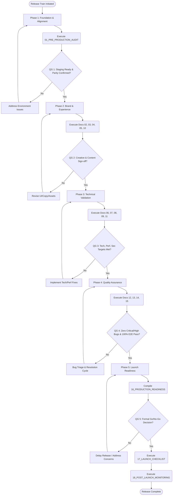

# 00 Master Execution Plan

## 1. Purpose
This document serves as the master orchestration plan for the House of Padmavati (HOP) digital platform production operations. It defines the overarching governance framework, lifecycle phases, document map, execution matrices, and quality gates required to ensure that all releases meet the uncompromising luxury standards of the brand. "Excellence will never be sacrificed for growth."

The House of Padmavati requires an operating model that matches its brand ethos. We are building an e-commerce experience analogous to a high-touch luxury boutique. Therefore, the production lifecycle must be deliberate, meticulous, and free from the compromises often found in fast-paced software development. This document codifies that philosophy into actionable, verifiable steps.

## 2. Scope
The scope of this Master Execution Plan covers the entirety of the production readiness and release lifecycle for the HOP e-commerce platform. This includes, but is not limited to:
- Major version releases (e.g., complete site redesigns, replatforming)
- Minor feature updates (e.g., introducing a new wishlist feature, updating the checkout flow)
- Seasonal campaigns (e.g., Diwali collections, Spring/Summer lookbooks)
- Content updates (e.g., journal entries, product catalog additions)
- Emergency hotfixes (e.g., resolving critical bugs affecting payments or core user journeys)
- Infrastructure and dependency upgrades

The functional domains covered include Frontend (React, Vite, Tailwind), Backend (Supabase, PostgreSQL), Design (UI/UX, Figma to Code), Editorial (Copy, Tone), Performance (Core Web Vitals), Security (Pen-testing, Data Privacy), and E-commerce operations (Razorpay integrations, Inventory syncing).

## 3. Objectives
- **Absolute Predictability:** Ensure that every release follows a known, practiced, and documented path.
- **Extreme Quality:** Guarantee that no code or content reaches production without meeting the defined luxury thresholds.
- **Single Source of Truth:** Provide a definitive guide for the execution order of all production audits and reviews.
- **Clear Governance:** Define precise roles, responsibilities, and escalation paths (RACI) to eliminate ambiguity during release cycles.
- **Strict Quality Gates:** Mandate hard stops in the process to prevent sub-standard work from progressing to the next phase.
- **Standardized Communication:** Establish clear protocols for communicating status, risks, and decisions during the release cycle.
- **Brand Protection:** Ensure that every technical deployment upholds and enhances the HOP brand equity.

## 4. Definitions
- **HOP**: House of Padmavati.
- **Go/No-Go Decision**: The final executive approval step before deploying to production. A unanimous "Go" is required.
- **Quality Gate (QG)**: A hard stop in the process where specific, measurable acceptance criteria must be met before proceeding.
- **RACI**: Responsible, Accountable, Consulted, Informed. A framework for defining roles in a process.
- **Release Train**: The scheduled lifecycle of deploying a planned set of features, analogous to a physical train departing on a schedule.
- **SOP**: Standard Operating Procedure. A documented set of step-by-step instructions.
- **Staging Environment**: An exact replica of the production environment used for final testing and validation.
- **Hotfix**: An expedited release designed solely to address a critical, blocking issue in production.
- **Rollback**: The process of reverting a deployment to the previous stable state in the event of a critical failure.
- **Core Web Vitals (CWV)**: Google's standardized metrics for measuring user experience regarding loading performance, interactivity, and visual stability.
- **WCAG**: Web Content Accessibility Guidelines.

## 5. Roles & Responsibilities

The execution of this master plan requires strict adherence to role definitions. Cross-functional collaboration is expected, but ultimate accountability remains with the designated leads.

| Role | Description | Core Responsibilities |
|---|---|---|
| **Release Manager (RM)** | The ultimate orchestrator of the release train. | Enforces Quality Gates, schedules Go/No-Go meetings, manages communications, tracks release metrics. |
| **Technical Lead (TL)** | Owner of code quality, performance, and infrastructure. | Code reviews, infrastructure provisioning, backend sign-off, merge approvals, rollback execution. |
| **Creative Director (CD)** | Guardian of the brand philosophy and aesthetic. | UI/UX approval, brand voice validation, editorial sign-off, visual asset approval. |
| **QA Lead (QAL)** | Owner of testing execution and defect management. | Automated testing strategy, manual testing oversight, performance profiling, accessibility auditing. |
| **Content Manager (CM)** | Owner of all copy, product descriptions, and metadata. | Content accuracy, SEO alignment, localization/translation validation, legal text review. |
| **Security Officer (SO)** | Guardian of customer data and payment integrity. | Vulnerability scanning, penetration testing oversight, compliance auditing (GDPR/DPDP), payment gateway security. |
| **Operations Lead (OL)** | Oversees post-launch stability and customer service. | Production monitoring, support readiness, fulfillment operations synchronization, incident response coordination. |

### 5.1 RACI Matrix

This matrix defines the involvement of each role across the primary phases and audit documents.

| Phase / Activity | RM | TL | CD | QAL | CM | SO | OL |
|---|---|---|---|---|---|---|---|
| **01. Pre-Production Audit** | A/R | C | I | I | I | I | I |
| **02. UI/UX Review** | A | C | R | C | I | I | I |
| **03. Editorial Review** | A | I | C | I | R | I | I |
| **04. Content Review** | A | I | I | I | R | I | I |
| **05. Brand Review** | A | I | R | I | I | I | I |
| **06. Accessibility Audit** | A | R | C | C | I | I | I |
| **07. Performance Audit** | A | R | I | C | I | I | I |
| **08. Security Audit** | A | C | I | I | I | R | I |
| **09. SEO Audit** | A | I | I | C | R | I | I |
| **10. Studio Audit** | A | I | R | I | C | I | I |
| **11. E-Commerce Audit** | A | R | I | C | I | C | I |
| **12. Cross-Browser Testing** | A | I | I | R | I | I | I |
| **13. Mobile Testing** | A | I | I | R | I | I | I |
| **14. Playwright E2E** | A | I | I | R | I | I | I |
| **15. Bug Tracker Mgmt** | A | R | I | R | I | I | I |
| **16. Prod Readiness** | A | R | C | R | C | C | C |
| **17. Launch Checklist** | R/A | C | I | C | I | I | C |
| **18. Post-Launch Monitor** | A | R | I | I | I | I | R |

*(R = Responsible, A = Accountable, C = Consulted, I = Informed)*

## 6. Execution Order and Document Map

The Production Operations Manual consists of 19 interdependent documents (00-18). They must be executed in the precise sequence defined by the phases below. Skipping phases or executing documents out of order introduces unacceptable risk and violates HOP policy.

### Phase 1: Foundation & Alignment (Technical & Infrastructure)
This phase ensures the underlying infrastructure is ready to receive the new code and that the staging environment accurately reflects production.
- **`01_PRE_PRODUCTION_AUDIT.md`**: Validates infrastructure readiness, environment parity (Staging vs. Prod), dependency locking (package.json/lockfiles), and Supabase Edge Function deployment status.

### Phase 2: Brand & Experience (Creative Sign-off)
This phase focuses on the human element: ensuring the visual, editorial, and experiential aspects of the update meet HOP's luxury standards.
- **`05_BRAND_REVIEW.md`**: Evaluates core brand aesthetics, tone, and luxury signaling. Ensures the digital experience feels like a physical boutique.
- **`02_UI_UX_REVIEW.md`**: Audits component behavior, micro-interactions, layout fidelity to Figma designs, and adherence to the HOP design system and typography.
- **`03_EDITORIAL_REVIEW.md`**: Reviews voice, tone, and storytelling alignment. Ensures the narrative elevates the product.
- **`04_CONTENT_REVIEW.md`**: Validates copy accuracy, localization (if applicable), legal text (T&C updates), and product descriptions.
- **`10_STUDIO_AUDIT.md`**: Checks asset quality, image optimization (WebP/AVIF), video streaming standards, and color accuracy (crucial for sarees).

### Phase 3: Technical Validation (Non-Functional Requirements)
This phase ensures the platform is robust, fast, secure, and discoverable.
- **`06_ACCESSIBILITY_AUDIT.md`**: Verifies WCAG 2.1 AA compliance, screen reader support, keyboard navigation, and color contrast ratios.
- **`07_PERFORMANCE_AUDIT.md`**: Measures Core Web Vitals (LCP, FID, CLS), payload sizes, React hydration speed, and API response times.
- **`08_SECURITY_AUDIT.md`**: Conducts vulnerability scanning, CSP (Content Security Policy) validation, and Razorpay integration security checks.
- **`09_SEO_AUDIT.md`**: Audits meta tags, structured data (JSON-LD), canonical URLs, XML sitemaps, and robots.txt.
- **`11_ECOMMERCE_AUDIT.md`**: Validates core business logic: cart behavior, tax calculations, shipping rule logic, and inventory synchronization.

### Phase 4: Quality Assurance (Testing & Defect Management)
This phase involves rigorous functional testing across various platforms and devices.
- **`14_PLAYWRIGHT_E2E.md`**: Orchestrates the execution of the automated end-to-end test suite for all critical user journeys.
- **`12_CROSS_BROWSER_TESTING.md`**: Ensures visual and functional parity across Safari, Chrome, Edge, and Firefox (desktop and mobile variants).
- **`13_MOBILE_TESTING.md`**: Validates the experience on real iOS and Android devices, focusing on diverse viewports and touch targets.
- **`15_BUG_TRACKER.md`**: Governs the triage, categorization, and resolution of defects found during all previous phases.

### Phase 5: Launch & Beyond (Deployment & Monitoring)
The final phase handles the actual deployment and subsequent verification.
- **`16_PRODUCTION_READINESS.md`**: The compilation of all evidence leading to the final Go/No-Go evaluation and compliance check.
- **`17_LAUNCH_CHECKLIST.md`**: Step-by-step deployment instructions, database migrations, DNS changes, and immediate post-deployment verification.
- **`18_POST_LAUNCH_MONITORING.md`**: Guidelines for ongoing health checks, alert response protocols, and metrics tracking for the 48 hours post-launch.

## 7. Workflow Diagram

The following diagram illustrates the critical path and the quality gates that govern the release process.

## 8. Prerequisites
Before initiating the Master Execution Plan for any release, the following conditions MUST be met:
- All feature development slated for the release must be completed, peer-reviewed, and merged into the `staging` branch.
- Figma design files for all related features must be explicitly marked as "Development Ready" and locked to prevent further changes.
- The staging environment infrastructure must be provisioned and verified to match production specifications exactly.
- Appropriate test data (e.g., test products, test user accounts, valid/invalid payment tokens for Razorpay) must be seeded in the staging database.
- The Release Manager must be officially designated for the cycle.

## 9. Inputs
The execution of this plan requires the following artifacts and information:
- Draft Release Notes / Changelog detailing all user-facing and backend changes.
- Links to relevant Jira epics, stories, and bug tickets.
- Specific URLs for locked Figma design files.
- Finalized copy documents from the Content Team.
- Threat modeling reports for any new architectural components or integrations.

## 10. Outputs
Successful execution of this plan will result in:
- A fully audited, verified, and signed-off staging environment.
- Completed and archived checklists from all 18 sub-documents, forming the audit trail.
- A fully executed `17_LAUNCH_CHECKLIST.md` documenting the deployment steps taken.
- Active post-launch monitoring dashboards and alert configurations specific to the new features.
- A successful deployment to the production environment.

## 11. Dependencies
The release process is dependent on several external and internal factors:
- **Infrastructure**: Supabase Edge Functions must be deployable to the staging environment without conflict.
- **Third-Party Integrations**: The Razorpay test mode API must be active, responsive, and verified before QA testing begins.
- **Tooling Availability**: Playwright test runners must have sufficient capacity to execute the full suite. Lighthouse CI must be properly configured and accessible.
- **Resource Availability**: Key personnel (Leads) must be available for their required sign-offs at designated milestones.

## 12. Quality Gates (QG)

Quality Gates are non-negotiable checkpoints. Progression to the next phase is strictly prohibited unless all criteria for the specific gate are met and documented.

### QG 1: Staging Readiness (Post-Phase 1)
- **Criteria:** Code freeze enacted on the `staging` branch (no new features, only bug fixes).
- **Criteria:** Supabase database migrations applied successfully to the staging instance without data loss or corruption errors.
- **Criteria:** Staging environment variables validated line-by-line against production parity requirements.
- **Approver:** Technical Lead (TL).

### QG 2: Creative & Content Approval (Post-Phase 2)
- **Criteria:** Creative Director explicitly signs off on the visual fidelity of the staging environment compared to the locked Figma designs.
- **Criteria:** Content Manager confirms zero spelling, grammar, or tone errors in all primary user flows and new product descriptions.
- **Criteria:** Luxury standard aesthetics confirmed (e.g., no layout shifts during loading, proper rendering of Cormorant Garamond and Vonca Regular fonts, precise adherence to the brand color palette).
- **Approver:** Creative Director (CD) & Content Manager (CM).

### QG 3: Technical & Security Clearance (Post-Phase 3)
- **Criteria:** Performance scores must be >= 90 for Desktop and >= 85 for Mobile on Lighthouse audits for all key templates (Index, PDP, PLP, Checkout).
- **Criteria:** Accessibility score must be 100 on Lighthouse, with no critical WCAG violations reported by automated tools or manual spot checks.
- **Criteria:** Security scans must report zero Critical or High vulnerabilities. CSP headers must be correctly configured.
- **Criteria:** E-commerce core logic (cart totals, Razorpay initialization, inventory deduction simulation) fully verified in staging.
- **Approver:** Technical Lead (TL) & Security Officer (SO).

### QG 4: QA & Bug Resolution (Post-Phase 4)
- **Criteria:** The Playwright End-to-End (E2E) automated test suite pass rate must be 100%. Flaky tests must be resolved, not ignored.
- **Criteria:** Zero P0 (Critical) and P1 (High) bugs open in the issue tracker.
- **Criteria:** Any remaining P2 (Medium) or P3 (Low) bugs must be formally triaged, documented as "Known Issues," and accepted by the Release Manager as non-blocking for launch.
- **Criteria:** Cross-browser and mobile device validations complete and signed off.
- **Approver:** QA Lead (QAL) & Release Manager (RM).

### QG 5: Go/No-Go Decision (Pre-Launch)
- **Criteria:** All phase checklists (01-15) are completed and archived.
- **Criteria:** The `16_PRODUCTION_READINESS.md` document is fully populated and reviewed.
- **Criteria:** Rollback plan is documented, understood by the deployment team, and deemed viable.
- **Criteria:** Unanimous "Go" decision from all stakeholders in the formal readiness meeting.
- **Approver:** Release Manager (RM), Technical Lead (TL), Creative Director (CD), QA Lead (QAL).

## 13. Timeline Templates

The duration of the release train varies based on the scope of the changes. The following templates provide standard cadences.

### 13.1 Major Release (e.g., New Collection Drop, Significant Replatforming)
These releases require the most rigorous oversight.
- **T-minus 14 Days**: Feature freeze. Code merged to staging. Phase 1 begins.
- **T-minus 12 Days**: Phase 2 (Brand/Experience Review) begins.
- **T-minus 10 Days**: Phase 3 (Tech & Security Validation) begins.
- **T-minus 7 Days**: Phase 4 (QA & Automated Testing) begins.
- **T-minus 3 Days**: Strict bug fixing phase. Final regression testing. No new commits unless fixing P0/P1 issues.
- **T-minus 1 Day**: Phase 5 (Readiness compilation). Formal Go/No-Go meeting held.
- **T-0 (Launch Day)**: Execute `17_LAUNCH_CHECKLIST.md`. Transition to Post-Launch Monitoring.

### 13.2 Minor Update (e.g., Small feature additions, non-critical enhancements)
- **T-minus 5 Days**: Feature freeze. Phase 1 & 2 execution.
- **T-minus 3 Days**: Phase 3 & 4 execution (focusing regression testing on impacted areas).
- **T-minus 1 Day**: Go/No-Go meeting (can be asynchronous for minor updates).
- **T-0**: Execute deployment and monitor.

### 13.3 Content Update (e.g., New Journal entry, updating product inventory/images)
- **T-minus 2 Days**: Content locked in CMS/Staging. Phase 2 execution (Content & Studio Audits only).
- **T-minus 1 Day**: Light QA verification (ensure no layout breakage).
- **T-0**: Publish content.

### 13.4 Emergency Hotfix
Hotfixes bypass the standard timeline but must still adhere to critical quality and security checks.
- **T-0 Hour**: Critical production issue identified. Incident response team assembled. Create hotfix branch from `main`.
- **T+1 Hour**: Develop fix.
- **T+2 Hours**: Deploy to staging. Run targeted Phase 4 (Playwright E2E for the affected flow only) and relevant specific audits (e.g., Security if it was a data issue).
- **T+3 Hours**: Expedited Go/No-Go decision by Technical Lead and Release Manager.
- **T+4 Hours**: Deploy to production. Initiate immediate intense monitoring.

## 14. Detailed Step-by-Step Procedures

1. **Initiate Release Train**: The Release Manager formally announces the upcoming release train, specifying the target dates based on the appropriate timeline template. A new release branch is cut from `main`, or the `staging` branch is designated as the release candidate.
2. **Kickoff Meeting**: The RM conducts a brief synchronization meeting with the TL, CD, QAL, CM, and SO to align on the scope of the release, highlight any high-risk areas, and confirm resource availability.
3. **Execute Phase 1 (Pre-Prod)**: The Technical Lead executes the procedures in `01_PRE_PRODUCTION_AUDIT.md`. Upon completion, the TL signals the RM that QG1 is ready for evaluation.
4. **Evaluate QG1**: RM verifies the QG1 criteria. If passed, the train moves to Phase 2.
5. **Execute Phase 2 (Brand & Experience)**: The Creative Director and Content Manager concurrently execute documents 02, 03, 04, 05, and 10. They log any discrepancies as tasks for the design/frontend teams.
6. **Evaluate QG2**: RM verifies CD and CM sign-offs. If passed, the train moves to Phase 3.
7. **Execute Phase 3 (Tech Validation)**: The Technical Lead, Security Officer, and QA Lead execute documents 06, 07, 08, 09, and 11. Performance baselines are recorded. Security scans are finalized.
8. **Evaluate QG3**: RM verifies metric targets (Performance, Accessibility) and security clearance. If passed, the train moves to Phase 4.
9. **Execute Phase 4 (QA)**: The QA Lead oversees the execution of automated (Doc 14) and manual (Docs 12, 13) testing. The RM actively manages defect triage via `15_BUG_TRACKER.md`.
10. **Evaluate QG4**: RM and QAL review the bug tracker and test reports. All P0/P1 bugs must be closed. 100% E2E pass rate confirmed. If passed, move to Phase 5.
11. **Readiness Preparation**: The RM compiles all audit results, checklist links, and final metrics into the `16_PRODUCTION_READINESS.md` document.
12. **Go/No-Go Meeting**: The RM presents the `16_PRODUCTION_READINESS.md` document to all leads. A formal poll is taken. Unanimous consent is required.
13. **Deployment**: Upon a "Go" decision, the Release Manager and Technical Lead coordinate to execute the steps precisely as defined in `17_LAUNCH_CHECKLIST.md`.
14. **Monitoring**: Immediately following deployment, the Operations Lead initiates the protocols defined in `18_POST_LAUNCH_MONITORING.md`.

## 15. Validation Steps
The Release Manager must perform the following validations throughout the process:
- Periodically verify that every SOP document has a corresponding completed checklist artifact stored in the release repository for the current release version ID (e.g., `v1.4.0`).
- Audit the bug tracker daily during Phase 4 to ensure no Critical or High severity issues are being down-leveled inappropriately to bypass QG4.
- Validate that the final Go/No-Go decision is formally logged in the project management tool (e.g., Jira Release page) with timestamps and approver names.

## 16. Checklists

The following checklist represents the macro-level tracking for the Release Manager. Detailed checklists exist within each sub-document.

### Master Release Checklist
- [ ] **Phase 1: Foundation**
  - [ ] Release candidate identified and code freeze enacted.
  - [ ] `01_PRE_PRODUCTION_AUDIT.md` executed and signed off by TL.
  - [ ] Quality Gate 1 Cleared.
- [ ] **Phase 2: Brand & Experience**
  - [ ] `02_UI_UX_REVIEW.md` signed off by CD.
  - [ ] `03_EDITORIAL_REVIEW.md` signed off by CD/CM.
  - [ ] `04_CONTENT_REVIEW.md` signed off by CM.
  - [ ] `05_BRAND_REVIEW.md` signed off by CD.
  - [ ] `10_STUDIO_AUDIT.md` signed off by CD.
  - [ ] Quality Gate 2 Cleared.
- [ ] **Phase 3: Technical Validation**
  - [ ] `06_ACCESSIBILITY_AUDIT.md` targets met (Score: 100).
  - [ ] `07_PERFORMANCE_AUDIT.md` targets met (Desktop >90, Mobile >85).
  - [ ] `08_SECURITY_AUDIT.md` signed off (Zero High/Critical vulns).
  - [ ] `09_SEO_AUDIT.md` signed off.
  - [ ] `11_ECOMMERCE_AUDIT.md` signed off.
  - [ ] Quality Gate 3 Cleared.
- [ ] **Phase 4: Quality Assurance**
  - [ ] `12_CROSS_BROWSER_TESTING.md` complete.
  - [ ] `13_MOBILE_TESTING.md` complete.
  - [ ] `14_PLAYWRIGHT_E2E.md` reports 100% pass rate.
  - [ ] `15_BUG_TRACKER.md` confirms zero P0/P1 bugs.
  - [ ] Quality Gate 4 Cleared.
- [ ] **Phase 5: Launch Readiness**
  - [ ] `16_PRODUCTION_READINESS.md` compiled and distributed.
  - [ ] Go/No-Go Meeting Completed with unanimous approval.
  - [ ] Rollback Plan formulated and approved.
  - [ ] Quality Gate 5 Cleared.
- [ ] **Deployment & Post-Launch**
  - [ ] `17_LAUNCH_CHECKLIST.md` executed successfully.
  - [ ] `18_POST_LAUNCH_MONITORING.md` initiated.

## 17. Pass / Fail Criteria
- **Pass**: All Quality Gates (1-5) are cleared sequentially. Zero Critical/High severity bugs remain in the release candidate. Formal, documented sign-off is obtained from all designated leads in the RACI matrix.
- **Fail**: Any Quality Gate fails criteria and cannot be remediated within the timeline. Any P0/P1 bugs exist in the release candidate at the time of Go/No-Go. Any single lead formally rejects the release during the Go/No-Go meeting.

## 18. Acceptance Criteria
The overarching acceptance criteria for any HOP deployment:
1. The platform functions flawlessly according to the documented business and technical requirements.
2. The visual presentation and user experience align perfectly with HOP's established luxury standards, matching Figma designs exactly.
3. No performance, security, or accessibility regressions are introduced compared to the previous production state.

## 19. Evidence Required
The following artifacts must be generated and preserved for auditing purposes for every release:
- Automated test run reports (e.g., Playwright HTML reporter output).
- Lighthouse CI report JSON/HTML outputs showing scores for key pages.
- Automated security scan outputs and penetration test summaries (if applicable).
- Signed-off checklists (in markdown or PDF format) for documents 01-16.

## 20. Documentation Requirements
- All completed checklist artifacts and evidence files must be stored in the central repository under `ops/releases/vX.X.X/` (where X.X.X is the semantic version).
- If a critical failure occurs during or immediately after release, a formal Post-Mortem document must be written and linked to the release notes archive.

## 21. Common Failure Scenarios
- **Scenario: Rushed Testing Phase.** Attempting to compress Phase 4 (QA) due to delayed development in earlier phases.
  - *Mitigation:* The Release Manager must delay the launch. HOP policy dictates excellence over adherence to arbitrary deadlines.
- **Scenario: Scope Creep.** Attempting to inject "quick" features or fixes into the release candidate after QG1 (Code Freeze).
  - *Mitigation:* Strict enforcement of code freeze. Any new code requires the release train to restart from Phase 1.
- **Scenario: Environment Drift.** Tests pass in staging, but fail in production because the environments are not identical.
  - *Mitigation:* Strict enforcement of Infrastructure as Code (IaC) principles. Manual changes to staging or production are forbidden.
- **Scenario: Flaky Tests.** E2E tests fail intermittently, leading teams to ignore failures.
  - *Mitigation:* Flaky tests are treated as failures. The QA Lead must investigate and stabilize the test or identify the underlying race condition before proceeding.

## 22. Troubleshooting
- **Blocked Phase:** If any phase is blocked (e.g., waiting on third-party API approval), escalate immediately to the Release Manager to adjust the timeline or remove the feature from the release scope.
- **Disagreement at Go/No-Go:** If there is a disagreement regarding launch readiness, the most conservative approach (delay) is taken by default until consensus is reached through further data analysis or mitigation planning.

## 23. Best Practices
- **Over-Communicate:** The Release Manager should provide daily status updates to all stakeholders during active release trains.
- **Never Override Gates:** Never override a Quality Gate without a documented, written exception from executive leadership acknowledging the specific risks being accepted.
- **Luxury Mindset:** Treat every release, no matter how minor the code change, with the same level of scrutiny. A single broken link degrades the luxury experience.

## 24. Standards
The execution plan adheres to the following industry frameworks, adapted for the HOP context:
- Principles derived from ITIL (Information Technology Infrastructure Library) Release Management guidelines.
- Standardized Semantic Versioning (SemVer) for all releases.

## 25. Review Process
This Master Execution Plan (`00_MASTER_EXECUTION_PLAN.md`) must be formally reviewed quarterly by the Engineering, Operations, and Creative leadership teams to ensure it evolves alongside the platform's architecture and business needs.

## 26. Sign-off Requirements
Final approval of a release candidate (QG5) requires explicit digital signature (e.g., approved Pull Request on the release readiness document) from:
- Release Manager
- Technical Lead
- Creative Director
- QA Lead

## 27. Completion Criteria
A release is formally considered "Complete" 48 hours post-deployment, provided no P0 (Critical) or P1 (High) incidents have occurred in the production environment that require rollback or emergency hotfixes, as dictated by the criteria in `18_POST_LAUNCH_MONITORING.md`.

## 28. References
This document orchestrates the following detailed standard operating procedures:
- → See `01_PRE_PRODUCTION_AUDIT.md`
- → See `02_UI_UX_REVIEW.md`
- → See `03_EDITORIAL_REVIEW.md`
- → See `04_CONTENT_REVIEW.md`
- → See `05_BRAND_REVIEW.md`
- → See `06_ACCESSIBILITY_AUDIT.md`
- → See `07_PERFORMANCE_AUDIT.md`
- → See `08_SECURITY_AUDIT.md`
- → See `09_SEO_AUDIT.md`
- → See `10_STUDIO_AUDIT.md`
- → See `11_ECOMMERCE_AUDIT.md`
- → See `12_CROSS_BROWSER_TESTING.md`
- → See `13_MOBILE_TESTING.md`
- → See `14_PLAYWRIGHT_E2E.md`
- → See `15_BUG_TRACKER.md`
- → See `16_PRODUCTION_READINESS.md`
- → See `17_LAUNCH_CHECKLIST.md`
- → See `18_POST_LAUNCH_MONITORING.md`
